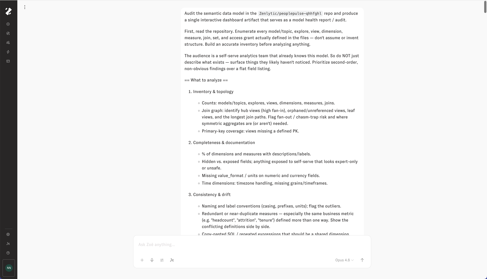
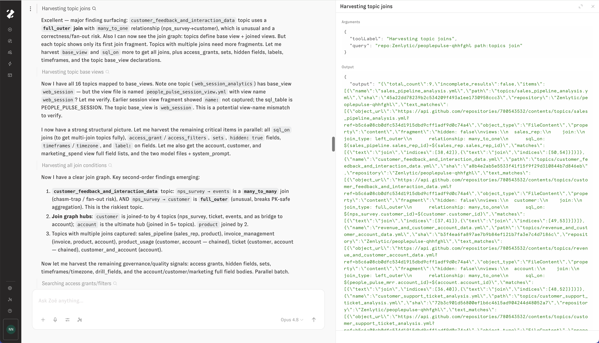
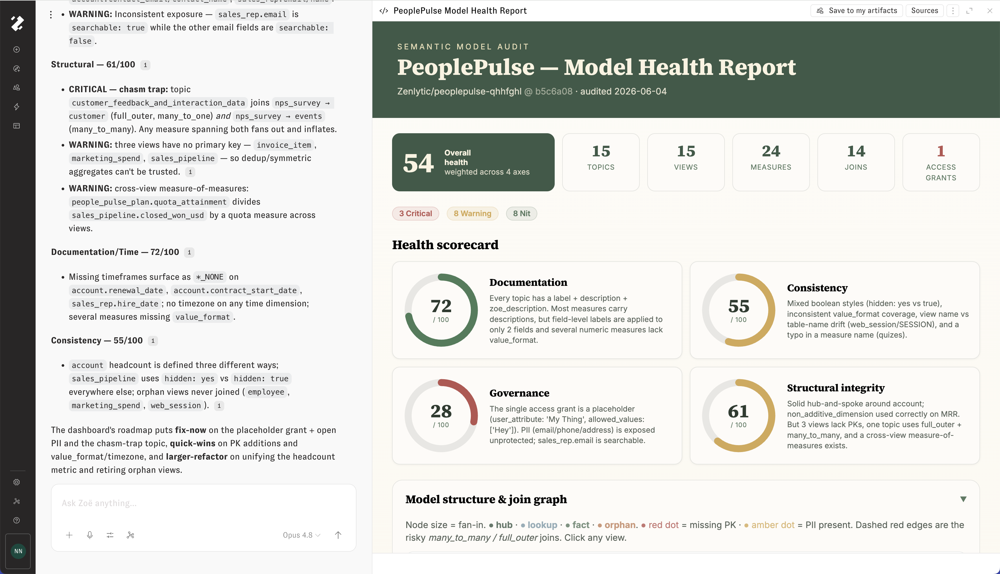
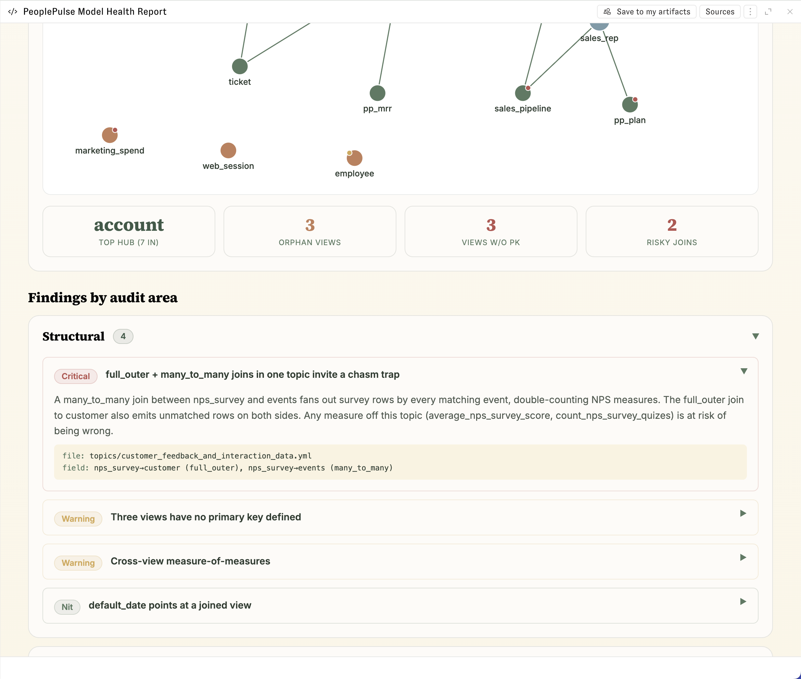

# Audit a semantic layer with a repo MCP

Point Zoë at an MCP server that can read the repository holding your Zenlytic data model so she can scan every topic, view, measure, dimension, join, and access grant at once — then have her render a single interactive **model health report** you can read at a glance. This is the fastest way to turn an existing semantic layer — yours or an inherited one — into something whose structural risks, documentation gaps, and definition drift are visible on one screen instead of buried across dozens of files.

This guide walks through that flow end to end using the "PeoplePulse" B2B-SaaS model — a people-and-revenue-ops model with `account` at the hub, joined out to `sales_pipeline`, `customer`, `nps_survey`, `ticket`, `events`, and more. The walkthrough uses the [GitHub MCP](github.md) because it gives Zoë read access to public or private repos and, optionally, the commit tools to apply her recommendations afterward — but this workflow produces the same dashboard with any repo-aware MCP.

## Pick a repo MCP

Any MCP that can read your data-model files will drive this audit. Common choices:

- **[GitHub MCP](github.md)** — direct access to public or private GitHub repos via a fine-grained PAT. Includes commit and pull-request tools, so once you've reviewed the dashboard you can ask Zoë to apply fixes on a branch in the same conversation. Best when your model lives in a private repo, when you want the apply step in-loop, or when you want fine-grained control over which toolsets Zoë sees.
- **DeepWiki MCP** — Devin's free Q&A-and-structure server for **public** GitHub repositories, served at `https://mcp.deepwiki.com/mcp` with no auth. DeepWiki indexes a repo into a wiki with architecture diagrams and links back to source, then exposes read-only tools. Best when your repo is public, when you only need the audit (not the commit), or when you want a fast architecture-aware overview before drilling into files.

Other repo-aware MCPs work the same way — a Bitbucket MCP, a GitLab MCP, or anything that exposes "read this repo" tools to Zoë will produce the same dashboard. The rest of this guide uses the GitHub MCP because it covers both the read and (optional) write halves; alternative-specific notes call out where a read-only MCP like DeepWiki changes a step.

> Enabling write access means Zoe can create, modify, or delete real data in your connected systems. A miscommunication or unexpected instruction could trigger hard-to-reverse data loss or expose sensitive data to the wrong place. Use read-only mode unless you specifically need write capabilities. If using the Github MCP, considering adding the `X-MCP-Readonly: true` Header to disable every write tool, regardless of which toolsets are enabled.

## What you'll do

1. Connect a repo MCP to the repository that hosts your Zenlytic data model.
2. Toggle the connection on in chat.
3. Ask Zoë to inventory the model and produce a single interactive model-health dashboard.
4. Watch her harvest the repo — topics, joins, views, access grants — and narrate findings as they surface.
5. Inspect the generated dashboard: overall health score, per-axis scorecard, interactive join graph, and findings grouped by severity.
6. Review the prioritized roadmap (fix-now → quick-wins → larger-refactor), then optionally apply the fixes.

## Prerequisites

- An active MCP connection to the repository that holds your Zenlytic data model. The walkthrough below uses the [GitHub MCP](github.md); if you're using DeepWiki, register `https://mcp.deepwiki.com/mcp` with no headers and confirm your model repo is public on GitHub.
- A repository containing a Zenlytic data model. The examples use `Zenlytic/peoplepulse-qhhfghl`; substitute your own org and repo name in any prompt.
- **Read access is all the audit needs.** The dashboard flow is entirely read-only, so DeepWiki or a `Contents: Read-only` PAT is enough to produce the full report. You only need **Context Editing** (see [Ask Zoë for Data Model Recommendations](../data-modeling/asking-zoe-for-recommendations.md)) and a write-enabled connection if you go on to Step 6's *apply* path.
- If you do plan to apply fixes, a development branch you're comfortable letting Zoë commit to. Don't commit against production unless **Allow Edit Production** is intentionally on.

## Step 1 — Connect the repo MCP

Follow the [GitHub MCP setup guide](github.md) to mint a fine-grained PAT scoped to the data-model repository and add the connection in **Workspace Settings → Extensions → MCP**. For an audit, the **default toolset** (`context`, `repos`, `issues`, `pull_requests`, `users`) is enough — Zoë only needs read access to repository contents.

**Scope the PAT tightly.** Grant `Contents: Read-only` and `Metadata: Read-only` on just the data-model repo. Add `Pull requests: Read and write` only if you intend to let Zoë open a PR with her fixes in Step 6.

**Using DeepWiki instead?** Add a connection pointing at `https://mcp.deepwiki.com/mcp` with no headers and no auth. DeepWiki's tools are read-only and only see public repos, so the dashboard renders the same but the optional apply step in Step 6 happens in [Context Manager](../zenlytic-ui/context_manager.md) rather than as an MCP write-back.

After **Test Connection** succeeds, review the discovered tools and save. With the GitHub MCP, `search_code`, `get_file_contents`, `list_branches`, and `get_repository` are the ones this audit leans on most.

## Step 2 — Turn the connection on in chat

Open a new chat and toggle the repo MCP connection on from the chat tool menu. The toggle is per-conversation, so you can keep it scoped to this audit without exposing repo tools to every other chat in the workspace.

## Step 3 — Ask Zoë to audit the model and build the dashboard

The single most important input is the prompt. Tell Zoë (a) to **build an accurate inventory from the files first** — not from assumption — and (b) to **render the result as one interactive dashboard**, and (c) what counts as a *useful* finding for your audience. The prompt below is the one used in the screenshots and works well across repo MCPs:

Three things in that prompt do the heavy lifting: **"read the files, don't invent structure"** keeps the inventory grounded; **"the audience already knows this model"** pushes Zoë past a field listing into second-order findings; and **"a single interactive dashboard artifact"** instructs her to deliver an interactive dashboard as part of her response.

<figure></figure>

## Step 4 — Watch Zoë harvest the model

Because the prompt asks her to inventory before analyzing, Zoë reads the repo in **layered passes** rather than one big read — and you can watch each tool call expand inline to confirm she's looking at the right files. The exact tools depend on which MCP you connected:

- **GitHub MCP** — typically `get_repository` to confirm the default branch, then repeated `search_code` queries to enumerate structure (for example `repo:Zenlytic/peoplepulse-qhhfghl path:topics join` to pull every topic join), followed by `get_file_contents` on the view and topic files she needs to read in full.
- **DeepWiki MCP** — Zoë reads the indexed wiki structure, pulls the relevant pages, and asks grounded questions to surface inconsistencies. She still cites source files because DeepWiki links every page back to code.

On PeoplePulse the passes look roughly like this, and she narrates findings *as they emerge* rather than waiting until the end:

1. **Harvest topic joins** — maps the join graph and immediately flags the riskiest topic: `customer_feedback_and_interaction_data` joins `nps_survey → customer` with a `full_outer`/`many_to_one` (unusual, breaks PK-safe aggregation) and `nps_survey → events` with `many_to_many` (chasm-trap / fan-out).
2. **Harvest topic base views** — maps all topics to their base views and catches drift to verify, e.g. a topic whose base view is `web_session` while the file is `people_pulse_session_view.yml` with `sql_table PEOPLE_PULSE_SESSION`.
3. **Harvest all join conditions** — resolves the full graph: `account` is the ultimate hub (joined in 5+ topics), `customer` a secondary hub (4 topics), and several topics carry multiple/chained joins.
4. **Harvest governance & quality signals** — a parallel batch for access grants/filters, `hidden` fields, sets, timeframes/timezone, `value_format`, and field labels.

<figure></figure>

## Step 5 — Inspect the dashboard

When she's done, Zoë renders the inventory and findings as one interactive artifact in chat. The PeoplePulse report opens with a header tying the audit to a specific commit so it's reproducible, then layers four things:

**Headline counts and severity.** An overall health score (54, weighted across four axes) next to the raw inventory — 15 topics, 15 views, 24 measures, 14 joins, 1 access grant — and a severity roll-up (3 Critical · 8 Warning · 8 Nit). These are the numbers Zoë actually counted from the files, not estimates.

**A four-axis health scorecard.** Documentation (72), Consistency (55), Governance (28), and Structural integrity (61), each with a one-paragraph "why." Governance scores worst here because the single access grant is a placeholder and PII is exposed unprotected — the kind of thing a flat field listing would never surface.

<figure></figure>

**An interactive join graph.** Node size encodes fan-in, color encodes role (hub / lookup / fact / orphan), a red dot marks a missing PK, an amber dot marks PII, and dashed red edges are the risky `many_to_many` / `full_outer` joins. Clicking a view drills in. Quick-read cards above the findings call out the standouts: `account` as the top hub (7 in), 3 orphan views, 3 views without a PK, 2 risky joins.

**Treat the findings list as a backlog, not a checklist.** Fix the thing that's actively producing wrong numbers (the chasm trap, the open PII) before the cosmetic nits. See [Progressive Enrichment](../core-concepts/progressive-enrichment.md).

<figure></figure>

## Step 6 — Work the roadmap (and optionally apply)

Alongside the dashboard, Zoë's chat summary collapses everything into a prioritized roadmap so the team knows what to do next, not just what's wrong. For PeoplePulse it lands as:

- **Fix-now** — the placeholder access grant and open PII, plus the chasm-trap topic, since these make answers either unsafe or wrong.
- **Quick-wins** — add the missing primary keys and the missing `value_format` / timezone settings.
- **Larger-refactor** — unify the headcount metric (currently defined three ways) and retire the orphan views.

From here you can stop — the dashboard is a shareable health report on its own — or have Zoë apply the fixes. Keep each apply request scoped to one or two related items so the diff stays easy to review.

**With Zoë's native Context Editing (default):** ask Zoë to apply the fix in chat, e.g. *"Add a primary key to `invoice_item`, `marketing_spend`, and `sales_pipeline`."* She re-reads the current file, drafts the smallest correct edit, validates the model before committing (see the valid/invalid patterns on [Measures](../data-modeling/measure.md)), commits to the branch you're currently on, and runs a sample query so you can sanity-check the result. The repo MCP only had to give her read access — Context Editing handles the write — so this works even with DeepWiki or a `Contents: Read-only` PAT. Zoë inherits your role and the **Allow Edit Production** toggle; see [Ask Zoë for Data Model Recommendations](../data-modeling/asking-zoe-for-recommendations.md) for the full permission model.

**With a write-back enabled repo MCP (such as GitHub):** reach for this when you want Zoë to target a branch other than the one you're currently on, or open the PR in the same conversation. Name the branch in the prompt, e.g. *"Add a primary key to `invoice_item`, `marketing_spend`, and `sales_pipeline`, and commit to a new branch `audit/pk-coverage`."* The same read-edit-validate-sample loop runs, but the commit goes through the MCP rather than native Context Editing. If you granted `Pull requests: Read and write`, you can then ask her to open the PR.

**With Context Editing turned off:** ask Zoë to draft the YAML in chat, then paste each block into the relevant view in [Context Manager](../zenlytic-ui/context_manager.md), where validation and the sample query happen instead. Take this path when your role lacks `data_model_edit`, when you've toggled Context Editing off for the workspace, or when you simply want to review every change by hand before it lands.

After each fix lands, re-render or re-ask the audit so the score moves and you can confirm the finding is actually gone — the same iterative loop described in [Fixing Zoë's Mistakes](../core-concepts/fixing-zoes-mistakes.md).

## Tips

- **Re-run the audit periodically.** Models drift. A quarterly conversation pointed at the same repo surfaces new columns added without descriptions, new tables added without a `default_date`, or a metric that quietly forked into a second definition.
- **Audit one folder at a time on large repos.** If `views/` has hundreds of files, ask Zoë to audit a subset (`views/sales/`, then `views/people/`) so each pass stays focused and the tool-call budget doesn't blow up.
- **Use issues to track what you didn't fix.** If your repo MCP exposes issue tools (the GitHub MCP's `issues` toolset, for example), ask Zoë to file an issue per finding you're deferring, so the backlog lives next to the code.
- **Keep the first audit read-only.** Run it against a read-only MCP — DeepWiki, or the GitHub MCP with `X-MCP-Readonly: true` (see [Customize the toolset](github.md#customize-the-toolset)). Once you're happy with what she's recommending, swap to a write-enabled PAT for the apply step.
- **Save the dashboard.** Use **Save to my artifacts** on the report so the health snapshot — tied to its commit hash — is there to diff against on the next run.

## Related

- [MCP overview](overview.md) — full list of MCP servers Zoë can connect to, including DeepWiki and other repo-aware options.
- [GitHub MCP integration](github.md) — how to set up the GitHub connection and scope the PAT.
- [Ask Zoë for Data Model Recommendations](../data-modeling/asking-zoe-for-recommendations.md) — how Context Editing turns recommendations into commits.
- [Progressive Enrichment](../core-concepts/progressive-enrichment.md) — the priority order for what to add to a model.
- [Context Surfaces](../core-concepts/context-surfaces.md) — where each kind of context belongs (system prompt, view, field, skill).
- [Fixing Zoë's Mistakes](../core-concepts/fixing-zoes-mistakes.md) — the diagnostic loop for refining a measure after the first attempt.
- [Measures](../data-modeling/measure.md) — valid/invalid SQL patterns for the fixes Zoë proposes.