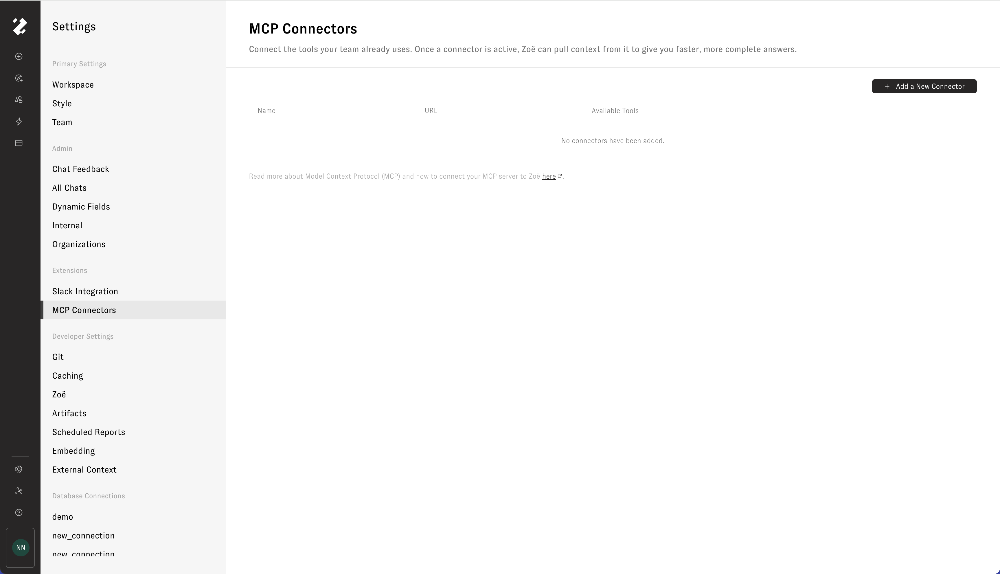
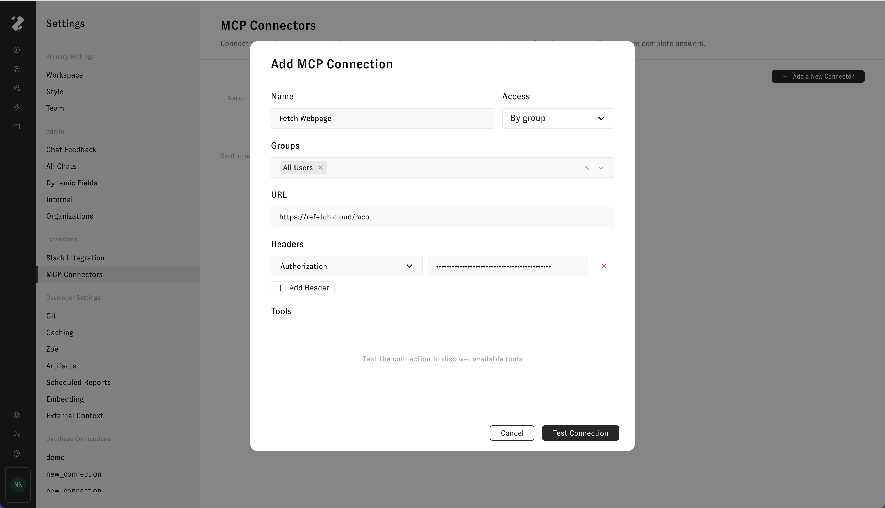
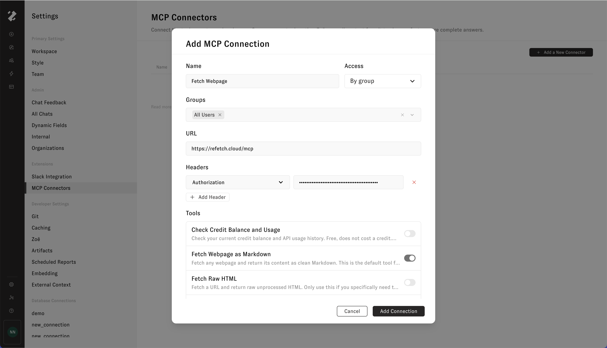
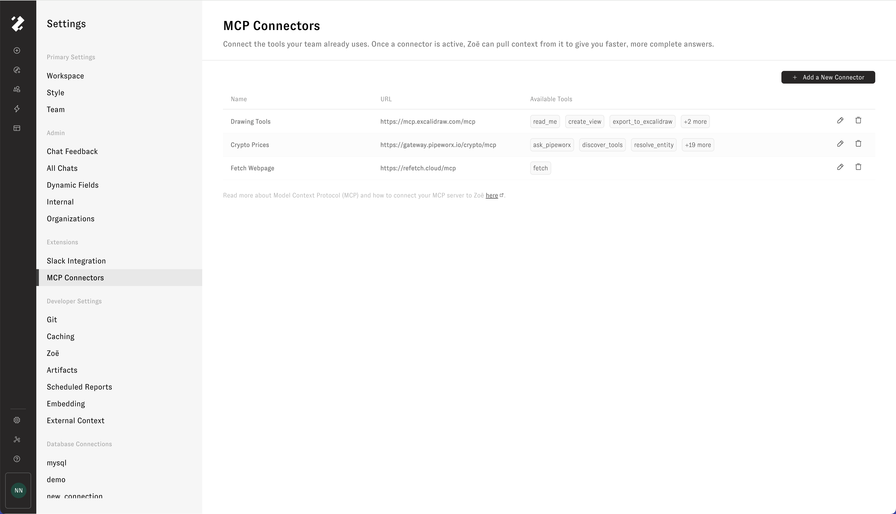

# MCP Connectors (Experimental)

The [Model Context Protocol](https://modelcontextprotocol.io) (MCP) is an open standard for exposing tools to LLM-powered agents like Zoë. Zenlytic acts as an **MCP client**: point Zoë at a compatible remote MCP server, and the tools that server advertises become available alongside Zoë's native ones. When enabled, Zoë can then pull data and trigger workflows from external systems directly from the Zenlytic chat experience.

## What you can do with MCP Connectors

- Pull live metadata, schemas, and lineage from your data warehouse or transformation layer.
- Read workbook, dataset, and report context from your BI tools so Zoë can ground answers in published assets.
- Expose internal APIs and operational workflows to Zoë through your own MCP server, with per-tool control over what she can call.
- Mix and match connections per conversation, so different chats can pull from different combinations of systems.

## How MCP works in Zenlytic

To set up a connection, register the server's HTTPS endpoint and any authentication headers in workspace settings, choose which of the discovered tools Zoë can access, and toggle the connection on per-conversation from the chat tool menu. When Zoë invokes one of your tools, Zenlytic forwards a `tools/call` request to your server, captures the response, and feeds the result back into the conversation.

## Before you begin

To connect any MCP server, confirm the following:

| Requirement | Detail |
| --- | --- |
| **Feature flag** | The `mcp-client` flag must be enabled for your workspace. If you don't see an **MCP** entry under **Workspace Settings → Extensions**, ask your Zenlytic contact to enable it. |
| **Workspace permission** | You need `admin` role to view, add, edit, delete, or refresh connections from Workspace Settings. |
| **A reachable server** | Your server (or the vendor's) must be publicly reachable over HTTPS from Zenlytic's infrastructure. |

## Get started

1. Open **Workspace Settings → Extensions → MCP Connectors** in Zenlytic.

<figure></figure>

2. To connect one of the examples listed below, follow the linked setup guide.
3. To connect an MCP server, click **Add a New Connector**, fill in the name, Access grant, HTTPS endpoint URL, and any authentication headers, then click **Test Connection**.

<figure></figure>

4. Review the discovered tools and toggle off any that Zoë shouldn't be able to call.

<figure></figure>

5. Click **Add Connection** to save.

<figure></figure>

Once a connection is active, open any chat, toggle the connection on from the tool menu, and ask Zoë a question that uses it. Admins can manage, rotate credentials, refresh tools, or delete any MCP connection at any time from the MCP Connectors page in Workspace Settings.

## Example MCP Connectors

Connect Zoë to public MCP servers such as the following by adding connections in workspace settings:

- **DeepWiki** — `https://mcp.deepwiki.com/mcp` — ask questions, read structure, and pull docs for any public GitHub repo indexed on DeepWiki (no auth)
- **Hugging Face** — `https://huggingface.co/mcp` — search models, datasets, and Spaces on the HF Hub. Optionally pass an `Authorization: Bearer <HF_TOKEN>` header for higher limits and access to gated content
- **Cloudflare Docs** — `https://docs.mcp.cloudflare.com/mcp` — Q&A over Cloudflare's product docs (no auth)
- **Context7** — `https://mcp.context7.com/mcp` — up-to-date, version-pinned library and framework documentation (Next.js, React, FastAPI, etc.). Requires a `CONTEXT7_API_KEY` header (free tier at [context7.com](https://context7.com))
- **Excalidraw** — `https://mcp.excalidraw.com/mcp` — create and edit Excalidraw diagrams directly from chat (no auth)
- **Fetch Webpage** — `https://refetch.cloud/mcp` — fetch and parse live webpage content into clean Markdown for Zoë to read. Requires an `X-API-Key` header (free tier at [refetch.cloud](https://refetch.cloud))
- **Crypto Prices** — `https://gateway.pipeworx.io/crypto/mcp` — look up live cryptocurrency prices and market data (no auth)

To discover more public servers, browse MCP directories like [PulseMCP](https://www.pulsemcp.com/) and [Remote MCP Servers](https://mcpservers.org/remote-mcp-servers). Use the following setup guides to connect Zoë to popular tools via their official MCP servers:

- [Tableau](tableau.md) — read workbook, view, and data source metadata.
- [Power BI](powerbi.md) — connect to workspaces, datasets, and reports.
- [Google](google.md) — query tables and inspect schemas directly.
- [Looker](looker.md) - query semantic models and dashboards.
- [dbt](dbt.md) — explore models, metrics, exposures, and lineage.
- [Atlan](atlan.md) — explore models, metrics, assets, and data glossaries.
- [Snowflake](snowflake.md) — query Cortex Analyst, Cortex Search, Cortex Agents, SQL, and your own UDFs.
- [Reltio](reltio.md) — search entities, traverse relationships, and invoke AgentFlow tools.
- [GitHub](github.md) — browse repositories, triage issues and pull requests, and monitor Actions and security alerts.

These guides are provided for general reference, be prepared for some details to vary depending on your specific deployment or license. You can also bring your own MCP server. Any server that implements the streamable HTTP transport for protocol version `2025-03-26` and exposes `initialize`, `tools/list`, and `tools/call` endpoints will work.

## Workflow guides

End-to-end walkthroughs that combine an MCP connection with Zoë to solve a specific problem:

- [Audit a semantic layer with a repo MCP](audit-semantic-layer.md) — point Zoë at the repo that holds your Zenlytic data model so she can read every view at once and recommend the highest-leverage additions. Uses the GitHub MCP for a practical example, with DeepWiki as a read-only alternative for public repos.
