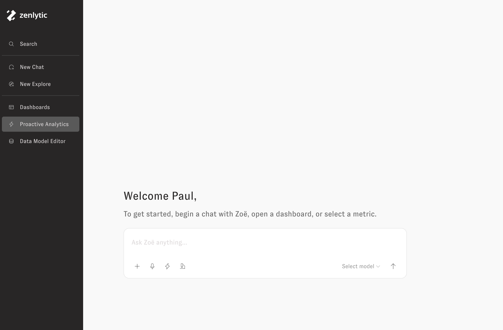
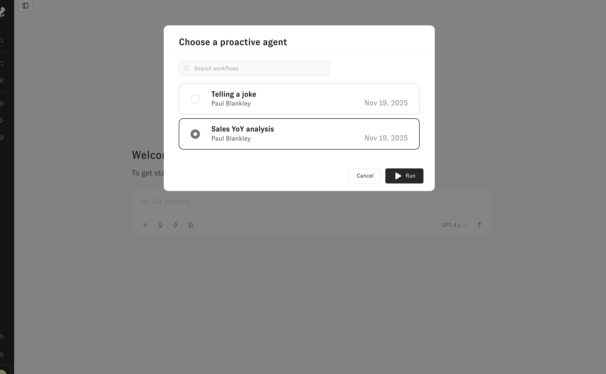
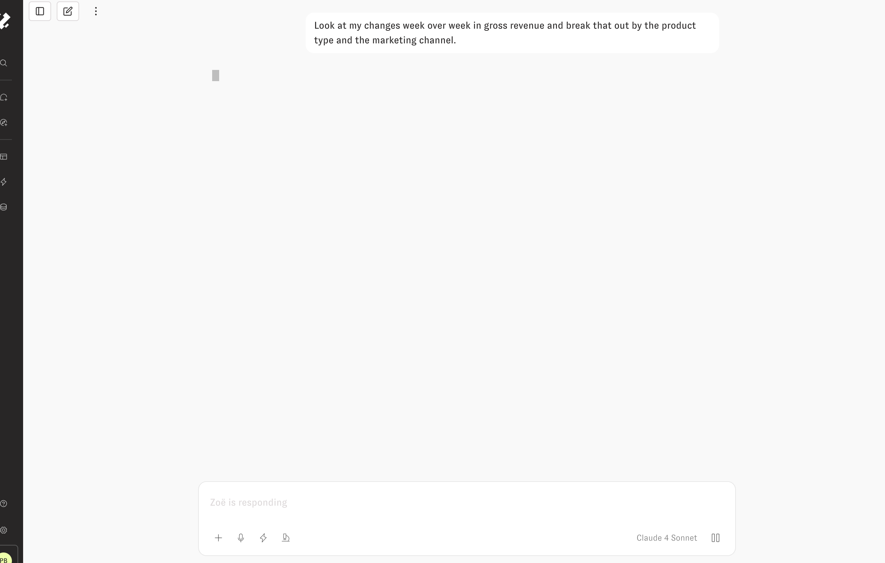
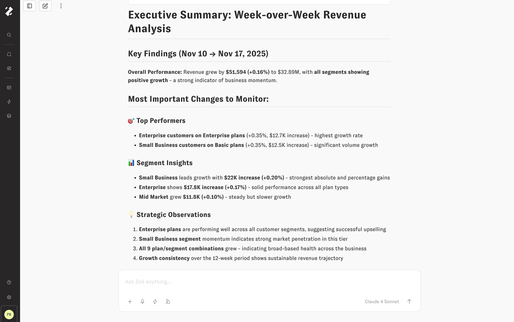
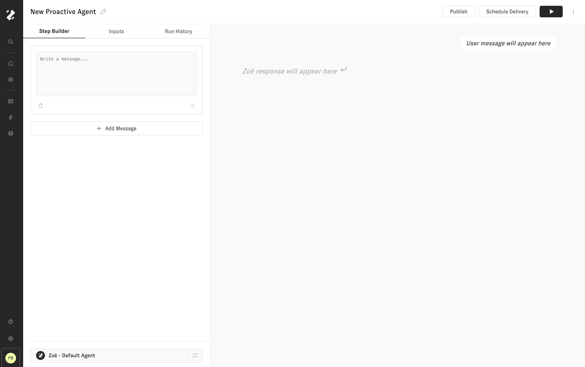
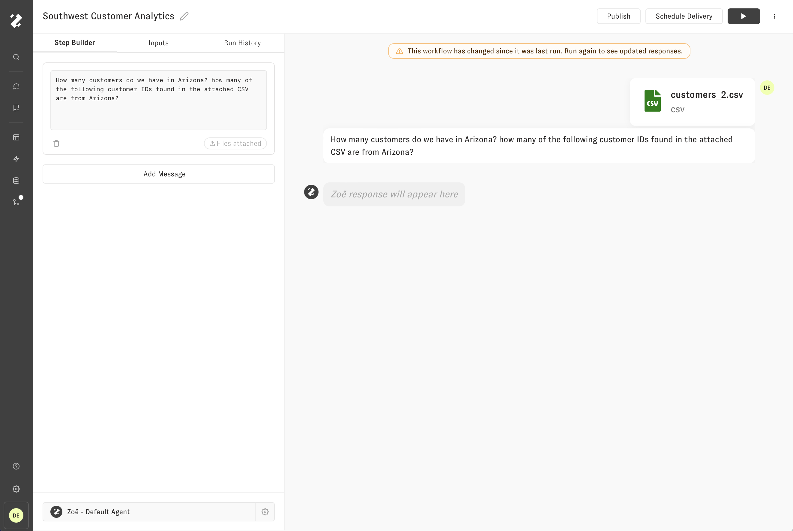

# Proactive Getting Started

Proactive Agents allow us to build and run entire conversations with Zoë, and then enable others in the organization to re-run those conversations easily. With this feature, Zoë is more proactive and reusable for solving task-specific workflows than ever before.

Proactive Agents can be used to automate repetitive data processes, iterate on better Zoë prompts, and much more. Some examples include:

* Building narrative-based weekly business reviews that can be re-run periodically
* Automating a tedious manual process of reconciling CSVs against database data
* Demonstrating chains of thought and other Zoë prompting techniques to new users
* Saving exceptional conversational outputs from Zoë so that the reasoning steps can be reproduced and refined
* Getting lists of products or customers and then having Zoë produce personalized long form promotional content for each one

Proactive Agents are ideal for implementing tasks where you need one or all of the following characteristics:

* You need analytical tasks to be run automatically on a schedule and sent to you when completed
* You need precise control over the exact sequencing of analytical reasoning steps
* You need to query and transform data across multiple conceptual steps
* You need structured, predictable outputs and consistent, formatted results
* The task involves conditional logic - different behaviors should be taken based on intermediate results

## Navigating to Proactive Analytics

1. To view your workflows and create new ones, from the left-hand navigational sidebar, click on ⚡Proactive Analytics

<figure><figcaption></figcaption></figure>

2. To run Proactive Agents from chat, click the ⚡ _Lightning_ icon button in the chat input:

## Running Proactive Agents

After clicking on the ⚡ _Lightning_ icon button, the following modal will appear. Search proactive workflows by name, creator, and creation date. Click a Proactive Agents name and press "Submit" to run it. If a Proactive Agents requires user input before it can run, click the "Next" button to provide the required input values first. More on inputs in the [Requiring User Inputs](../workflows/inputs/) section.

<figure><figcaption></figcaption></figure>

While the Proactive Agent runs, the chat input for the Proactive Agent's conversation will load in it's results. Feel free to navigate away from the Proactive Agent's conversation to other chats or browser tabs while the Proactive Agent is running. Proactive Agents were designed with tasks that take a long time to complete in mind; the Proactive Agent's conversation will update with responses whenever they are available.

<figure><figcaption></figcaption></figure>

## Continuing the Proactive Conversation

That's it! After the Proactive Workflow is completed, the chat input will become available again and we can send follow up messages to continue our analysis with Zoë from wherever the Proactive Workflow completed.

<figure><figcaption></figcaption></figure>

## Viewing Proactive Agents

By clicking the _Proactive Analytics_ option in the left-hand navigational sidebar, you will see a list of Proactive Agents that exist in your workspace. The three-dot menu reveals options to run, duplicate, or delete a Proactive Agents. When you click on a Proactive Agent's name or highlighted row, you will be navigated to the Proactive Agent Builder.

<figure><figcaption></figcaption></figure>

## Creating Proactive Agents

In the upper right-hand side of the screen, you can create new Proactive Agents by pressing _New Proactive Agents_. This button will then navigate you to your new Proactive Agent in the Proactive Agent Builder.

<figure><figcaption></figcaption></figure>

## Editing Proactive Agents

By default, the newly created Proactive Agent will be titled "New Proactive Agent" and contain no messages. We can click the Proactive Agent title and type to change the title. The new name will be saved with an outside click or "Enter" keypress.

Proactive Agents allow us to define an entire "script" of messages that will be added to a conversation and run in sequence. Let's click on the _Add Message_ button in the _Step Builder_ tab to get started.

<figure><figcaption></figcaption></figure>

After adding the first message to the Proactive Agent, check the preview on the right to see how that message will be added to the conversation when run. Because we haven't added any message content yet, the Proactive Agent preview is showing placeholder text.

<figure><figcaption></figcaption></figure>

Click the text area labeled "Write a message…" to edit the first message in the Proactive Agent. Type the new prompt, then click outside the text area or hit _Enter on your keyboard_ to save the changes. Once saved, the text content of the message in the _Step Builder_ tab on the left-hand side should correspond with the text content of the first user message in the Proactive Agent conversation preview on the right-hand side.

Click on the _Play_ button in the upper right-hand section to preview a Run of our single-message Proactive Agent.

<figure><figcaption></figcaption></figure>

When running, the Proactive Agent messages will temporarily be unavailable to edit. The Proactive Agent run can be cancelled at any time by pressing the _Pause_ button in the upper right-hand section. The current Proactive Agent message being run will be distinguished by a pulsing black outline. The respective message in the Proactive Agents conversation preview will read "Zoë is generating a response…" until it is available.

When the Proactive Agent conversation preview has completed its run, we can inspect its output, run it again, or we can modify the Workflow before running again. The _Trash_ icon button will remove the message from the Proactive Agent. The _Upload_ icon button will allow you to attach files to the Proactive Agent message.

## Building more advanced Proactive Agents

In the following example, three additional messages have been added to the Proactive Agent we previously ran, and this is represented by the Proactive Agent conversation preview on the right-hand side by three placeholder responses following each message that hasn't been run yet.

When the Play button is clicked in the upper right header, the Proactive Agent starts running from the beginning, and responses are generated for the newly added messages. The image below shows the updated, completed Proactive Agent.

## Run from Here

When writing new Proactive Agents, you may find yourself making small changes to messages and often re-running the conversation preview. In the previous section, the last Proactive Agent message prompted Zoë to generate a "concise executive summary". If we wanted to run the Proactive Agent again, but this time generating a "comprehensive final report", We can modify the text of the message we want to change, and then use the _Run from Here_ button to run the Proactive Agent from that point. The most recent run of the conversation preview will be re-used for all messages from before the new starting point.

When making changes to the Proactive Agent messages, you may find yourself using a combination of running from the start and running from a point as you hone into the perfect message prompts.

## File Attachments

Files can be added to Proactive Agent messages by pressing the _File Upload_ icon button in the message card. When the Proactive Agent has `file attachment` type Inputs available, the Upload icon button will appear as a Plus icon and open a detail menu including the option to attach an uploaded file or require one from the user. Once a file attachment or input is selected, the conversation preview on the right side will add the attachment above the text content. The Upload/Plus icon button within the message card will change to a Chip and indicate that a File is attached or an Input is required.

## Create Proactive Agent from an existing Conversation

From an existing chat, we can click the "Save as Proactive Agent" button in the three-dot dropdown menu to create a new Proactive Agent from the outline of an existing chat. It will be saved in the Proactive Agents tab, and you can navigate to it in the future by hovering over the left-hand navigation side bar and clicking on 'Proactive Agents'. You can also run the new Proactive Agent immediately by clicking the Lightning icon button in the Chat input box and selecting the latest Proactive Agent.

<figure><figcaption></figcaption></figure>
