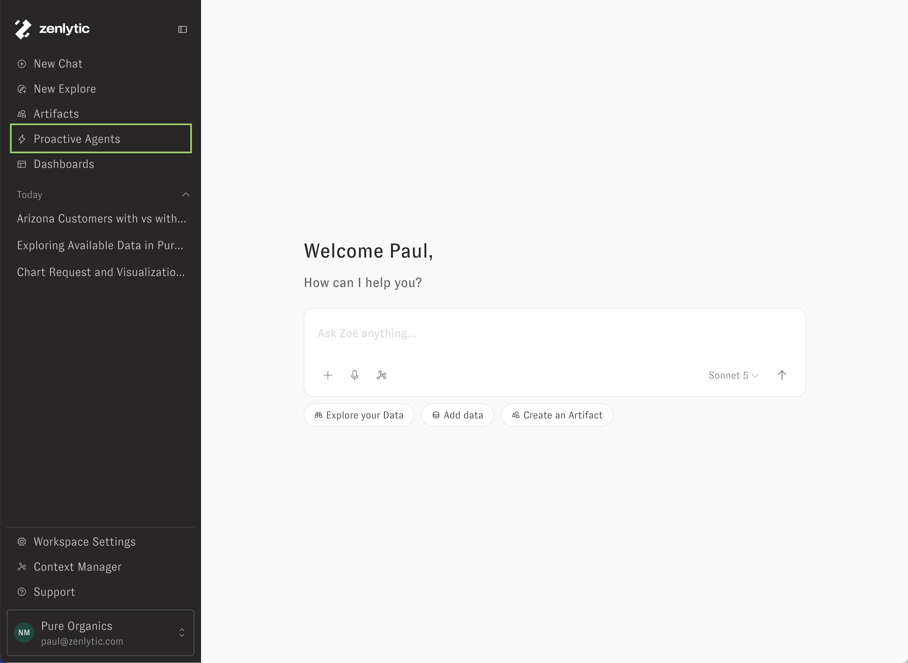
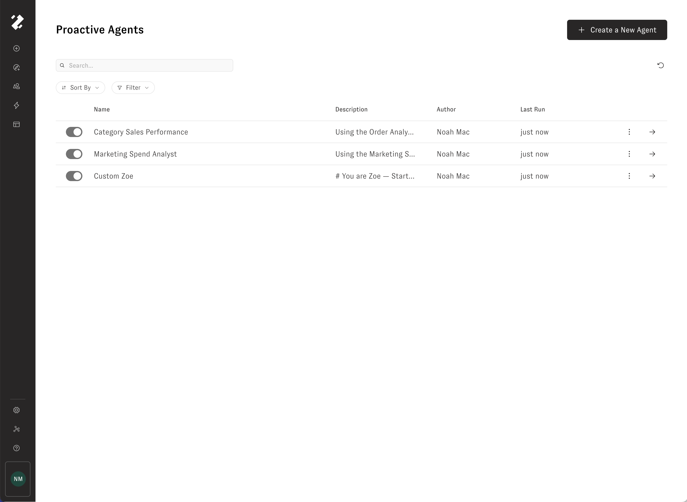
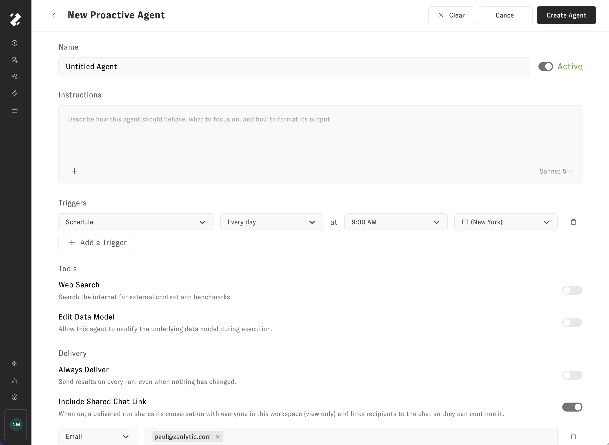
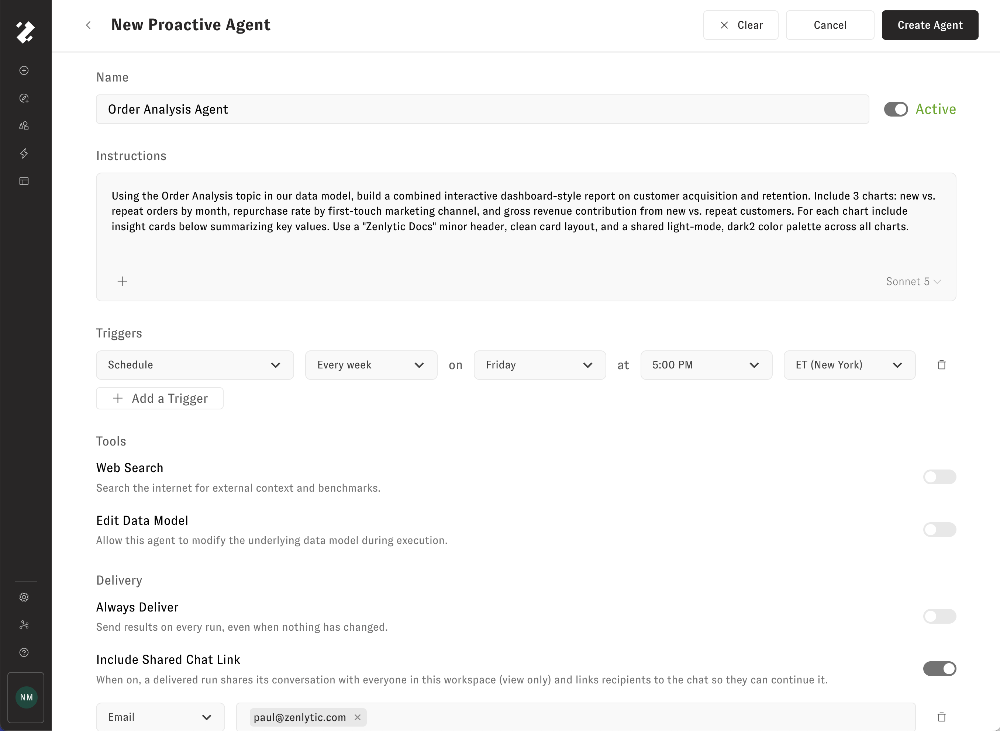
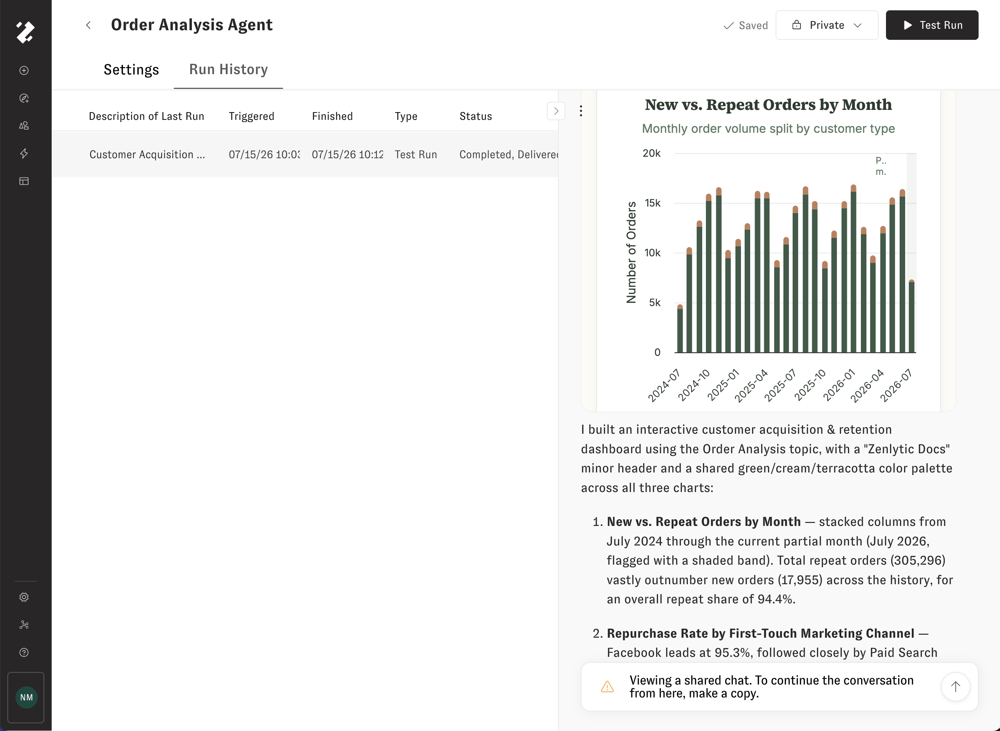
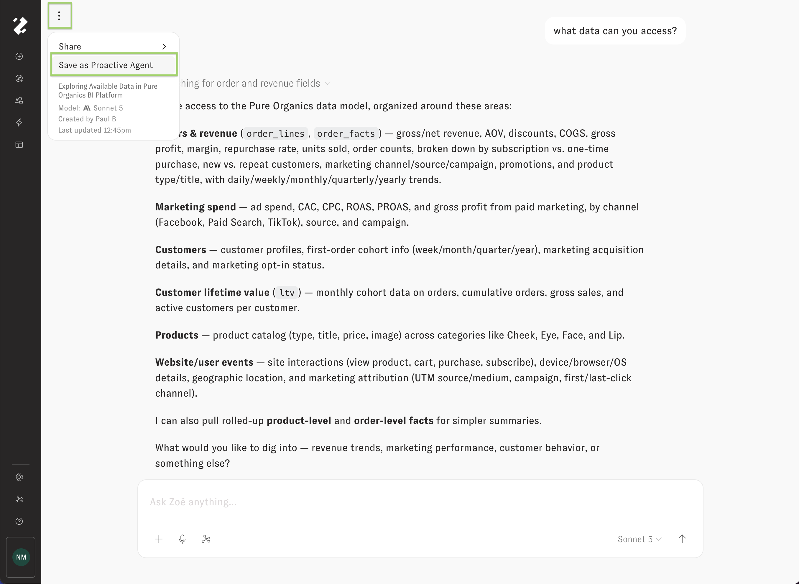

# Proactive Getting Started

Proactive Agents allow us to build and run entire conversations with Zoë, and then enable others in the organization to re-use those conversations easily. With this feature, Zoë is more proactive and reusable for solving task-specific analyses than ever before.

Proactive Agents can be used to automate repetitive data processes, iterate on better Zoë prompts, and much more. Some examples include:

* Building narrative-based weekly business reviews that can be re-run periodically
* Automating a tedious manual process of reconciling CSVs against database data
* Demonstrating chains of thought and other Zoë prompting techniques to new users
* Saving exceptional conversational outputs from Zoë so that the reasoning steps can be reproduced and refined
* Getting lists of products or customers and then having Zoë produce personalized long form promotional content for each one

Proactive Agents are ideal for implementing tasks where you need one or all of the following characteristics:

* You need analytical tasks to be run automatically on a schedule and sent to you when completed
* You need precise control over the exact sequencing of analytical reasoning steps
* You need to query and transform data across multiple conceptual steps
* You need structured, predictable outputs and consistent, formatted results
* The task involves conditional logic - different behaviors should be taken based on intermediate results

## Navigating to Proactive Agents

1. To view your Proactive Agents and create new ones, from the left-hand navigational sidebar, click on ⚡Proactive Agents

<figure><figcaption></figcaption></figure>

## Viewing Proactive Agents

By clicking the _Proactive Agents_ option in the left-hand navigational sidebar, you will see a list of Proactive Agents that exist in your workspace. The three-dot menu reveals options to run, duplicate, or delete a Proactive Agent. When you click on a Proactive Agent's name or highlighted row, you will be navigated to the Proactive Agent Builder.

<figure><figcaption></figcaption></figure>

## Creating Proactive Agents

In the upper right-hand side of the screen, you can create new Proactive Agents by pressing _Create a New Agent_. This button will then navigate you to the Proactive Agent Builder.

<figure><figcaption></figcaption></figure>

## Editing Proactive Agents

By default, the newly created Proactive Agent will be titled "New Proactive Agent" and contain no instruction details. We can click the Proactive Agent title and type to change the title. The new name will be saved with an outside click or "Enter" keypress.

Proactive Agents allow us to define a specific Zoe task that will be run as a conversation. Let's click through the form options on this _New Proactive Agent_ page to get started. Click on the _Test Run_ button in the upper right-hand section to preview a run of our new Proactive Agent.

<figure><figcaption></figcaption></figure>

When the Proactive Agent conversation preview has completed its run, we can inspect its output, run it again, or we can modify the Proactive Agent before running again.

## File Attachments

Files and workspace Artifacts can be added to Proactive Agent instructions as attachments by pressing the _Plus_ icon button in the Instruction textarea's bottom left corner.

## Create Proactive Agent from an existing Conversation

From an existing chat, we can click the "Save as Proactive Agent" button in the three-dot dropdown menu to create a new Proactive Agent from the outline of an existing chat. It will be saved in the Proactive Agents tab, and you can navigate to it in the future by hovering over the left-hand navigation side bar and clicking on 'Proactive Agents'.

<figure><figcaption></figcaption></figure>
