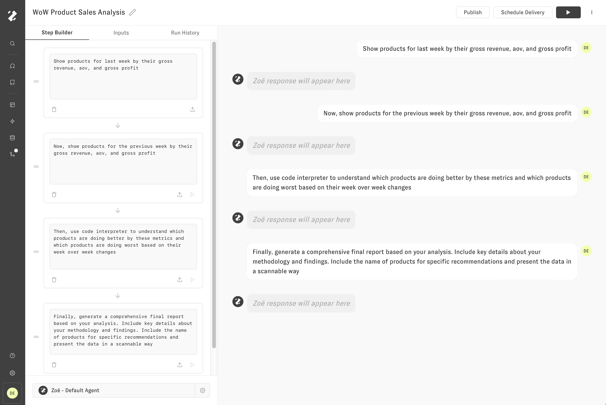
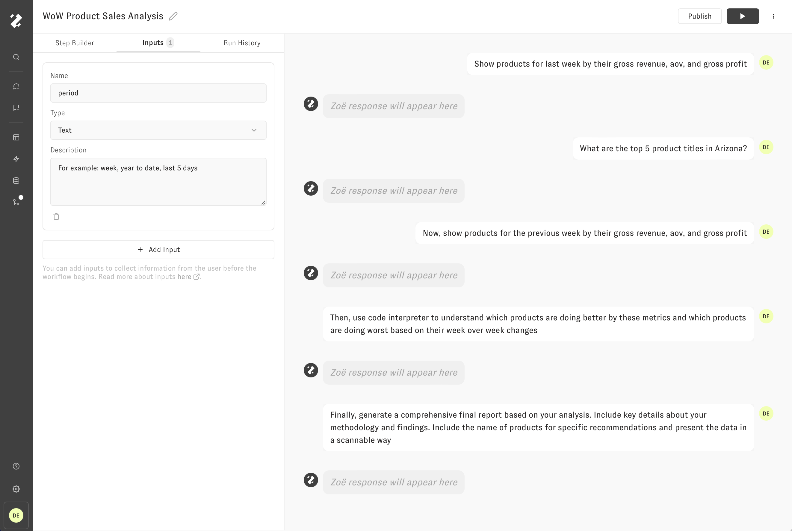
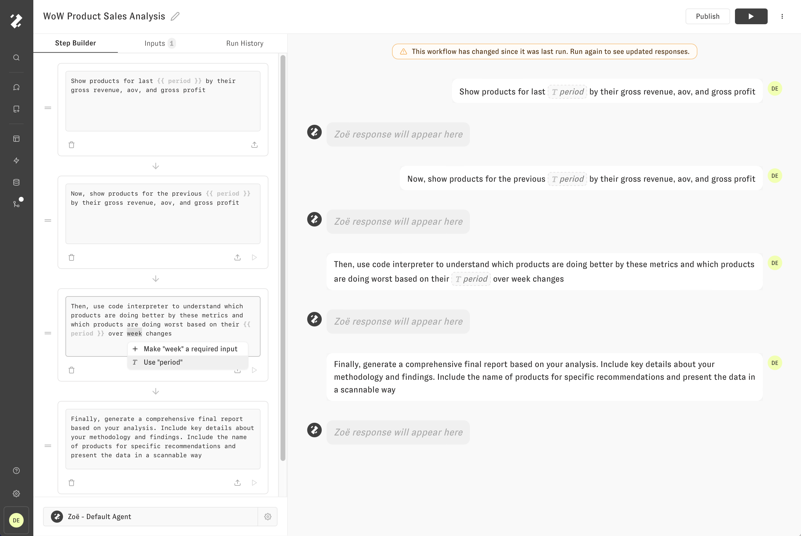
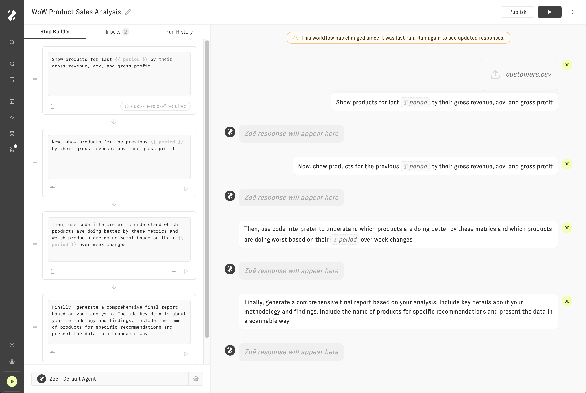
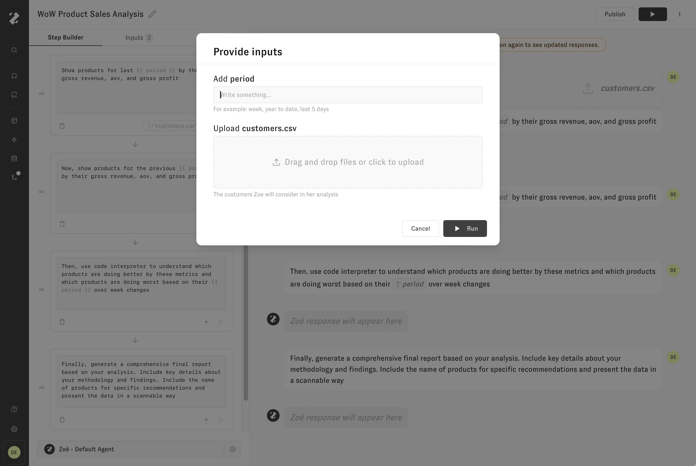

# Inputs

Inputs are used to collect information from the user before the Proactive Agent begins. Consider the following example, where Zoe is taking a look at products in a week over week analysis. With inputs, it's possible to make this Proactive Agent run differently depending on the user's input.

Let's click the "Inputs" tab within the left panel and create a new input named "period". Input names must be unique, not empty, and a single word without whitespace. Inputs are like variables that will be replaced with the information the user provides when the Proactive Agent is run. The types of inputs currently supported are `text`, `select`, and `file attachment`. In the following image, I've added a text input with a description entry that helps the Proactive Agent runner understand what kind of value they should provide.

Now that our Input has been created, we have to modify the Proactive Agent messages to use the Input instead of the existing hard-coded value. In the message editor, access `text` and `select` inputs with the "braces" syntax: `{{ input_name }}` . Inputs can automatically be created or inserted from a valid text selection. An autocomplete menu will also appear after typing `{{` when there are available inputs. In the Proactive Agent preview on the right, a dashed variable chip will represent the input value that will be provided by the Proactive Agent runner.

In the following image, another input was created and added to the first Proactive Agent message. The file attachment input is shown in the bottom right of the card and can be changed or removed by clicking the chip. In the Proactive Agent preview on the right, a dashed region above the user message represents the input file that will be uploaded by the Proactive Agent runner.

Now, when the Proactive Agent is run, the user will first be presented with a modal to provide input values. Once the values are provided, and "Run" button is pressed, the conversation preview will show the "filled in" values of the inputs.

That's it! Inputs are an important tool in crafting Workflows for your organization that are highly flexible and can incorporate data from outside the data model such as CSVs.
