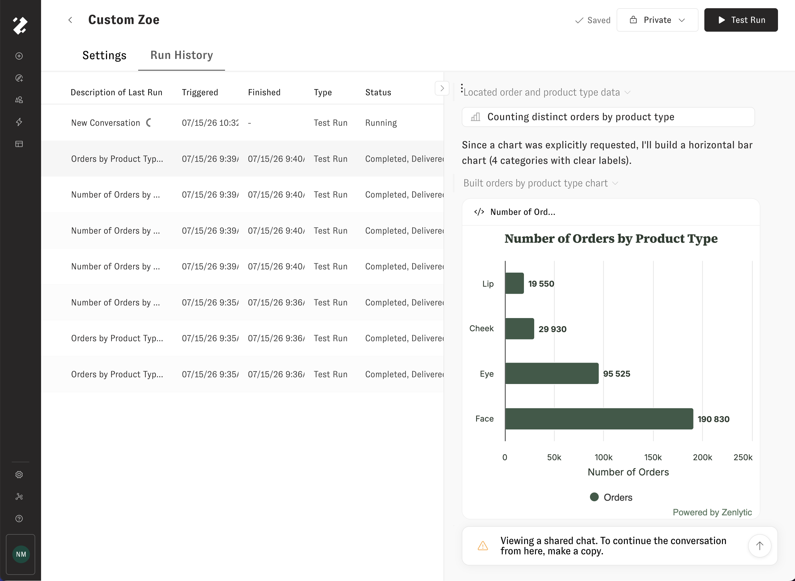

# Run History

The _Run_ _History_ tab provides a list of previous runs of the currently selected Proactive Agent. By clicking on a run on the left-hand side, the conversation preview on the right-hand side will change to show that previous run's conversation history.

<figure><figcaption></figcaption></figure>
