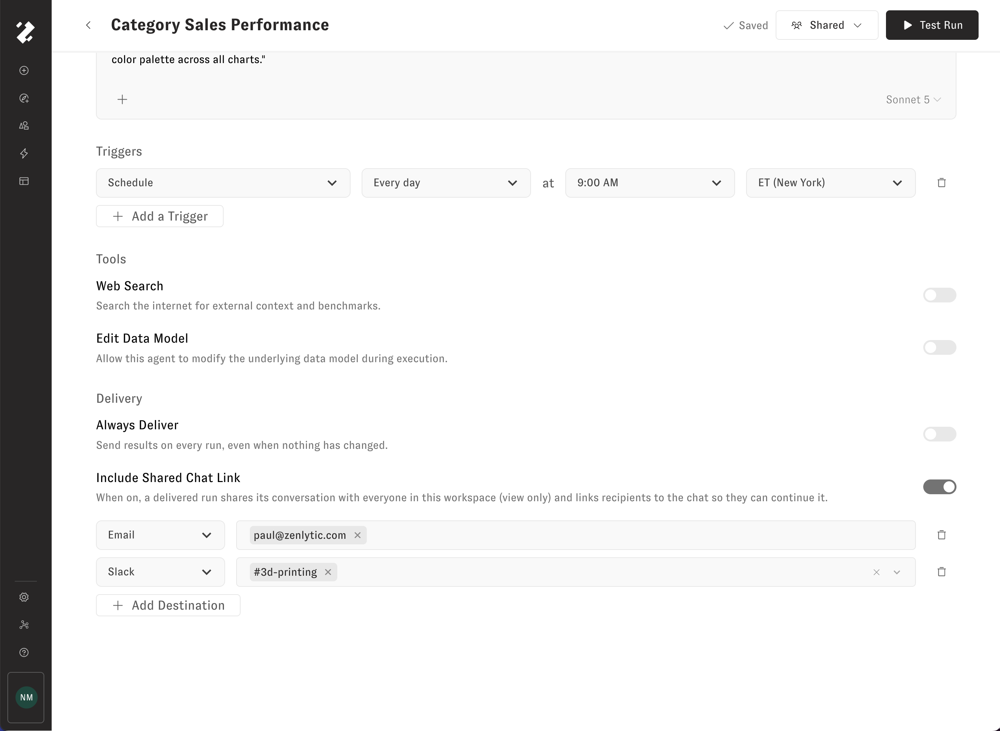

# Schedule Delivery

At the bottom of the Proactive Agent Builder, click "Add Destination" to create a new email or slack delivery destination for this Proactive Agent. By default, there will be a single delivery destination to the Proactive Agent's creator by email. 

On this page we have multiple options for configuring our scheduled delivery, such as name, cadence (When and how frequently to send), and destination (Email or Slack). Once the scheduled delivery has been created, we can also edit or delete the scheduled delivery from this form. From the button in the upper-right, click "Test Run" to trigger the Proactive Agent delivery manually at any time.

When the "Always Deliver" option is disabled, the Proactive Agent will review the conversation outputs before deciding whether to send the result to the delivery destination.

<figure><figcaption></figcaption></figure>
