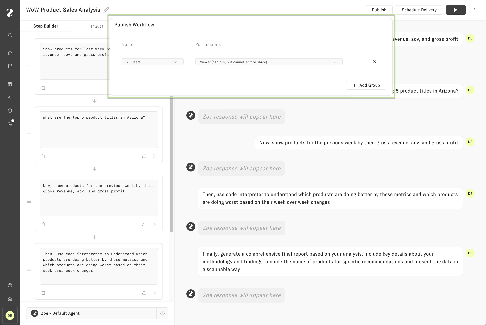

---
layout:
  title:
    visible: true
  description:
    visible: false
  tableOfContents:
    visible: true
  outline:
    visible: true
  pagination:
    visible: true
---

# Publish

By default, Workflows are private to you, however, we can allow others in our organization to run and extend our Workflows when they are ready. The following image shows the "Publish Workflow" popover that appears after clicking "Publish" in the Workflow Builder Header.

After pressing '+ Add Group', we can select a workspace 'group' and give the group an 'access level' of Viewer, Editor, and Owner. For example, I've given all users in my workspace the ability to View the following Workflow. See the table below for more detail on Workflow access levels.

| **Access Level** | **Description**                                |
| ---------------- | ---------------------------------------------- |
| OWNER            | can run, edit, and share the Workflow          |
| EDITOR           | can run and edit the Workflow, but not share   |
| VIEWER           | can run the Workflow, but cannot edit or share |

