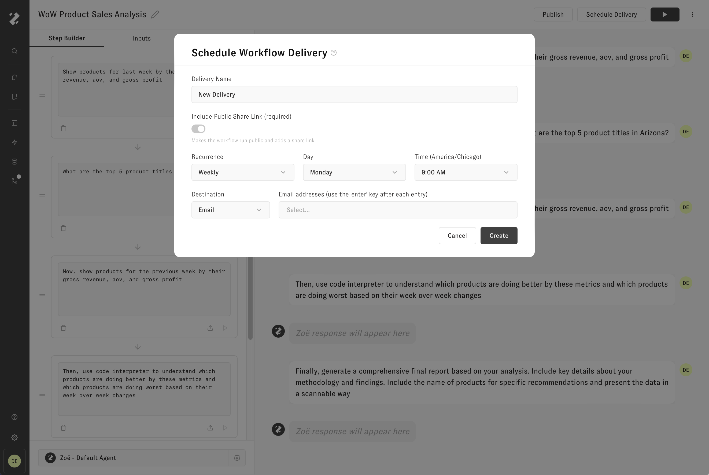
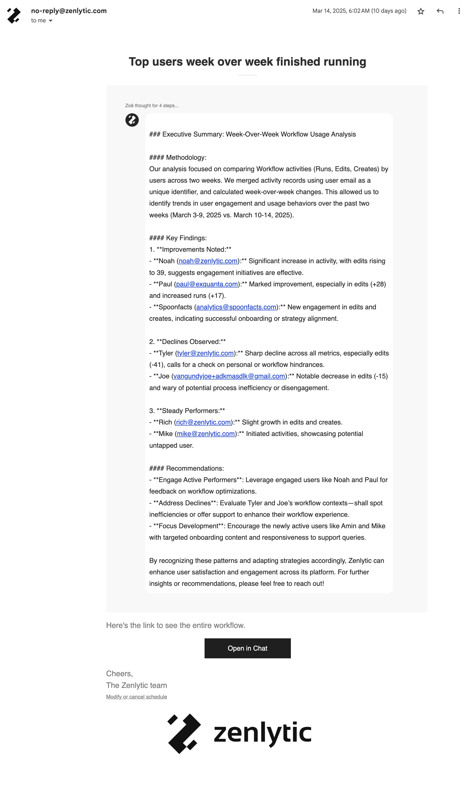

---
layout:
  title:
    visible: true
  description:
    visible: false
  tableOfContents:
    visible: true
  outline:
    visible: true
  pagination:
    visible: true
---

# Schedule Delivery

Next to the Run Preview "Play" button, we can click "Schedule Delivery" to open a modal for managing delivery schedules for this Workflow. By default, there will be no schedules, so click "Create New Delivery" to get started.

On this page we have multiple options for configuring our scheduled delivery, such as name, cadence (When and how frequently to send), and destination (Email or Slack). Once the scheduled delivery has been created, we can also edit or delete the scheduled delivery from this form. From the list of scheduled deliveries, we can click "Send a copy now" to test the Workflow delivery at any time.

The following image shows an example delivery from the schedule we created in the previous step.

