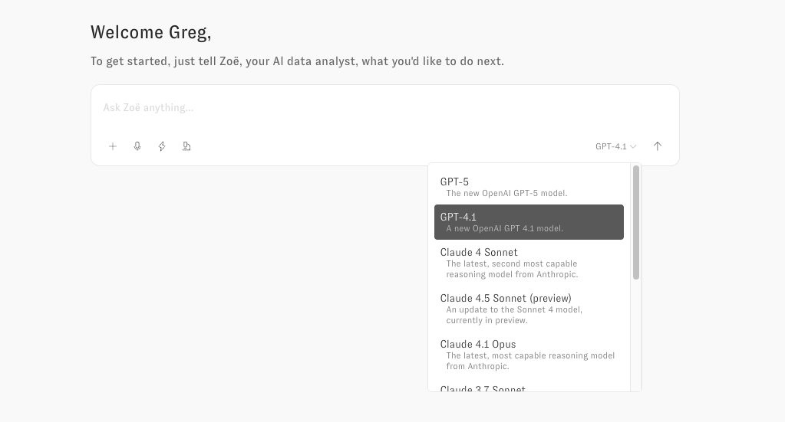

# AI Model Selection Guide

<figure><figcaption></figcaption></figure>

## Recommended Models

### Claude Sonnet 4.5

Your go-to for most business questions - Exceptional at causal analysis, pattern recognition, and understanding complex business context.

* Example: "Why did our conversion rate drop last quarter and what factors contributed?"
* Example: "Analyze the relationship between marketing spend and customer lifetime value"

### GPT 4.1

Your choice for speed and precision - Fast responses with exceptional ability to follow specific instructions and formatting requirements.

* Example: "Extract Q3 metrics in this exact format: \[Metric] | \[Value] | \[Change %]"
* Example: "List top 10 products by revenue (quick check)"

***

## Other Available Models

### Claude Opus 4.1

Deep strategic analysis with unmatched causal reasoning for your most critical decisions.

* Example: "Provide a comprehensive analysis of market entry risks for our expansion"
* Example: "What are all the factors affecting our unit economics and their interdependencies?"

### Claude Sonnet 4

Reliable balanced performance similar to 4.5 but with slightly less advanced capabilities.

* Example: "Compare this month's performance to last month"
* Example: "What are the main drivers of customer satisfaction?"

### GPT-5

Advanced model for complex predictive analytics and multi-variable scenario modeling

* Example: "Model 5-year revenue impact across 50 different market scenarios with economic variables"
* Example: "Predict customer lifetime value using behavioral, demographic, and macroeconomic factors with confidence intervals"

### GPT-4o

Deprecated in favor of GPT 4.1.

* Example: "Create a Python script to analyze this sales data"
* Example: "Calculate the statistical significance of our A/B test results"

### Claude Sonnet 3.5 / 3.7

Deprecated in favor of Claude 4.5 Sonnet.

* Example: "What's our current monthly recurring revenue?"
* Example: "Summarize yesterday's sales figures"

### Gemini 2.5 Pro / Flash

Alternative models for basic queries (not optimized for Zenlytic environment).

* Example: Basic metric queries
* Example: Simple data summaries
