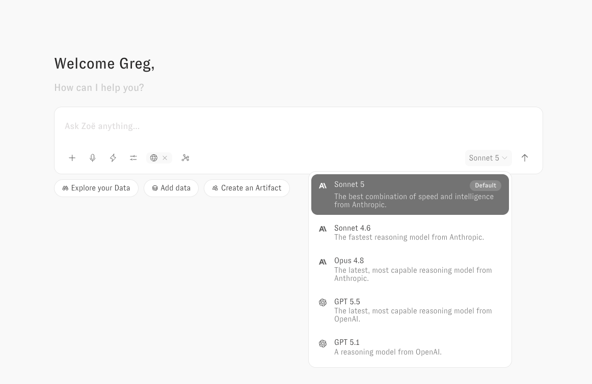

# AI Model Selection Guide

Zoë supports multiple AI models that you can switch between using the model dropdown in the chat interface. Each model has different strengths, and the best choice depends on your data model complexity, the types of questions your team asks, and your preference for speed versus depth.


**Default model:** Claude Sonnet 5 is the default for all workspaces.


<figure><figcaption></figcaption></figure>

## Recommended Models

### **Claude Sonnet 5 (Default)**

The best balance of speed, accuracy, and analytical depth for most workspaces. Sonnet 5 is the default model and the recommended starting point for all users.

Strengths:

* Self-correcting — detects data quality issues mid-query and fixes them automatically without user intervention
* Strong instruction adherence — reliably follows guidance in field descriptions, topic descriptions, and system prompts
* Proactive interpretation — flags data anomalies, provides contextual narratives, and suggests follow-up analysis
* Handles complex multi-step queries including CTEs, window functions, and cross-table comparisons, with improved consistency on longer analytical chains over the previous default

Best for: General-purpose analytics, business reporting, trend analysis, and most day-to-day questions across any data model.

### Claude Opus 4.8

The most capable model available. Opus 4.8 delivers the deepest analysis and the most autonomous error recovery, making it ideal for complex data models and messy data.

**Strengths:**

* Fully autonomous — makes reasonable assumptions and delivers answers without asking clarifying questions
* Systematic error recovery — when a query returns unexpected results (nulls, zero values, broken data), Opus investigates the root cause across multiple queries and resolves the issue without user intervention
* Domain-aware — discovers business context like fiscal calendar boundaries and applies them automatically
* Highest SQL complexity ceiling — handles the most sophisticated analytical queries

**Best for:** Complex data models with many joins, workspaces with known data quality issues (null values, promotional records, inconsistent categorization), strategic analysis, and advanced analytical questions like price elasticity or forecasting.

**Trade-off:** Slower and more expensive per query than Sonnet models. For simple, well-structured data models with straightforward queries, Sonnet 5 may be equally effective and faster.

## Additional Available Models

### Claude Sonnet 4.6

The best balance of speed, accuracy, and analytical depth for most workspaces. Sonnet 4.6 is the default model and the recommended starting point for all users.

**Strengths:**

* Self-correcting — detects data quality issues mid-query and fixes them automatically without user intervention
* Strong instruction adherence — reliably follows guidance in field descriptions, topic descriptions, and system prompts
* Proactive interpretation — flags data anomalies, provides contextual narratives, and suggests follow-up analysis
* Handles complex multi-step queries including CTEs, window functions, and cross-table comparisons

**Best for:** General-purpose analytics, business reporting, trend analysis, and most day-to-day questions across any data model.

### GPT 5.5

Available for teams that prefer or require an OpenAI model.

**Strengths:**

* Highest methodology transparency — structures responses with clear sections explaining what data was queried, what issues were found, and what limitations exist
* Functional for standard reporting queries, metric extraction, and straightforward analytics

**Considerations:** GPT 5.5 may ask clarifying questions before executing when it encounters ambiguity, which adds round-trips to the conversation. It also provides less autonomous error recovery — when queries fail or return unexpected results, it tends to explain the problem and ask for user guidance rather than self-correcting. Longer field descriptions and complex multi-paragraph guidance may be followed less reliably than with Anthropic models.

**Best for:** Teams that prefer OpenAI, or users who value detailed methodology explanations over speed-to-answer.

### GPT 5.1

Available for teams that prefer or require an older OpenAI model. We would recommend using GPT 5.5 instead of this model in most scenarios.

## How to Choose

| Scenario                                                 | Recommended Model      |
| -------------------------------------------------------- | ---------------------- |
| The best combination of speed and intelligence           | **Sonnet 5** (default) |
| Complex data model with many joins                       | **Opus 4.8**           |
| Data has known quality issues (nulls, edge cases)        | **Opus 4.8**           |
| Speed is the top priority, data model is clean           | **Sonnet 4.6**         |
| Advanced analysis (elasticity, forecasting, statistical) | **Opus 4.8**           |
| Team prefers OpenAI                                      | **GPT 5.5**            |
| Not sure which to pick                                   | **Sonnet 5** (default) |
