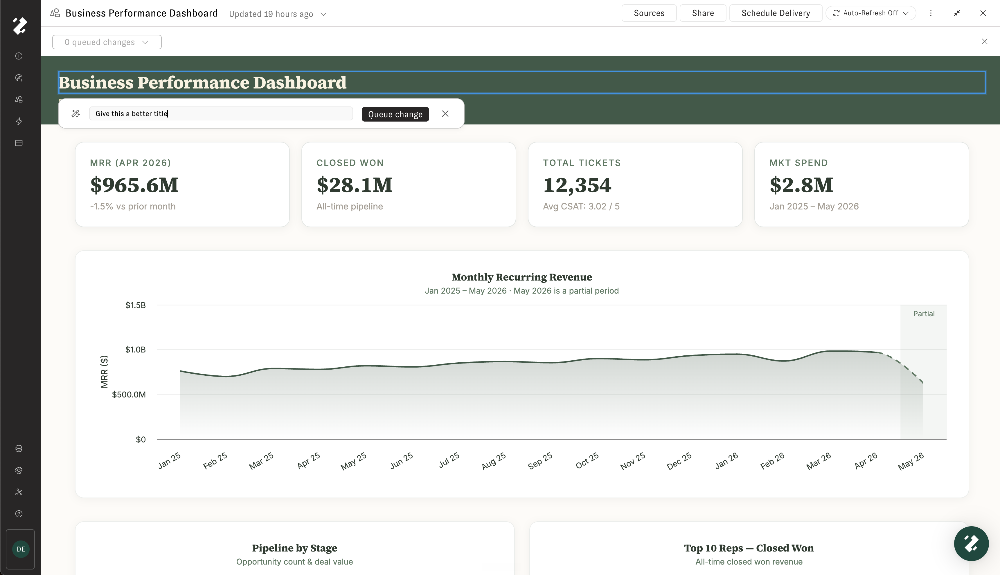
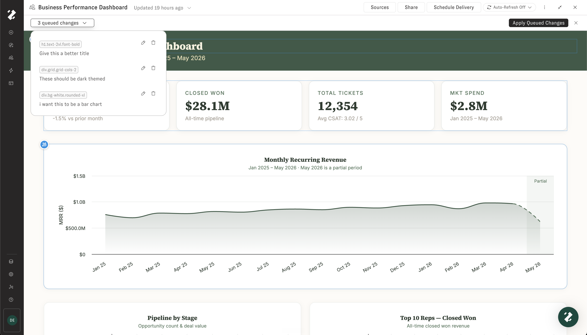
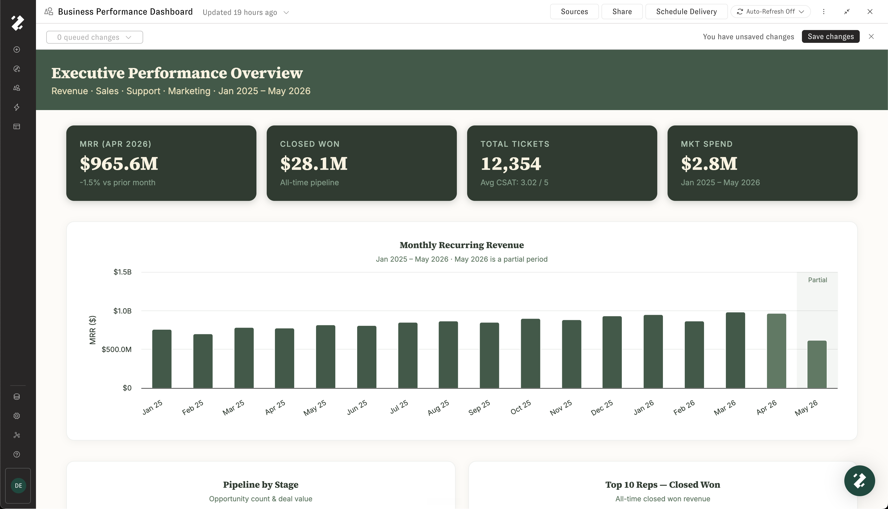
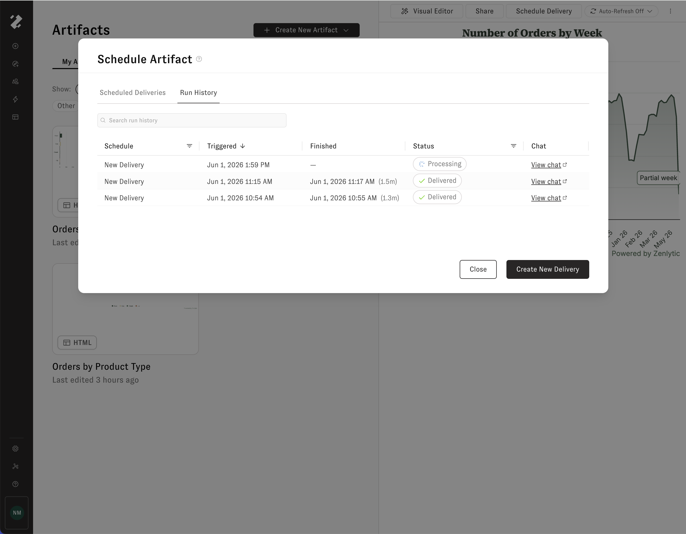
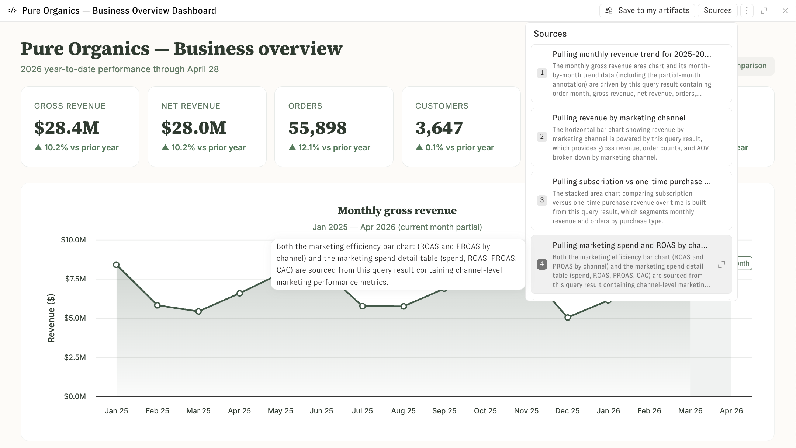

# Artifacts

Artifacts are rich, interactive outputs that Zoë creates for you. They can be a wide variety of types — interactive apps, written documents, data spreadsheets, slide presentations, and more. Use the Artifacts page to organize, revisit, and share everything Zoë has built across your conversations.

## What makes up an artifact

Each artifact bundles together four components:

* **Output file** — The document you see and share (an HTML dashboard, chart, spreadsheet, PDF, or image).
* **Source code** — The code Zoë used to generate it.
* **Data files** — The CSVs and SQL results used as inputs.
* **Memory** — An auto-generated summary of the artifact's purpose, context, and change history.

## Viewing your artifacts

Click **Artifacts** in the left-hand navigation sidebar to see all of your saved artifacts. Use the tabs at the top to switch between:

* **My Artifacts** — Artifacts you've created.
* **Shared With Me** — Artifacts others in your organization have shared with you.

Each artifact displays a thumbnail preview, its name, and when it was last edited. Filter by type using the chips below the tabs — **All Artifacts**, **Apps**, **Documents**, **Spreadsheets**, **Presentations**, or **Other** — to quickly narrow down what you're looking for. Use the search bar in the upper right to find a specific artifact by name.

<figure><figcaption></figcaption></figure>

## Organizing artifacts with folders

Artifact folders let teams organize saved artifacts into shared workspace areas. A personal artifact can be shared directly with users or groups; once it is moved into a folder, the folder controls who can access it.

For more on how folders work, see [Artifact Folders](artifact-folders.md). For access levels, direct shares, groups, and troubleshooting, see [Artifact Folder Permissions](artifact-folder-permissions.md).

## Artifacts in chat

Zoë creates artifacts automatically whenever a visual output would be helpful — or when you ask her to build something. Artifacts appear inline in the chat, and you can click on one to expand it in the side drawer.

<figure><figcaption></figcaption></figure>

If an artifact is something you'd like to keep and come back to, click **Save to my artifacts**. The artifact will then appear in your Artifacts gallery alongside everything else you've saved.

<figure><figcaption></figcaption></figure>

## Creating a new artifact

You can also create artifacts directly from the Artifacts page. Click the **+ Create New Artifact** button in the upper right corner. A dropdown lets you choose the type of artifact to create:

* **App** — An interactive application.
* **Document** — A rich text document.
* **Spreadsheet** — A data spreadsheet.
* **Presentation** — A slide presentation.
* **Other** — Any other artifact type.

Selecting a type opens a new chat with Zoë where you can describe what you'd like to create.

<figure><figcaption></figcaption></figure>

## Opening and editing an artifact

Click any artifact on the Artifacts page to open it in a side drawer. From the drawer you can preview the artifact, share it with others in your organization, or schedule it for automatic refresh.

<figure><figcaption></figcaption></figure>

To edit an artifact, click **Edit in a new chat** from the three-dot menu in the drawer header. This opens a new chat with the artifact attached, so you can tell Zoë what you'd like to change. Zoë will update the artifact and a new version will appear in the [update history](artifacts.md#update-history).

<figure><figcaption></figcaption></figure>

## Visual Editor


**The Visual Editor is only available for HTML-based artifacts.** Use it for artifacts like dashboards, charts, and other custom apps.


Open the **Visual Editor** from the artifact menu bar to make targeted changes directly on the artifact. Move your mouse around the document to see a blue rectangle around the element you are selecting. Click the element you want to change, write a short description of the change, and click **Queue change**.

<figure><figcaption></figcaption></figure>

You can queue up to 20 changes before applying them. Open the queued changes menu to review everything you have queued, edit a change, or remove a change before applying it.

<figure><figcaption></figcaption></figure>

When your queued changes are ready, click **Apply Queued Changes**. Review the updated artifact, then click **Save Changes** if you are happy with the result. Saving creates a new version of the artifact in the [update history](artifacts.md#update-history).

<figure><figcaption></figcaption></figure>

If you do not like the result, queue more changes and apply them again, or close the Visual Editor without saving.

## Update history

Every artifact uses immutable, append-only versioning — nothing is overwritten or deleted. New versions are created when you edit the artifact and save your changes, or when a scheduled refresh runs.

Click the **Updated** timestamp on an artifact to open its update history. The history panel displays every version of the artifact, letting you time-travel through past states. Each version includes an edit message describing what changed.

From the three-dot menu on any version, you can:

* **View Artifact Memory** — See the context Zoë used when creating that version.
* **Download** — Download the artifact as it existed at that point in time.
* **Edit from this version** — Start a new edit based on an older version of the artifact.

<figure><figcaption></figcaption></figure>

## Auto refresh

Keep an artifact's data up to date by enabling auto refresh. When turned on, Zoë automatically re-pulls the data and rebuilds the artifact on a schedule — so your dashboard, presentation, or writeup is always ready with live data.

Click the **Auto-Refresh Off** button in the artifact drawer header to open the auto refresh settings. Toggle **Enable auto refresh**, then configure:

* **Frequency** — How often to refresh (daily, weekly, monthly, or a custom cron expression).
* **Time** — What time of day to run the refresh, shown in your local timezone.
* **Instructions** — Optional directions for Zoë to follow during each refresh. For example: "Highlight any outliers in the data and write short blurbs about their trends."

Click **Save** to apply the schedule.

<figure><figcaption></figcaption></figure>

To run a refresh immediately without waiting for the next scheduled time, click **Refresh now**.

Every refresh appears in the artifact's [update history](artifacts.md#update-history), so you can see how the artifact has changed over time.

## Delivery

Artifacts can be delivered on a recurring schedule to **email** or **Slack**. A single artifact can have multiple delivery schedules — for example, email to leadership on Mondays and Slack to #data-team daily.

### Email delivery

* Inline thumbnail preview of the artifact.
* Optional file attachment.
* "View Online" button if public sharing is enabled.

### Slack delivery

* Message with the artifact name and description.
* Optional file upload to the channel.

### Run history

From the **Schedule Artifact Delivery** modal, click the **Run History** tab to review every past delivery run for the artifact. Use the run history to confirm that a scheduled delivery went out, troubleshoot a missed send, or jump back to the chat that produced a particular delivery.

Each row in the table represents a single run and shows:

* **Schedule** — The delivery schedule that triggered the run.
* **Triggered** — When the run started, in your local timezone.
* **Finished** — When the run completed, with the total duration in parentheses. A dash (`—`) means the run is still in progress.
* **Status** — The current state of the run: **Processing** while it is running, **Delivered** once it has been sent, or an error state if it failed. Hover over the "Failed" chip to see technical details about the issue.
* **Chat** — A **View chat** link that opens the Zoë conversation behind the run, so you can inspect what Zoë did to generate and send the delivery.

Use the search bar above the table to filter by schedule name, and use the column headers to sort or filter — for example, sort by **Triggered** to see the most recent runs first, or filter **Status** to show only failed runs.

<figure><figcaption>
The Run History tab showing recent delivery runs for an artifact
</figcaption></figure>

## Sharing and permissions

Click the **Share** button in the artifact drawer to share an artifact with others in your organization. From the Share tab, select a user group and assign a permission level. Click **+ Add Group** to grant access to additional groups.

<figure><figcaption></figcaption></figure>

### Access levels

| Role       | Capabilities                                                       |
| ---------- | ------------------------------------------------------------------ |
| **Owner**  | Full control — edit, delete, share, configure refresh and delivery |
| **Editor** | Edit name and description, create new versions                     |
| **Viewer** | Read-only access                                                   |

You can share with workspace groups (including "All Users") or with individual users. Workspace admins always have access.

## Publishing to the web

To make an artifact publicly accessible, click the **Share** button and open the **Publish** tab. Click **Publish** to generate a unique public URL and an embed script that anyone can use to access the artifact — no Zenlytic account required.

<figure><figcaption></figcaption></figure>

Once published, the artifact displays a **Public** chip on the Artifacts page. A public link and an iframe embed script are provided so you can share the artifact or embed it on another site.

<figure><figcaption></figcaption></figure>

Editing or refreshing an artifact does not automatically update the published version. When you're ready for the latest version to go live, click **Publish latest version**. To remove public access entirely, click **Unpublish**.

<figure><figcaption></figcaption></figure>

## Artifact memory

Every artifact has an artifact memory — a detailed summary of the artifact's purpose, your instructions, version history, and key context. Zoë references this memory whenever you work with the artifact in a chat, so she understands what the artifact is, what you like and dislike about it, and how it has evolved over time.

To view an artifact's memory, click the three-dot menu in the artifact drawer header and select **View Artifact Memory**.

<figure><figcaption></figcaption></figure>

## Artifact citations

Artifacts can include citations that show the data sources Zoë used to create the output. Citations are available from the **Sources** button in the artifact drawer header.

<figure><figcaption>
The Sources panel listing artifact-level citations
</figcaption></figure>

Artifact citations are currently **artifact-level**. They explain the main data inputs used to build the artifact as a whole, rather than tracing each individual chart, table, or visualization inside the artifact.

Data sources may include:

* Query result files
* User-uploaded files
* Intermediary data files created by Zoë

Each source includes a short explanation of how it contributed to the artifact. When the same data source is referenced elsewhere in the conversation, citation numbers help you connect it back to the same underlying data.

Use artifact citations to review where an artifact's data came from, understand how Zoë assembled the output, and verify the key inputs behind the result.

## Supported output types

Artifacts support a range of output formats, all generated on top of your governed data:

* HTML apps and dashboards
* Charts and visualizations
* Spreadsheets (.xlsx)
* Presentations (.pptx)
* PDFs
* Images

## Limitations

* Refresh timeout is 1 hour per run.
* Public share links are pinned to a specific version — they do not auto-update when new versions are created.
