# Artifacts

Artifacts are rich, interactive outputs that Zoë creates for you. They can be a wide variety of types — interactive apps, written documents, data spreadsheets, slide presentations, and more. Use the Artifacts page to organize, revisit, and share everything Zoë has built across your conversations.

## What makes up an artifact

Each artifact bundles together four components:

* **Output file** — The document you see and share (an HTML dashboard, chart, spreadsheet, PDF, or image).
* **Source code** — The code Zoë used to generate it.
* **Data files** — The CSVs and SQL results used as inputs.
* **Memory** — An auto-generated summary of the artifact's purpose, context, and change history.

## Viewing your artifacts

Click **Artifacts** in the left-hand navigation sidebar to see all of your saved artifacts. Use the tabs at the top to switch between:

* **My Artifacts** — Artifacts you've created.
* **Shared With Me** — Artifacts others in your organization have shared with you.

Each artifact displays a thumbnail preview, its name, and when it was last edited. Filter by type using the chips below the tabs — **All Artifacts**, **Apps**, **Documents**, **Spreadsheets**, **Presentations**, or **Other** — to quickly narrow down what you're looking for. Use the search bar in the upper right to find a specific artifact by name.

<figure>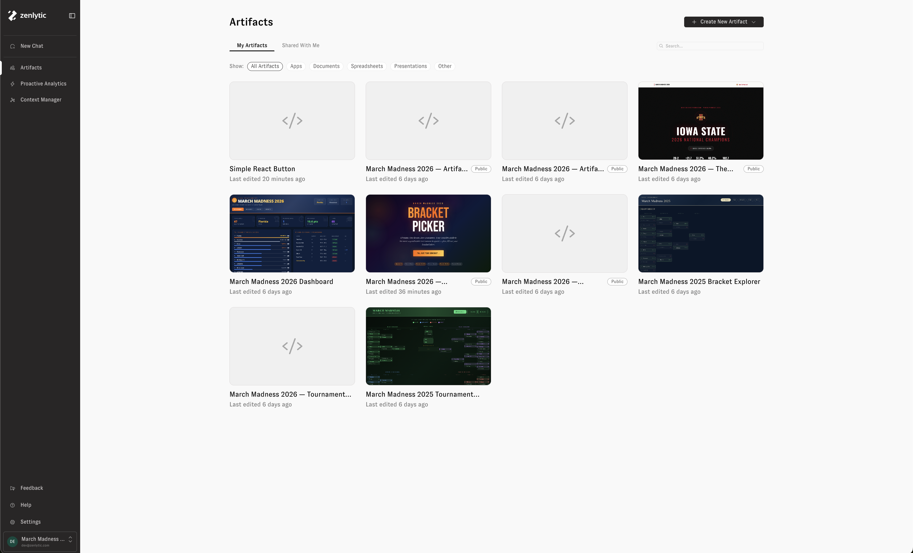</figure>

## Artifacts in chat

Zoë creates artifacts automatically whenever a visual output would be helpful — or when you ask her to build something. Artifacts appear inline in the chat, and you can click on one to expand it in the side drawer.

<figure>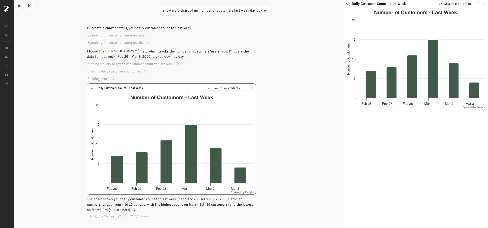</figure>

If an artifact is something you'd like to keep and come back to, click **Save to my artifacts**. The artifact will then appear in your Artifacts gallery alongside everything else you've saved.

<figure>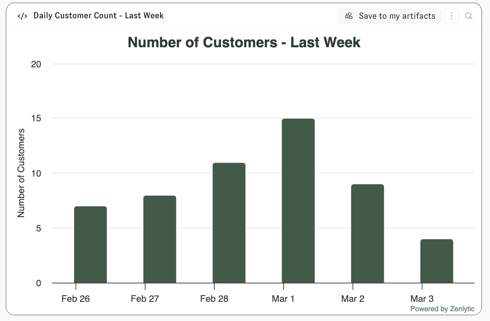</figure>

## Creating a new artifact

You can also create artifacts directly from the Artifacts page. Click the **+ Create New Artifact** button in the upper right corner. A dropdown lets you choose the type of artifact to create:

* **App** — An interactive application.
* **Document** — A rich text document.
* **Spreadsheet** — A data spreadsheet.
* **Presentation** — A slide presentation.
* **Other** — Any other artifact type.

Selecting a type opens a new chat with Zoë where you can describe what you'd like to create.

<figure>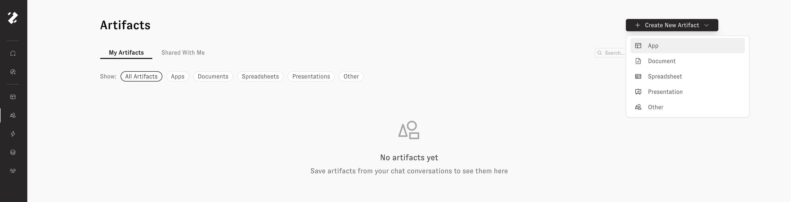</figure>

## Opening and editing an artifact

Click any artifact on the Artifacts page to open it in a side drawer. From the drawer you can preview the artifact, share it with others in your organization, or schedule it for automatic refresh.

<figure>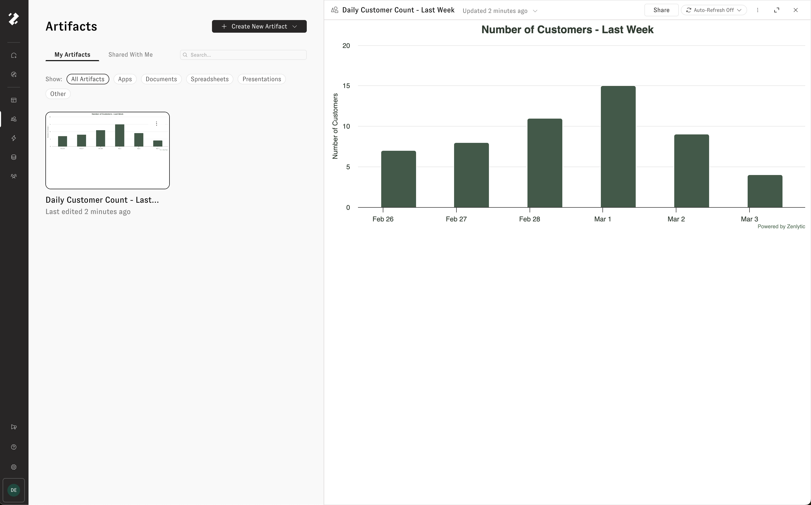</figure>

To edit an artifact, click **Edit in a new chat** from the three-dot menu in the drawer header. This opens a new chat with the artifact attached, so you can tell Zoë what you'd like to change. Zoë will update the artifact and a new version will appear in the [update history](#update-history).

<figure>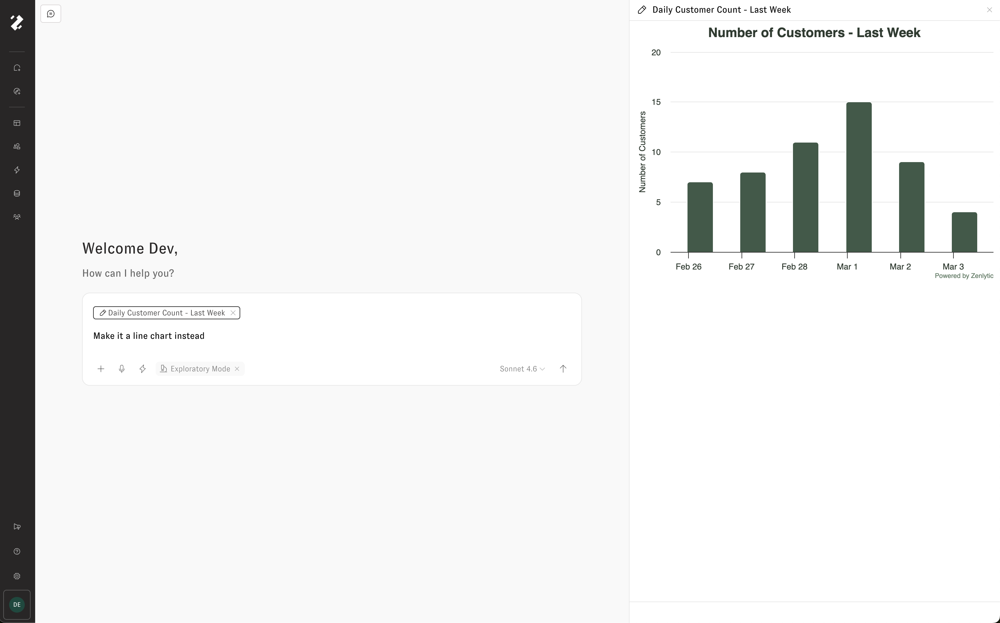</figure>

## Update history

Every artifact uses immutable, append-only versioning — nothing is overwritten or deleted. New versions are created when you edit the artifact and save your changes, or when a scheduled refresh runs.

Click the **Updated** timestamp on an artifact to open its update history. The history panel displays every version of the artifact, letting you time-travel through past states. Each version includes an edit message describing what changed.

From the three-dot menu on any version, you can:

* **View Artifact Memory** — See the context Zoë used when creating that version.
* **Download** — Download the artifact as it existed at that point in time.
* **Edit from this version** — Start a new edit based on an older version of the artifact.

<figure>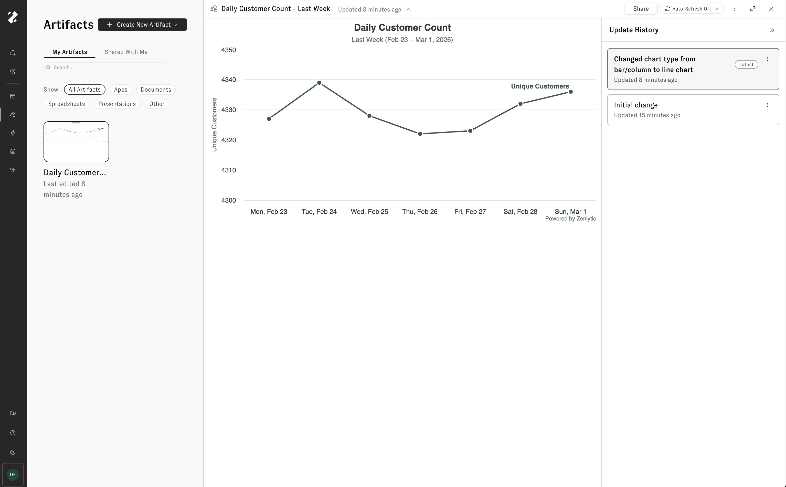</figure>

## Auto refresh

Keep an artifact's data up to date by enabling auto refresh. When turned on, Zoë automatically re-pulls the data and rebuilds the artifact on a schedule — so your dashboard, presentation, or writeup is always ready with live data.

Click the **Auto-Refresh Off** button in the artifact drawer header to open the auto refresh settings. Toggle **Enable auto refresh**, then configure:

* **Frequency** — How often to refresh (daily, weekly, monthly, or a custom cron expression).
* **Time** — What time of day to run the refresh, shown in your local timezone.
* **Instructions** — Optional directions for Zoë to follow during each refresh. For example: "Highlight any outliers in the data and write short blurbs about their trends."

Click **Save** to apply the schedule.

<figure>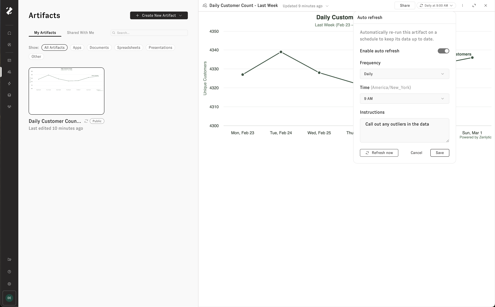</figure>

To run a refresh immediately without waiting for the next scheduled time, click **Refresh now**.

Every refresh appears in the artifact's [update history](#update-history), so you can see how the artifact has changed over time.

## Delivery

Artifacts can be delivered on a recurring schedule to **email** or **Slack**. A single artifact can have multiple delivery schedules — for example, email to leadership on Mondays and Slack to #data-team daily.

### Email delivery

* Inline thumbnail preview of the artifact.
* Optional file attachment.
* "View Online" button if public sharing is enabled.

### Slack delivery

* Message with the artifact name and description.
* Optional file upload to the channel.

## Sharing and permissions

Click the **Share** button in the artifact drawer to share an artifact with others in your organization. From the Share tab, select a user group and assign a permission level. Click **+ Add Group** to grant access to additional groups.

<figure>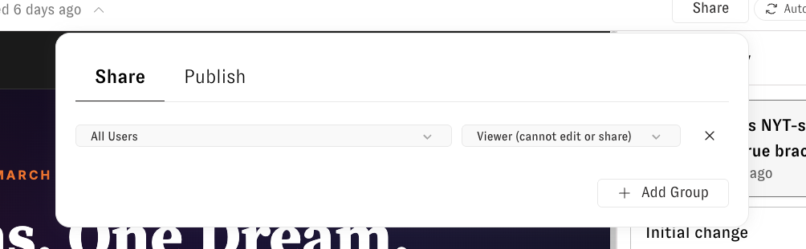</figure>

### Access levels

| Role       | Capabilities                                                       |
| ---------- | ------------------------------------------------------------------ |
| **Owner**  | Full control — edit, delete, share, configure refresh and delivery |
| **Editor** | Edit name and description, create new versions                     |
| **Viewer** | Read-only access                                                   |

You can share with workspace groups (including "All Users") or with individual users. Workspace admins always have access.

## Publishing to the web

To make an artifact publicly accessible, click the **Share** button and open the **Publish** tab. Click **Publish** to generate a unique public URL and an embed script that anyone can use to access the artifact — no Zenlytic account required.

<figure>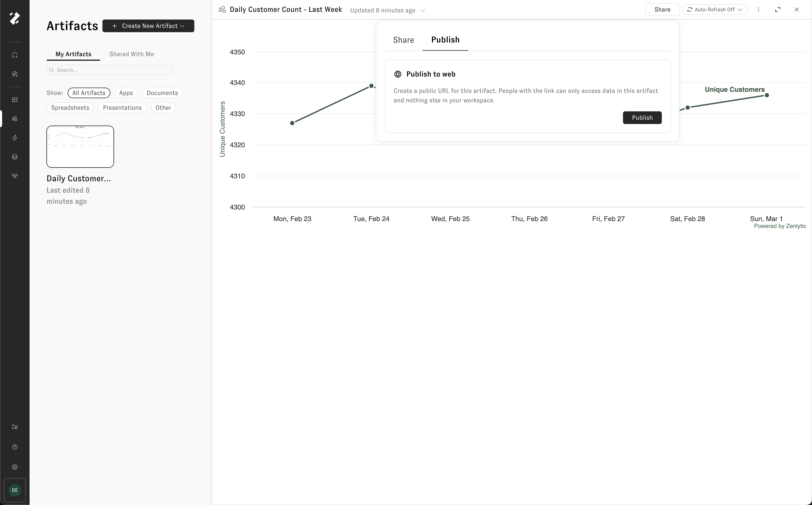</figure>

Once published, the artifact displays a **Public** chip on the Artifacts page. A public link and an iframe embed script are provided so you can share the artifact or embed it on another site.

<figure>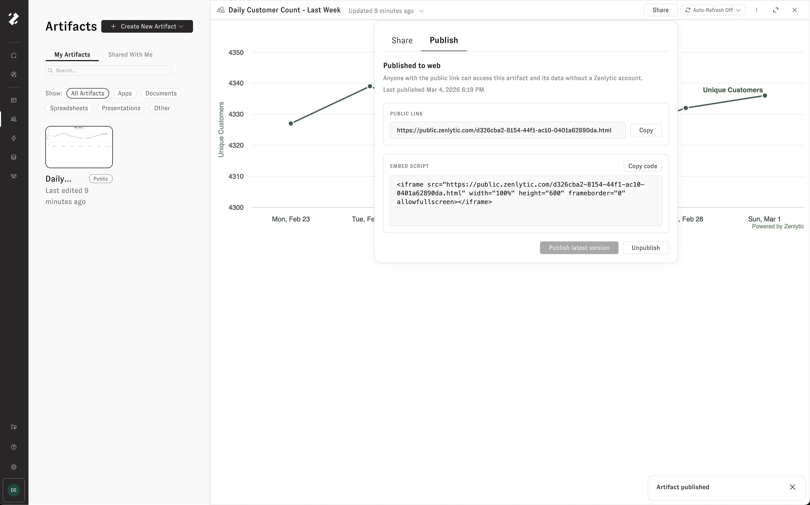</figure>

Editing or refreshing an artifact does not automatically update the published version. When you're ready for the latest version to go live, click **Publish latest version**. To remove public access entirely, click **Unpublish**.

<figure>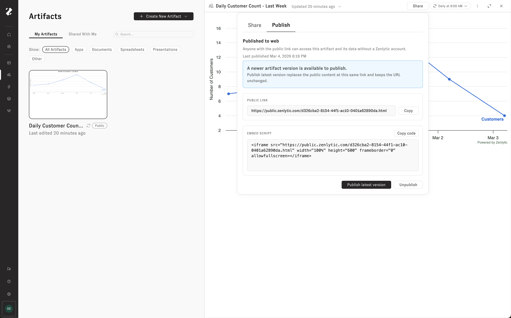</figure>

## Artifact memory

Every artifact has an artifact memory — a detailed summary of the artifact's purpose, your instructions, version history, and key context. Zoë references this memory whenever you work with the artifact in a chat, so she understands what the artifact is, what you like and dislike about it, and how it has evolved over time.

To view an artifact's memory, click the three-dot menu in the artifact drawer header and select **View Artifact Memory**.

<figure>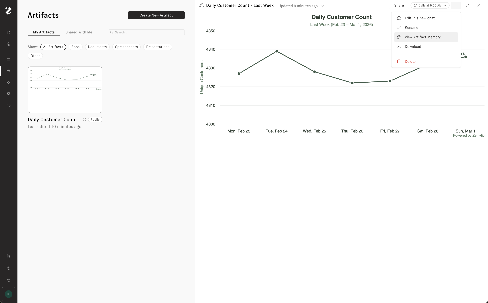</figure>

## Supported output types

Artifacts support a range of output formats, all generated on top of your governed data:

* HTML apps and dashboards
* Charts and visualizations
* Spreadsheets (.xlsx)
* Presentations (.pptx)
* PDFs
* Images

## Limitations

* Refresh timeout is 1 hour per run.
* Public share links are pinned to a specific version — they do not auto-update when new versions are created.
