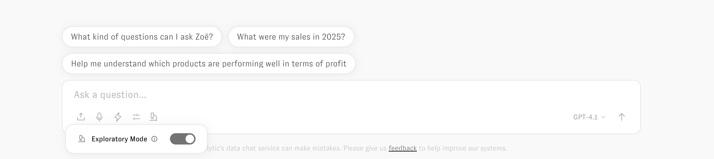
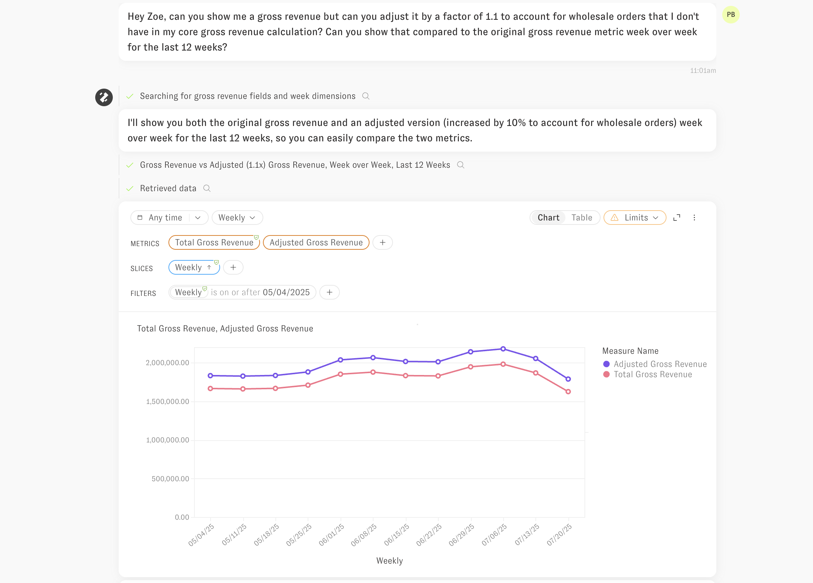
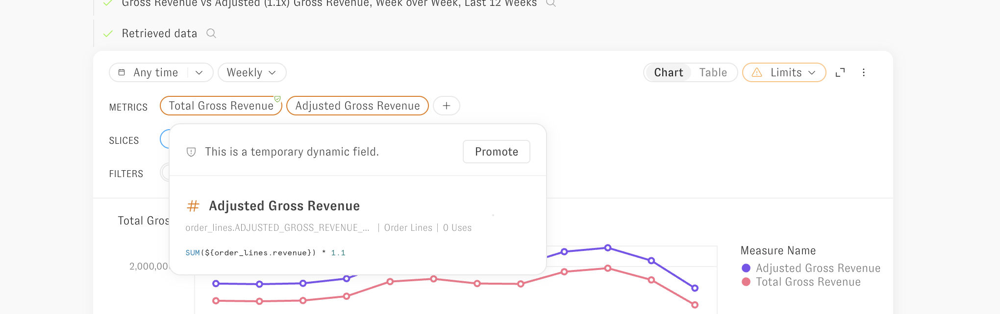
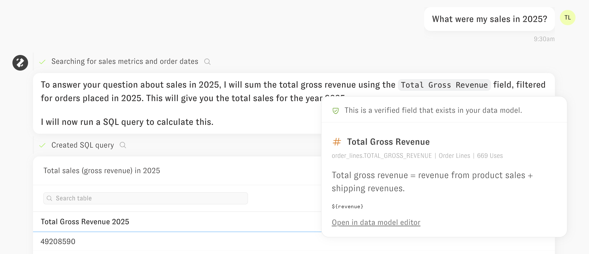
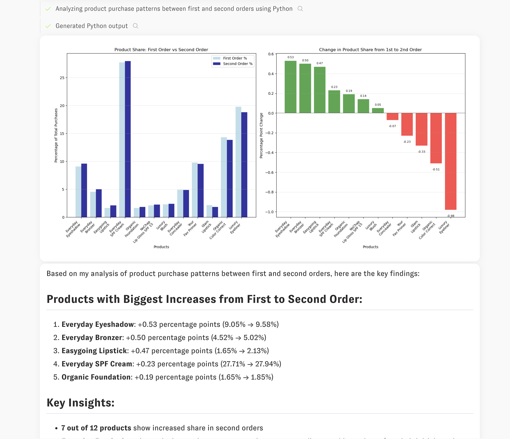

# Clarity Engine

The Clarity Engine is Zenlytic's AI suspension system that powers Zoë, enabling her to help you go from facts to confident decisions. The Clarity Engine operates in two distinct modes, each designed for different types of data analytics needs.

## Just ask!

To get started using the Clarity Engine through Zoë, just ask her a question. If you don't know what you can ask about, simply ask what data she can see, or what would be a great question to ask next. She will be even more helpful if you share your job title and more context about what you're trying to accomplish.


When you're asking for data, you can be specific (e.g. "Show me sales YTD compared to the prior YTD, broken out by product type") or general (e.g. "I don't really know what I want to see, but tell me about channel and campaign performance"). The Clarity Engine can handle both types of questions and Zoë will ask you follow-up questions if she isn't able to make reasonable assumptions about what you intend.

The buttons in the chat work like this
* By pressing the Microphone icon, Zoë will listen through the web browser to capture your prompt through realtime voice transcription. 
* The Lightning icon opens a panel for selecting a Workflow (analytical process, you or someone on your team as setup earlier) to run. 
* The Upload icon supports adding file attachments to the message, like images (limit 5mb), CSVs, and PDFs (limit 5 at a time and 25mb size).
* A dropdown on the right side of the user input supports changing the chat model that will be used for the new conversation. 
* The Chat Options section opens a toggle for Exploratory mode. When Exploratory mode is toggled on, you'll see a microscope icon as another icon in the chat input box (see below)
* Press "Enter" or click the Up Arrow button to submit the message.



The first (and default) mode of operation is for Zoë to use your semantic model, referencing fields from your model when appropriate, and extending the model by writing SQL on the fly when she needs to. That mode is called Dynamic fields (for the SQL Zoë is writing on the fly).

## Dynamic Fields

The first (and default) mode of operation is for Zoë to use your semantic model, referencing fields from your model when appropriate, and extending the model by writing SQL on the fly when she needs to. That mode is called Dynamic fields (for the SQL Zoë is writing on the fly). This mode provides maximum governance while enabling flexible data exploration (and even building of your semantic model itself).

### How Dynamic Fields Work

The Clarity Engine analyzes your semantic model and identifies all available measures, dimensions, and their underlying columns. When you ask a question, it:

1. **Identifies relevant fields** from your semantic model in a given topic that can answer the question
2. **Reuses existing components** like column references, joins, and business logic
3. **Generates new SQL** that builds on top of existing definitions when necessary to answer the user's question
4. **Applies all governance rules** including row and column-level security

### Permissions in Dynamic Fields Mode

The Clarity Engine follows a principle of **component accessibility**: if you have access to a measure or dimension, the engine can use any underlying column referenced in that field's definition.

**Example:**
```yaml
- name: count_unique_emails
  field_type: measure
  type: count_distinct
  sql: ${TABLE}.email
  required_access_grants: [marketing_team]
```

If you have access to the `count_unique_emails` measure through the `marketing_team` access grant, the Clarity Engine can use the `email` column in multiple ways:
- **Counting**: Create variations like "count of customers with gmail addresses"
- **Filtering**: Apply filters like "customers who signed up with work emails"
- **Grouping**: Group results by email domain or email provider
- **Custom Logic**: Create new measures that reference the email column

This permission model ensures that access controls remain enforced while maximizing analytical flexibility for Zoë.

### Querying with Dynamic Fields


The Clarity Engine searches across governed measures and dimensions to reuse existing fields and intelligently creates new ones to answer your data questions with compelling summaries and visualizations. It operates with an agentic architecture that gives it the ability to plan approaches to problems, use tools to answer questions on your behalf, and maintain memory to improve over time.



Zoë shows when she is re-using a verified metric or dimension from your semantic model by the green checkmark in the upper right of the chip.

Likewise, if she has written SQL on the fly to answer your question, not using a verified metric or dimension, that is a dynamic field, and does not have a green checkmark. 



If Zoë answers your question with a metric or dimension that is not already in your data model (and you are a developer or above permission level), you will see an option to Promote that metric or dimension into your semantic model when hovering the dynamic field.


## Exploratory Mode

Exploratory Mode allows the Clarity Engine to write SQL directly against your data warehouse for advanced analysis that goes beyond the semantic model's structure.

### How Exploratory Mode Works

In this mode, the Clarity Engine:

1. **Writes custom SQL** directly against your tables and views in Zenlytic, with context on all your existing semantics
2. **Applies identical security** - all row and column-level permissions are enforced
3. **Parses and highlights reuse** - identifies when the SQL leverages existing semantic model components
4. **Provides transparency** - summarizes the query in plain english including references to existing data model concepts

### Security in Exploratory Mode

The Clarity Engine applies the same security model as Dynamic Fields mode:

- **Row-level security**: Access filters are automatically applied to SQL queries
- **Column-level security**: Only accessible columns are included in generated SQL
- **Semantic model integration**: When possible, existing measures and dimensions are referenced rather than recreated

### Context Reuse Highlighting

When the Clarity Engine writes custom SQL, it actively identifies opportunities to reuse existing semantic model context:




The Clarity Engine will let Zoë highlight to you in natural language what approach she is taking with your query and highlight which parts of your semantic model she is re-using with hover-able text 


## Code Interpreter Integration

Both modes of the Clarity Engine integrate seamlessly with the code interpreter, which can write and evaluate Python code in a sandbox environment. This gives the system tremendous flexibility to:

- **Merge results** from separate queries
- **Apply external assumptions** to scenarios
- **Perform advanced analytics** including clustering, correlation, regression, and forecasting
- **Create custom visualizations** beyond standard chart types




## Choosing Between Modes

The Clarity Engine provides these two modes to handle different types of analytical problems. 

The Dynamic Fields mode is best for structured questions and has built in re-use of components across UI and dashboards in the Zenlytic platform.

The Exploratory mode is best for answering complex questions that cannot be answered in any BI product or structured data model.

Both modes maintain the same high standards for security, governance, and transparency while providing the flexibility needed for comprehensive data analysis. 
