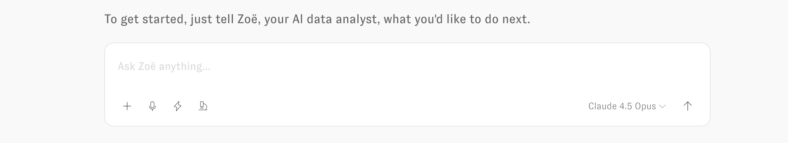
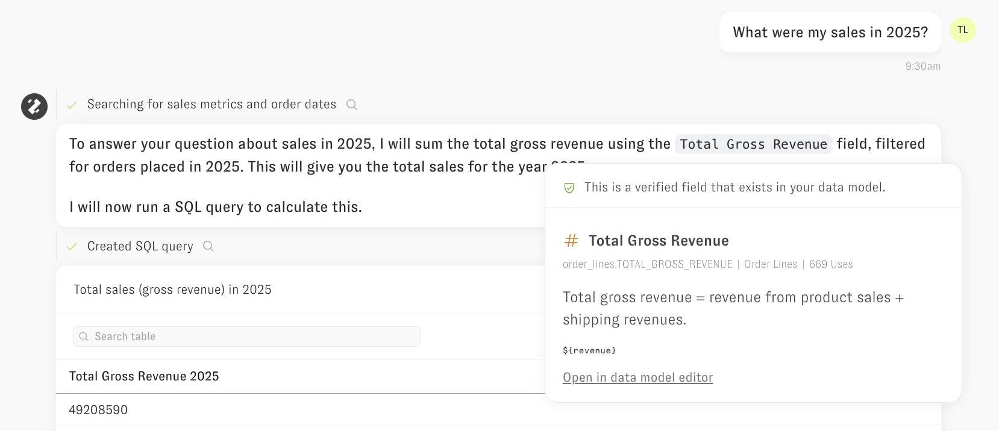
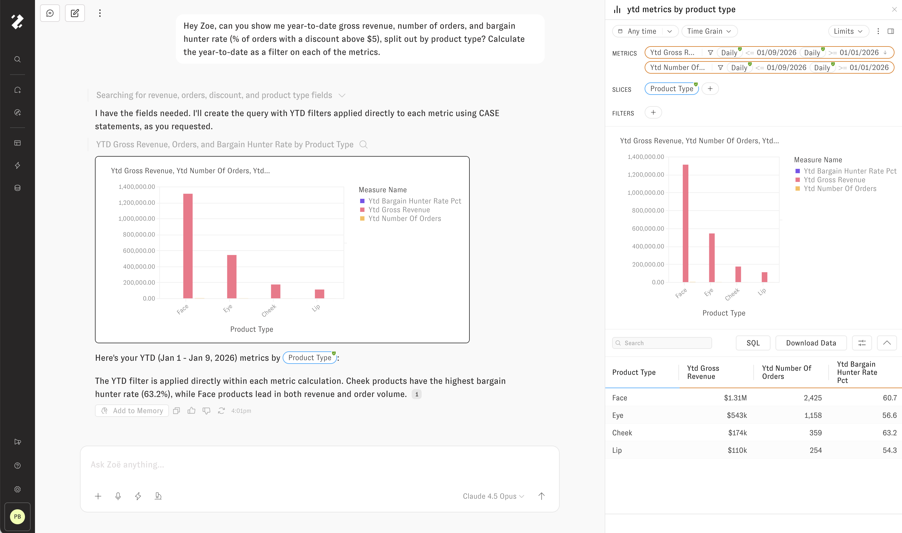
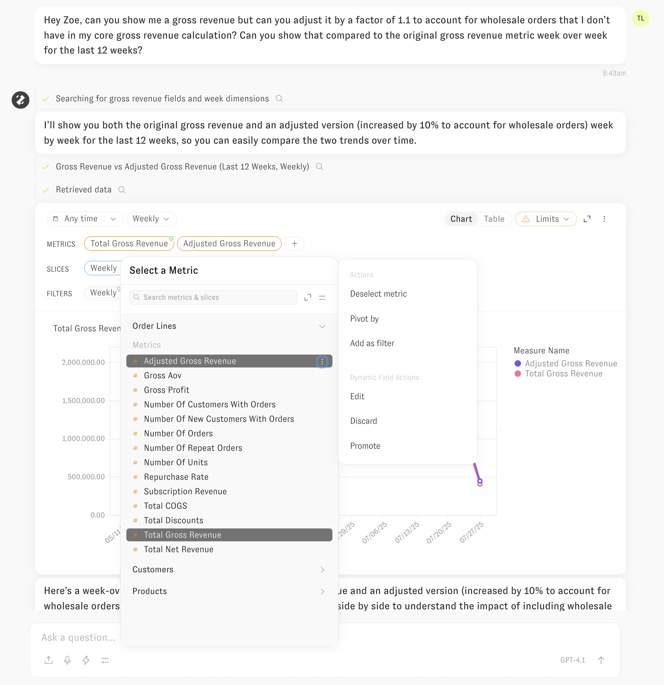

# Clarity Engine

The Clarity Engine is the layer of Zenlytic that interprets the SQL Zoë's LLM produces. Whenever Zoë writes a query, the Clarity Engine sits between her output and your warehouse: it validates the SQL against your semantic model, enforces your row- and column-level security, and surfaces exactly which parts of the answer came from your governed model versus which were generated on the fly to answer this question.

This is what makes Zoë's flexibility compatible with your data team's governance. The LLM produces SQL freely; the Clarity Engine doesn't let any of that SQL bypass the rules.

## Just ask!

To start using Zoë, navigate to the chat interface and simply ask her a question. If you're unsure where to begin, ask what data she has access to, or request a good follow-up question based on your prior analysis within the conversation.

Note: Providing more context about the task you're trying to accomplish, your team, and job title will make Zoë even more helpful.



You can ask Zoë specific questions (e.g. "Show me sales YTD compared to the prior YTD, broken out by product type") or general ones (e.g. "I don't really know what I want to see, but tell me about channel and campaign performance"). Zoë handles both, and will ask follow-up questions when she can't make reasonable assumptions about your intent.

The chat interface includes several interactive elements:

* **Plus icon**: Add attachments to your message, including images (5MB limit), CSVs, and PDFs (maximum 5 files, 25MB total), and data via the query builder
* **Microphone icon**: Click to use voice input — Zoë will capture your prompt through real-time voice transcription via your web browser
* **Lightning icon**: Opens a panel to select and run a Proactive Agent
* **Model dropdown**: Located on the right side of the input area, this allows you to change the base LLM used for Zenlytic's LLM-based agent
* **Submit**: Press "Enter" or click the up arrow button to send your message

## How the Clarity Engine interprets Zoë's SQL

Every query Zoë writes — whether against existing measures and dimensions or new ones she creates on the fly — passes through the Clarity Engine before it reaches your warehouse. The Clarity Engine does four things to that SQL:

1. **Validates against your semantic model.** Every field reference, join, and aggregation is checked against what your model defines. If Zoë references a measure or dimension that exists, the Clarity Engine uses that governed definition rather than re-deriving it.
2. **Enforces row- and column-level security.** Access filters from your model are applied to the SQL before it runs. Columns you don't have permission to see are filtered out of the query, regardless of whether Zoë used an existing field or wrote a new one.
3. **Identifies and surfaces reuse.** When Zoë's SQL leverages existing components of your semantic model, the Clarity Engine highlights it inline. You can see exactly which parts of the answer came from governed definitions and which were generated for this question only.
4. **Explains the approach.** The Clarity Engine produces a plain-English explanation of what Zoë did, including which parts of your semantic model contributed.

### Security

* **Row-level security**: Access filters defined in your data model are automatically applied to every query the Clarity Engine processes.
* **Column-level security**: Only columns you have permission to view appear in the generated SQL.
* **Semantic model integration**: Existing measures and dimensions are reused whenever possible, preserving the governance attached to them.

Expanded analytical capability never bypasses your data security and governance policies.

### Context reuse highlighting

When Zoë's SQL references components of your existing semantic model, the Clarity Engine highlights those references inline so you can see what was reused and what was new.



Hover any highlighted reference to see exactly which measure, dimension, or relationship it came from. This is how the Clarity Engine bridges governed and ad-hoc analysis: you get the flexibility of LLM-generated SQL with the auditability of a semantic layer.

## Dynamic Fields

When Zoë needs to answer a question that the existing semantic model can't cover directly — a new ratio, a new bucketization, a new derived dimension — she creates a **Dynamic Field**. Dynamic Fields are field definitions that the Clarity Engine validates and runs alongside your governed measures and dimensions, even though they aren't (yet) part of your permanent model.

The Clarity Engine treats Dynamic Fields the same way it treats any governed field: they're validated against your semantic model, they inherit the same row- and column-level security, and they can reference your existing measures and dimensions as building blocks.

### Permissions in Dynamic Fields

The Clarity Engine follows a **component accessibility** model for security: when you have access to a measure or dimension, Zoë can use any underlying column referenced in that field's definition to create Dynamic Fields.

Consider this measure in your semantic model:

```yaml
- name: count_unique_emails
  field_type: measure
  type: count_distinct
  sql: ${TABLE}.email
  required_access_grants: [marketing_team]
```

If you have access to `count_unique_emails` through the `marketing_team` access grant, the Clarity Engine can use the underlying `email` column in multiple ways:

* **Counting**: "How many customers have Gmail addresses?"
* **Filtering**: "Show me customers who signed up with work emails"
* **Grouping**: "Break down results by email domain"
* **Custom logic**: Create new measures that reference the email column

This maintains strict access controls while giving Zoë maximum flexibility to answer your questions using the data components you're already authorized to access.

### Identifying Dynamic Fields in your results

When Zoë returns results, the Clarity Engine marks every field with a visual indicator showing whether it's governed or dynamic:



* **Green checkmark**: A verified field from your semantic model — governed and reusable across the platform.
* **No checkmark**: A Dynamic Field created within the context of the current question.

The Clarity Engine uses an intelligent agent-based architecture that allows Zoë to plan approaches to complex problems, use multiple tools to gather information, maintain context throughout your conversation, and update her memory to provide increasingly relevant answers.

### Promoting Dynamic Fields

When Zoë creates Dynamic Fields to answer your questions, you can promote these fields into your semantic model for reuse across the platform. Dynamic Fields appear without a green checkmark, indicating they were generated in the context of your current question and haven't yet been validated by the data team.

Note: Promoting Dynamic Fields requires developer-level permissions or above.

**To promote a Dynamic Field:**

1. Click on the Dynamic Field in your results
2. Click the three-dot menu on the right side of the field
3. Select "Promote"



This promotion workflow transforms ad-hoc analysis into governed, reusable components that become available in [Artifacts](artifacts.md), explores, [Proactive Agents](../proactive-analytics/getting-started.md), and future conversations with Zoë. By building your semantic model this way, you create measures and dimensions based on real analytical needs rather than trying to anticipate every possible field upfront.

## Artifacts

Outputs produced through the Clarity Engine are delivered as [Artifacts](artifacts.md) — rich, interactive results including apps, documents, spreadsheets, presentations, charts, and more. When Zoë's answer goes beyond a single table or chart — merging results from multiple queries, applying external assumptions, building custom visualizations, or running statistical analysis like clustering, correlation, regression, or forecasting — the result is delivered as an Artifact you can save, share, refresh on a schedule, and publish.

See [Artifacts](artifacts.md) for the full feature set: saving and organizing artifacts, update history and versioning, auto refresh, scheduled delivery to email or Slack, sharing and permissions, and web publishing.
