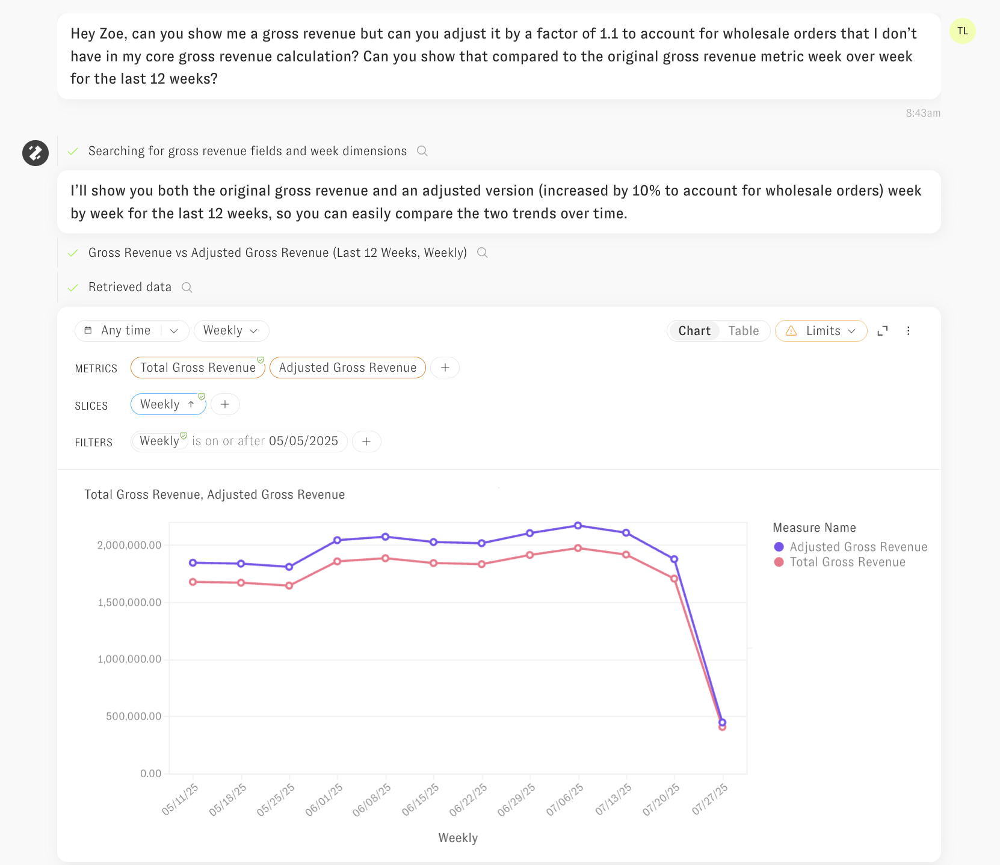
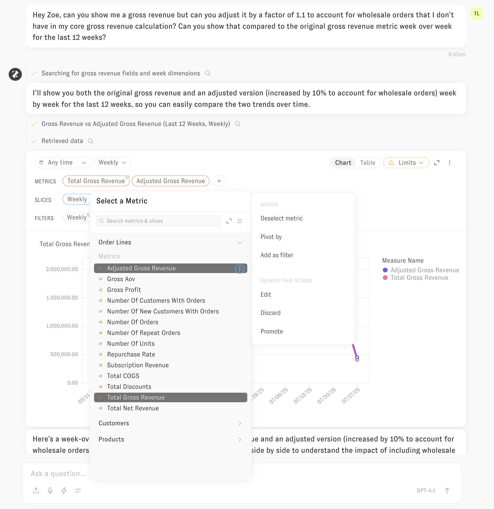

---
layout:
  width: default
  title:
    visible: true
  description:
    visible: false
  tableOfContents:
    visible: true
  outline:
    visible: true
  pagination:
    visible: true
  metadata:
    visible: true
---

# Clarity Engine (beta)

The Clarity Engine serves as the backbone of Zenlytic's LLM-based agent, Zoë, enabling you to transform raw facts to confident decisions. The Clarity Engine operates in two distinctive modes: the Default Mode with Dynamic Fields for structured analysis governed by your semantic model, and Exploratory Mode for more advanced, raw SQL-based analysis that extend beyond the boundaries of the semantic model.

## Just ask!

To start using the Clarity Engine in Zenlytic, navigate to Zoë (the chat interface in Zenlytic) and simply ask her a question. If you're unsure where to begin, ask what data she has access to, or request a good follow-up question based on your prior analysis within the conversation.

Note: Providing more context about the task you're trying to accomplish, your team, and job title will make Zoë even more helpful.


You can ask Zoë specific questions (e.g. "Show me sales YTD compared to the prior YTD, broken out by product type") or general ones (e.g. "I don't really know what I want to see, but tell me about channel and campaign performance"). The Clarity Engine handles both types of questions, and Zoë will ask follow-up questions when she is unable to make reasonable assumptions about your intent.

The chat interface includes several interactive elements:

* **Microphone icon**: Click to use voice input - Zoë will capture your prompt through real-time voice transcription via your web browser
* **Lightning icon**: Opens a panel to select and run a Workflow (analytical processes that you or your team have set up previously)
* **Upload icon**: Add file attachments to your message, including images (5MB limit), CSVs, and PDFs (maximum 5 files, 25MB total)
* **Model dropdown**: Located on the right side of the input area, this allows you to change the base LLM used for Zenlytic's LLM-based agent
* **Chat Options**: Opens a toggle for Exploratory mode; when enabled, you'll see a microscope icon appear in the chat input (shown below)
* **Submit**: Press "Enter" or click the up arrow button to send your message


## Default Mode with Dynamic Fields

The Default Mode is the primary way Zoë operates within the Clarity Engine. In this mode, Zoë leverages your existing semantic model by referencing fields that have already been defined. When the fields needed to answer your question don't exist in your semantic model yet, she creates Dynamic Fields by writing custom SQL on the fly, building on top of your already defined fields.

This approach provides maximum governance while enabling flexible data exploration. With Dynamic Fields, you can interactively build your semantic model by promoting these dynamically created fields into your permanent semantic layer.

### How Dynamic Fields Work

When you ask Zoë a question, the Clarity Engine first analyzes your semantic model to understand what fields, joins, and business logic are already available. If the specific fields needed to answer your question don't exist in your semantic model yet, here's what happens:

1. **Identifies existing components** - Reviews available measures, dimensions, and their underlying columns within relevant topics
2. **Leverages current structure** - Uses your existing joins, relationships, and business logic as building blocks
3. **Generates custom SQL** - Writes new field definitions on the fly that build on top of your established semantic layer
4. **Maintains governance** - Applies all security rules, including row and column-level permissions, to the dynamically created fields

This process allows Zoë to answer complex questions that go beyond your current semantic model while staying within the governance framework you've established.

### Permissions in Dynamic Fields Mode

The Clarity Engine follows a **component accessibility** model for security: when you have access to a measure or dimension, Zoë can use any underlying column referenced in that field's definition to create Dynamic Fields.

**How this works:**

Consider this measure in your semantic model:

```yaml
- name: count_unique_emails
  field_type: measure
  type: count_distinct
  sql: ${TABLE}.email
  required_access_grants: [marketing_team]
```

If you have access to `count_unique_emails` through the `marketing_team` access grant, the Clarity Engine can use the underlying `email` column in multiple ways:

* **Counting**: "How many customers have Gmail addresses?"
* **Filtering**: "Show me customers who signed up with work emails"
* **Grouping**: "Break down results by email domain"
* **Custom logic**: Create new measures that reference the email column

This approach maintains strict access controls while giving Zoë maximum flexibility to answer your questions using the data components you're already authorized to access.

### Querying with Dynamic Fields

When you ask Zoë a question, she analyzes your semantic model to find existing fields that can answer your question and creates new Dynamic Fields when needed. Her responses include clear visual indicators to help you understand what she's using:



**Visual Indicators:**

* **Green checkmark**: Indicates a verified field from your semantic model that's governed and reusable across the platform
* **No checkmark**: Indicates a Dynamic Field created within the context of the current question

The Clarity Engine uses an intelligent agent-based architecture that allows Zoë to plan approaches to complex problems, use multiple tools to gather information, maintain context throughout your conversation, and update her memory to provide increasingly relevant answers.

### Promoting Dynamic Fields

When Zoë creates Dynamic Fields to answer your questions, you can promote these fields into your semantic model for reuse across the platform. Dynamic Fields appear without a green checkmark, indicating they were generated in the context of your current question and haven't yet been validated by the data team.

Note: Promoting Dynamic Fields requires developer-level permissions or above.

**To promote a Dynamic Field:**

1. Click on the Dynamic Field in your results
2. Click the three-dot menu on the right side of the field
3. Select "Promote"



This promotion workflow transforms ad-hoc analysis into governed, reusable components that become available across dashboards, explores, workflows and future conversations with Zoë. By building your semantic model this way, you create measures and dimensions based on real analytical needs rather than trying to anticipate every possible field upfront.

## Exploratory Mode

Exploratory Mode enables the Clarity Engine to write custom SQL directly against your data warehouse for advanced analysis that extends beyond your semantic model's current structure.

### How Exploratory Mode Works

When you enable Exploratory Mode, the Clarity Engine operates with expanded capabilities:

1. **Writes custom SQL** - Creates queries directly against your tables and views, using full context about your existing semantic model
2. **Maintains security** - Enforces all row and column-level permissions, ensuring you only access data you're authorized to see
3. **Highlights reuse** - Identifies and shows you when the SQL leverages existing components from your semantic model
4. **Provides transparency** - Explains the approach in plain English, including which parts of your semantic model are being referenced

This mode gives you the flexibility to explore complex data relationships while staying within your organization's governance framework.

### Security in Exploratory Mode

Exploratory Mode maintains the same strict security standards as Default Mode:

* **Row-level security**: Your access filters are automatically applied to all SQL queries
* **Column-level security**: Only columns you have permission to view are included in the generated SQL queries
* **Semantic model integration**: Existing measures and dimensions from your semantic model are reused whenever possible, preserving their built-in governance

This approach ensures that expanded analytical capabilities never compromise your organization's data security and governance policies.

### Context Reuse Highlighting

When writing custom SQL in Exploratory Mode, the Clarity Engine identifies and highlights when it leverages components from your existing semantic model.


Zoë provides clear explanations of her analytical approach, showing you which parts of your semantic model she's reusing through interactive hover text. This transparency helps you understand how your established data definitions contribute to exploratory analysis, bridging the gap between governed and ad-hoc investigation.

## Code Interpreter Integration

Both Default Mode and Exploratory Mode integrate seamlessly with Zenlytic's built-in code interpreter, which executes Python code in a secure sandbox environment. This integration expands Zoë's analytical capabilities significantly:

* **Merge results** - Combine results from multiple queries or external data sources
* **Apply external assumptions** - Incorporate external assumptions into your analysis
* **Advanced analytics** - Perform statistical analysis including clustering, correlation, regression, and forecasting
* **Custom visualizations** - Create specialized charts and graphs beyond standard business intelligence formats


## Choosing Between Modes

The Clarity Engine's two modes are designed to handle different analytical scenarios. Understanding when to use each mode helps you get the most effective results from Zoë.

**Default Mode with Dynamic Fields** is ideal for:

* **Flexible semantic model expansion** - Leverages your existing data structure while dynamically creating new fields that extend far beyond traditional BI platforms' capabilities, allowing complex analysis while maintaining governance
* **Platform integration and reusability** - Creates analysis components that integrate natively with dashboards, explores, workflows, and can be promoted into your permanent semantic model for team-wide use

**Exploratory Mode** is perfect for:

* **Custom analysis beyond semantic constraints** - Handles questions that cannot be answered within the structured relationships of any semantic model, requiring complete flexibility to redefine how data connects and flows
* **Advanced ad-hoc investigations** - Enables complex analytical techniques that extend beyond the capabilities of any other BI platform, and even beyond our Default Mode, which is already significantly more flexible than traditional solutions

Both modes maintain the same high standards for security, governance, and transparency while providing the advanced flexibility needed for comprehensive data analysis.
