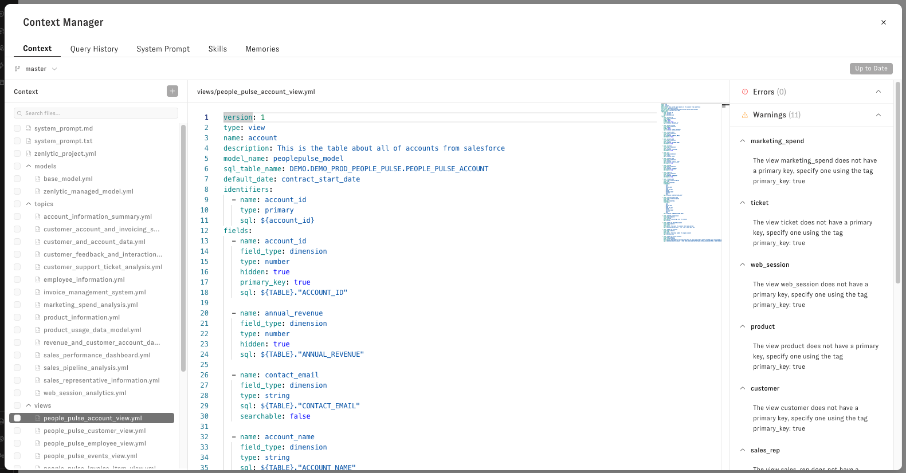
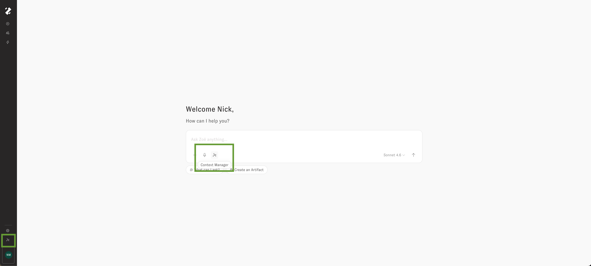
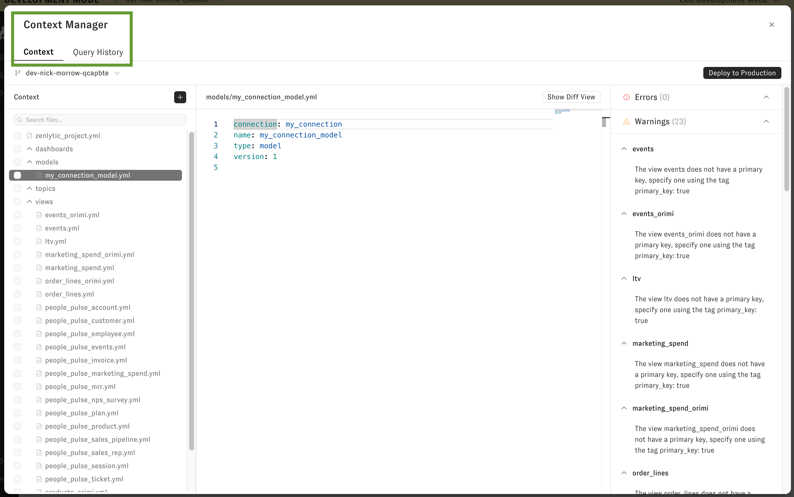
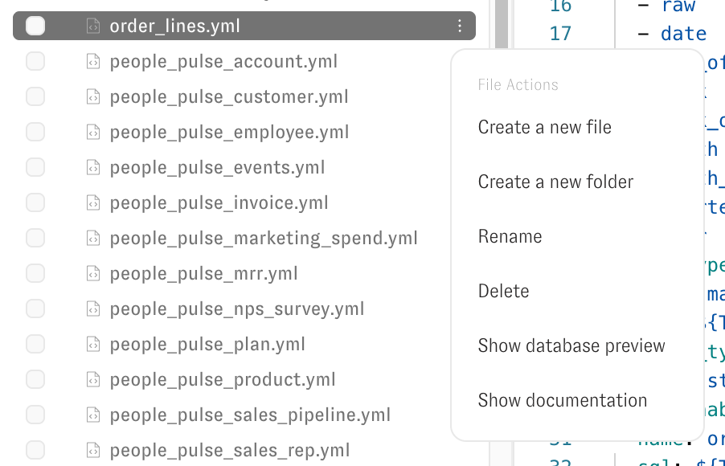
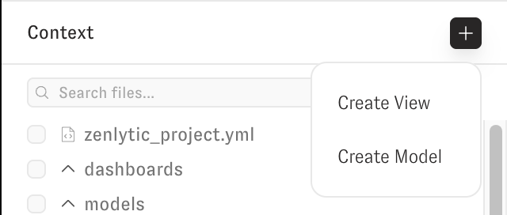
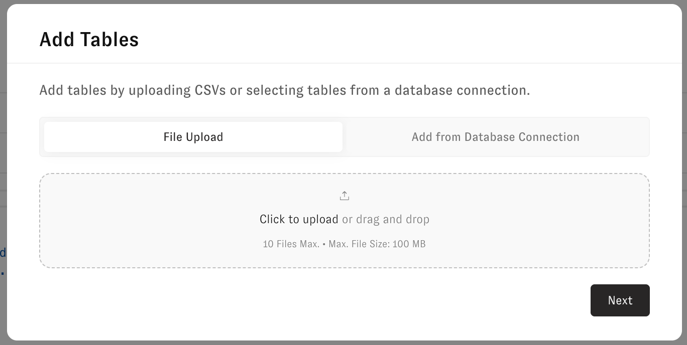
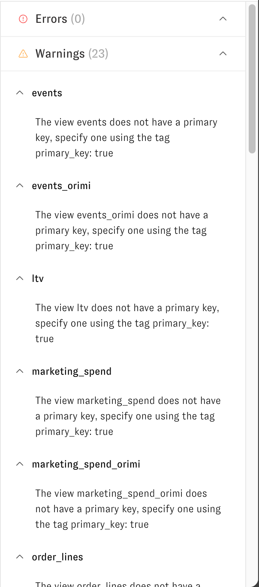
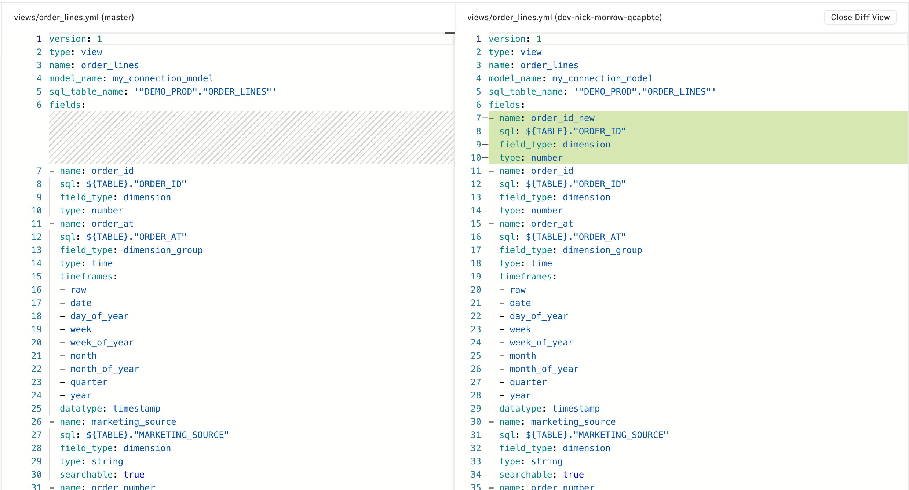
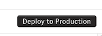

# Context Manager

Use Context Manager to manage your semantic model files, review changes, and deploy updates to production.

## Open Context Manager

Open Context Manager from the workspace navigation or from chat.

## Understand the tabs

Use the tabs to control model context and query-based learning:

- **Context:** Create and edit model files, view files, folders, and branches
- **Query history:** Let Zenlytic learn from prior queries to improve query accuracy and speed

## Manage files in the Context tab

Use the file tree to organize and maintain your data model:

- Create files and folders
- Rename files and folders
- Open view and model files in the editor
- Access file actions from the three-dot menu

From the three-dot menu, you can also:

- Show documentation for view and model files
- Open database preview for view files

## Add new model assets

Use the **Add** button to create new assets:

- **Add view**
- **Add model file**

When you add a view, choose one of these methods:

- Upload a CSV file
- Add from a database connection

Use an existing connection or create a new connection during setup.

## Edit, validate, and review changes

Edit files directly in the text editor. Use the validation panel to review errors and warnings, then fix issues before deployment.

Open diff view to compare branch changes against production before you deploy.

## Work with branches safely

Use the branch selector next to the Context Manager title to work on non-production branches.

Enable the workspace setting that blocks direct editing on the production branch when you want to enforce a branch-based workflow.

## Deploy to production

After you commit changes on a development branch, use the action button to deploy to production.

Context Manager saves changes as you type, but you must resolve validation errors before deployment.

