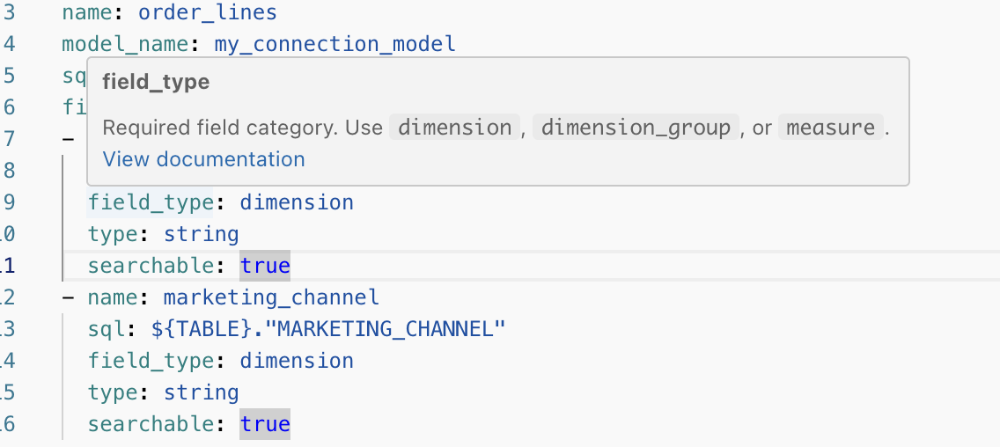

# Context Manager

Use Context Manager to manage semantic model files, review changes, and deploy updates to production.

## Open Context Manager

Open Context Manager from the workspace navigation or from chat.

## Manage files

Use the file tree to organize and maintain your data model:

* Create files and folders
* Rename files and folders
* Open view and model files in the editor
* Access file actions from the three-dot menu

Use the three-dot menu to:

* Show documentation for view and model files
* Open database preview for view files

 

## Add to the data model

Use the **Add** button to create or upload assets:

* **Add view**
* **Add model**
* **Add skill**
* **Create file**
* **Create folder**
* **Upload file**

When you add a view, choose one of these options:

* Upload a CSV file
* Add from a database connection

Use an existing connection or create a new connection during setup. 

 

## Edit, validate, and review changes

Edit files directly in the text editor. Use the validation panel to review errors and warnings, then fix issues before deployment.

Open the diff view to compare branch changes against production before deployment.

 

Review YAML key documentation by hovering over keys in the text editor.

## Work with branches safely

Use the branch selector to work in non-production branches.

Disable the workspace setting that allows direct edits on the production branch to enforce a branch-based workflow.

 

## Deploy to production

After you commit changes on a development branch, use the deploy action to publish to production.

You must resolve validation errors before deployment.

