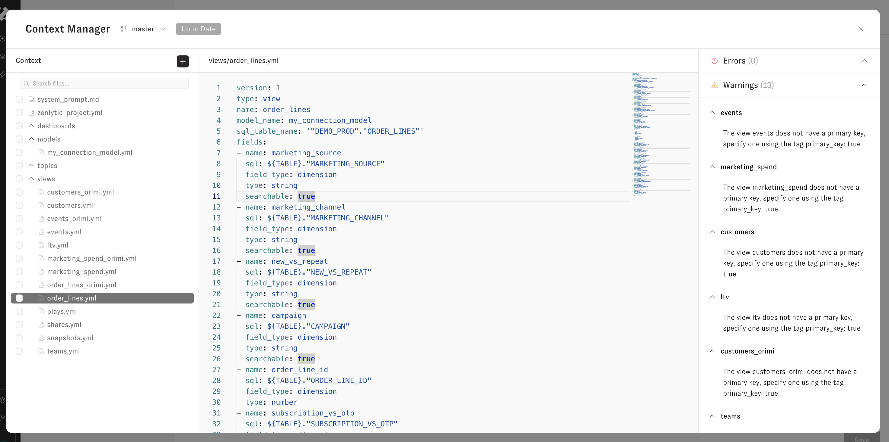
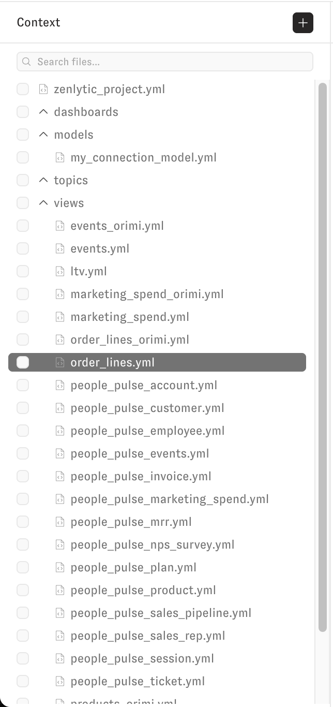
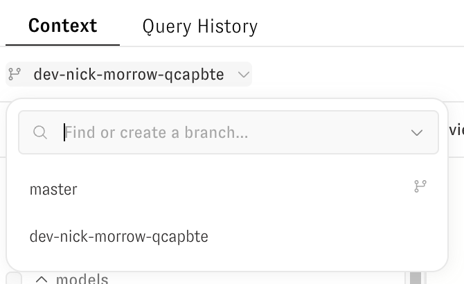
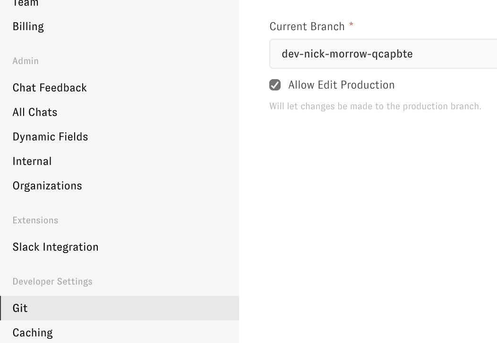

# Context Manager

Use Context Manager to manage your semantic model files, review changes, and deploy updates to production.

## Open Context Manager

Open Context Manager from the workspace navigation or from chat.

## Manage files

Use the file tree to organize and maintain your data model:

* Create files and folders
* Rename files and folders
* Open view and model files in the editor
* Access file actions from the three-dot menu

From the three-dot menu, you can also:

* Show documentation for view and model files
* Open database preview for view files

 

## Add to data model

Use the **Add** button to create or upload files:

* **Add view**
* **Add model file**
* **Add skill**
* **Create file**
* **Create folder**
* **Upload file**

 

## Edit, validate, and review changes

Edit files directly in the text editor. Use the validation panel to review errors and warnings, then fix issues before deployment.

Open diff view to compare branch changes against production before you deploy.

 

## Work with branches safely

Use the branch selector next to the Context Manager title to work on non-production branches.

Enable the workspace setting that blocks direct editing on the production branch when you want to enforce a branch-based workflow.

 

## Deploy to production

After you commit changes on a development branch, use the action button to deploy to production.

Context Manager saves changes as you type, but you must resolve validation errors before deployment.

