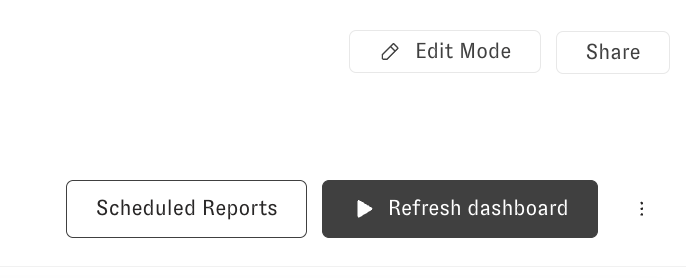

---
layout:
  width: default
  title:
    visible: true
  description:
    visible: false
  tableOfContents:
    visible: true
  outline:
    visible: true
  pagination:
    visible: true
  metadata:
    visible: true
---

# Dashboard Scheduled Delivery

Scheduling dashboards gives users the ability to run a dashboard at a predetermined time or times and send the results to a selected audience. The scheduler can send a PDF version of the dashboard, CSV data download and a link to view the dashboard within the Zenlytic UI. The scheduler can also include a standard or customized AI summary of the results.

## To schedule a dashboard:

1. Open the “Scheduled Reports” model at the top right of the dashboard:

<figure><figcaption></figcaption></figure>

2. When the model opens, click on “Create New Schedule Report”

<figure><figcaption></figcaption></figure>

3. Once the schedule model opens, include the desired parameters:

* Enter a Schedule Name.
* Toggle on **Include PDF** to include a pdf version in the email.
* Toggle on **Include CSV** to include a csv data download in the email.
* Toggle on **Include AI Summary** to include an AI generated summary of the results (for customization, see **Advanced** section below.
* Toggle on **Include Link** to include a link to the dashboard. Note only include this if the user has an account on your Zenlytic workspace.
* Set the **Recurrence**. This can be Daily, Weekly or Monthly, on specific days and times. Use the **Cron** option for using Cron job syntax.
* Add destinations, this can be via email or Slack (if configured).

<figure><figcaption></figcaption></figure>


**Note** Make sure the dashboard is **shared** with the intended recipients if including a link to the dashboard in the email.


**Advanced** option - use this to customize the AI summary output. For example, you can tell Zoë to focus on specific metrics or sections of the dashboard.

<figure><figcaption></figcaption></figure>

4.  Once the schedule has been created, it will appear on the list of scheduled reports. You can click on the **Send a Copy Now** button to the right of the schedule name to send right away.

    To run a test of the scheduler you can send to yourself and click **Send a Copy Now** before\
    including others in the recipient list.

<figure><figcaption></figcaption></figure>

