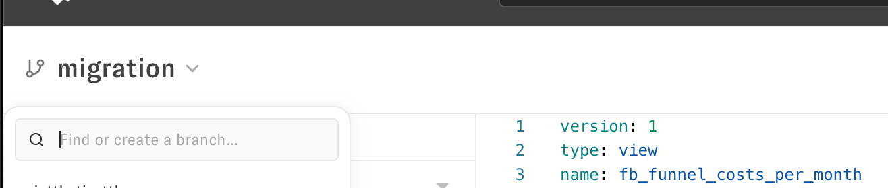
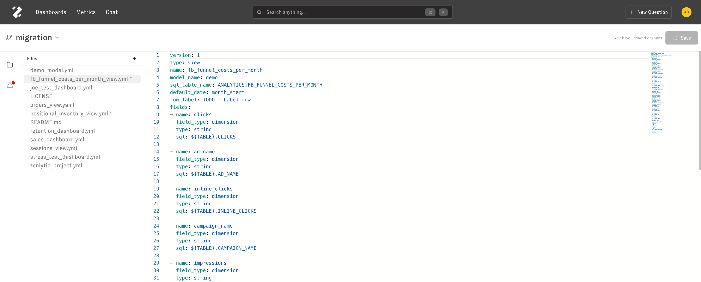
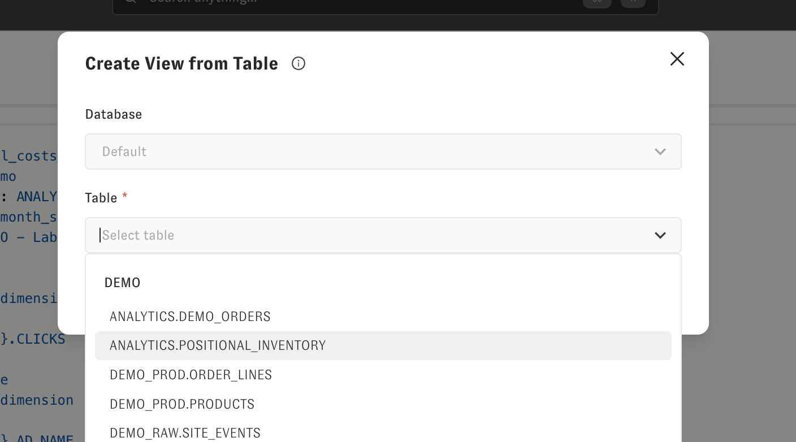
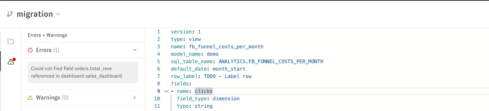
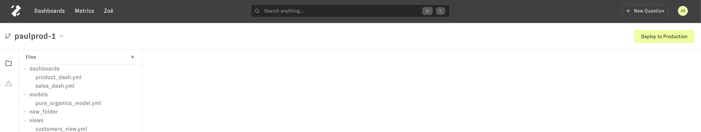

---
layout:
  title:
    visible: true
  description:
    visible: false
  tableOfContents:
    visible: true
  outline:
    visible: true
  pagination:
    visible: true
---

# Data Model Editor

> How to edit your cognitive layer using Zenlytic's in-built editor

The data model editor helps you edit your company's Cognitive Layer right in Zenlytic's interface.

In the main interface, you'll first create a branch (we won't let you edit the production branch live in the interface).

Once you create a branch, you can edit files. You can reference [the docs](https://docs.zenlytic.com) for more information on defining metrics, joins, and permissions on data.

To add new tables to Zenlytic, you will click the "+" above the names of the files on the left-hand side, then click "Create View from Table." You can then select the database associated with your the table you want to use, and click on it. Click "Create View" to initialize the view based on the table you selected. This will take care of all the boilerplate setup, and all you'll have to do is define the metrics and joins you want.

If there are errors when you're editing, you'll see the error and where it's located on the errors and warnings section on the left-hand side.

When you're ready to deploy to production, the button in the upper right will turn green and you'll see it say "Deploy to Production."

When you click this button, the code on your branch will be merged into the production branch and Zoë (Zenlytic's chat interface) will be updated with any added metrics and dimensions. That update process takes a few seconds, so allow about 10 seconds before using Zoë after adding new metrics to production.
