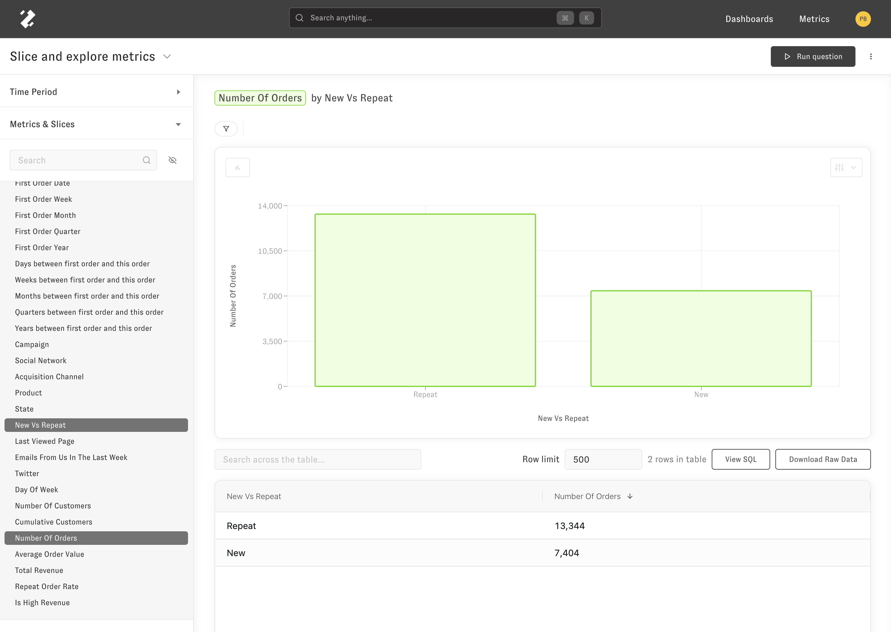
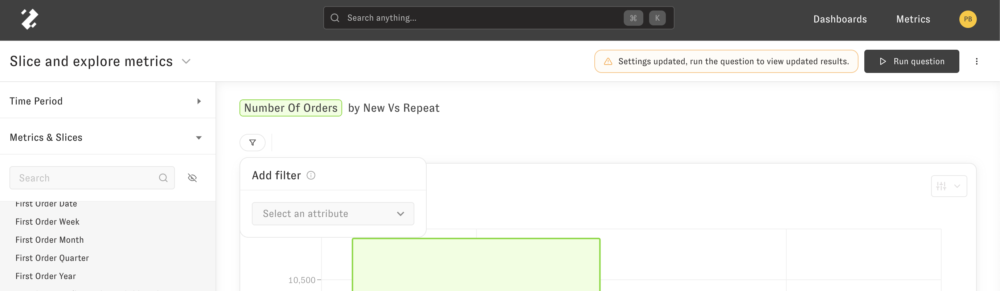
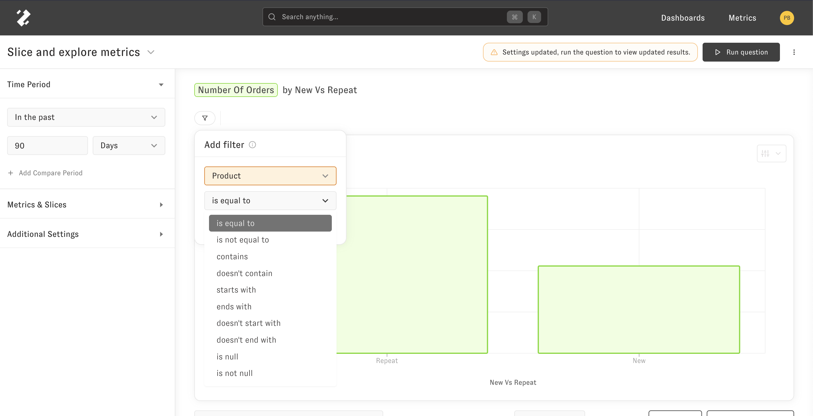
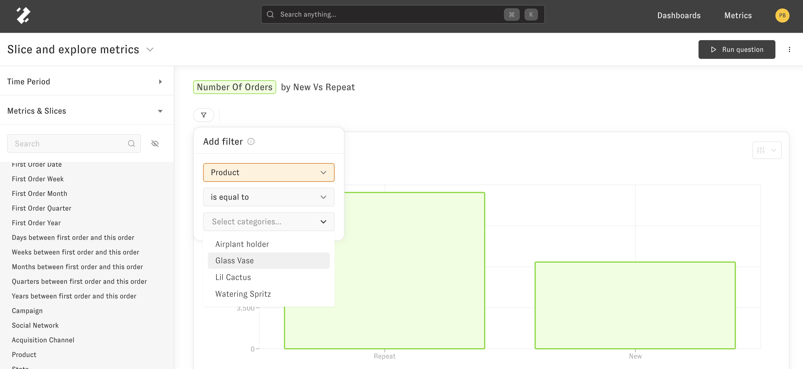
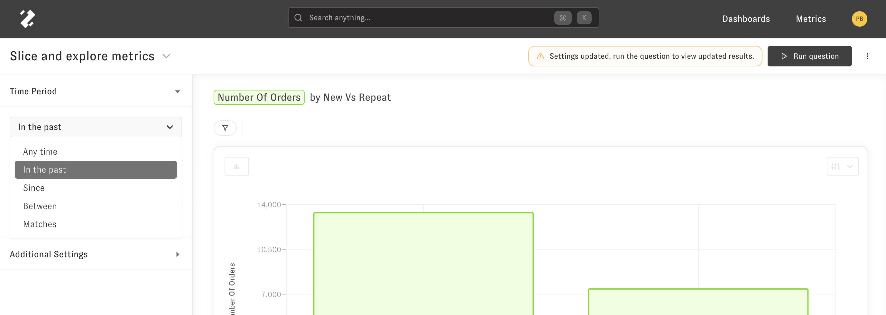
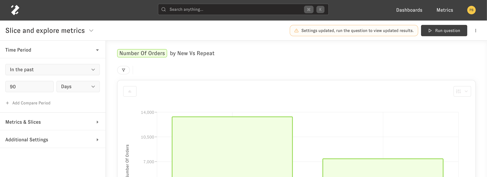

# Exploring

The Slice and Explore Metrics question lets you answer the "What" questions about your data. You can get to this question by [searching your data](using_zenlytic.md#search), [clicking on a metric](using_zenlytic.md#metrics), or [following up from a dashboard](using_zenlytic.md#dashboards). Once in the Slice and Explore interface, you can do several operations on your data.

## Slicing

You can add or remove metrics and slices from your question whenever you'd like. You use the Metrics and Slices menu on the left hand side to add these additional metrics or slices.

## Filtering

You can also use the left hand menu to filter on a metric or a slice by clicking the three dot menu and clicking "Add as filter" or you can add a filter by clicking the filter icon right below the question title.

To set your filter how you want it you can change the comparison by clicking the middle drop down.

To set the value to use for the filter you can use the drop down for the value on the right side of the value.

## Time periods

The time period allows you to filter your data by its primary time slice. You can change the value to a custom range by choosing how you'd like to use the time period.

Then, once you choose how you'd like to define your time period, you choose the values to complete the time period selection, like this.

## Table Calculations

If you have questions about the types of formula's and functions you can use in table calculations use the reference [here](../data-modeling/table_calculation_syntax.md)
