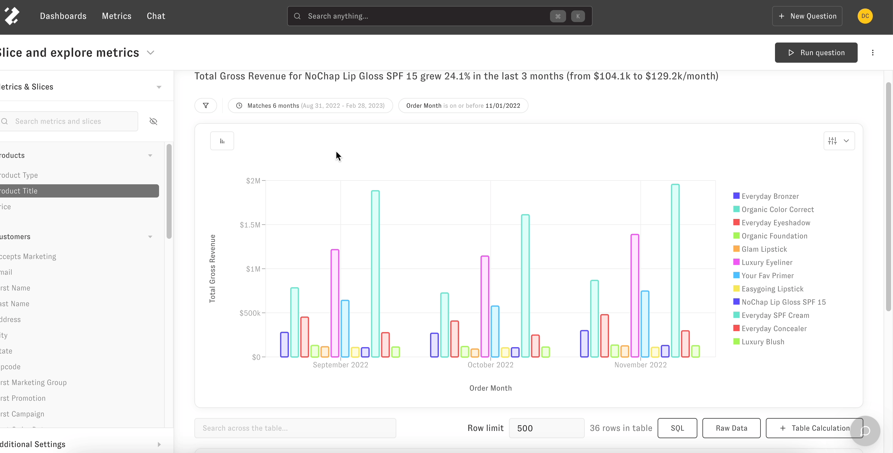
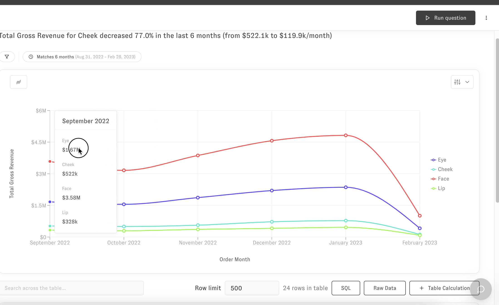
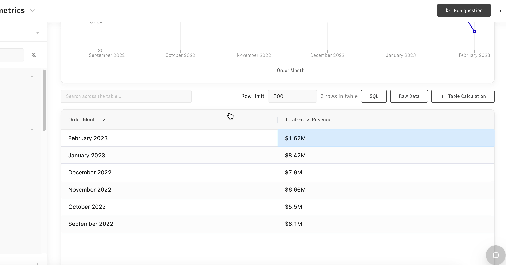
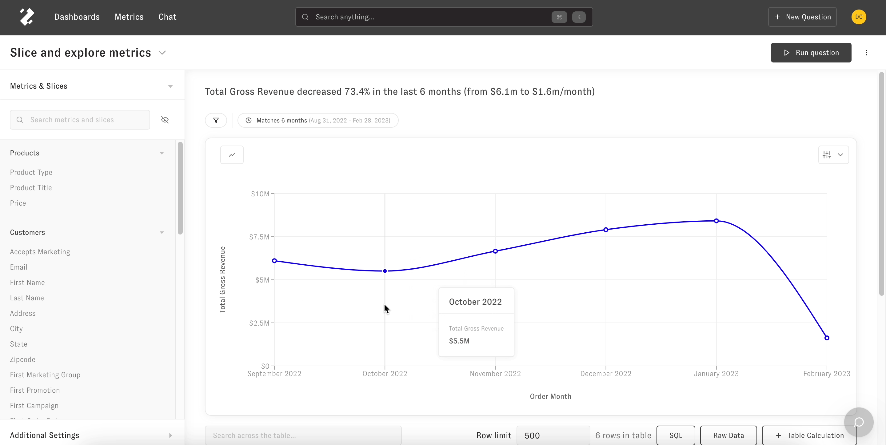
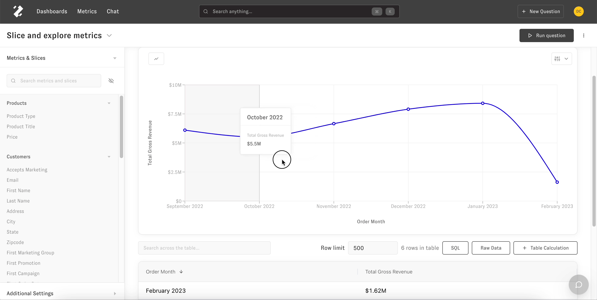
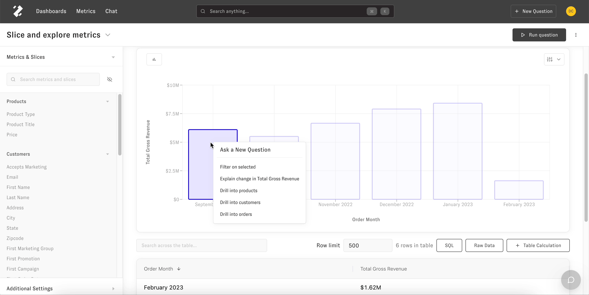

---
layout:
  title:
    visible: true
  description:
    visible: false
  tableOfContents:
    visible: true
  outline:
    visible: true
  pagination:
    visible: true
---

# Follow Ups

> Ask follow up questions by using filtering, 'Explain the change' question type, and 'Drill into' features

Follow Ups are Zenlytic's way of helping you ask questions that dig deeper into details of your analysis from the [Slice and Explore](exploring.md) section.

For example, if you are looking at a yearly view and want to see the details of a certain month, or you'd like to see details of a certain user in your data, Zenlytic makes it easy to navigate from the page you are on, so you don't have to build a completely new report.

## Navigating to follow ups

Once you have [selected your metrics and slices](exploring.md#slicing) , ask follow up questions the following 3 ways; clicking on the visualization, dragging a section on a line plot, or clicking on a table cell value.

## Clicking on visualization

Click on any slice from the visualization section to show the follow up question types available.

## Dragging section on a line graph

Drag your cursor across a line graph to select a range of a slice to show the follow up question types available.

If there is more than one value in the visualization, you will be prompted to select one.

## Clicking on table cell value

Click on the table's cell value to show the follow up question types available.

Follow up question types

There are three follow up questions types you can use to add more details to your question. They are 'Filter on selected', 'Explain the change', and 'Drill into'.

## Filter on selected

Filter on selected will filter the slice range you have selected and narrows down the metrics in the question.

## Explain the change

'Explain the change' adds slices that most likely correlate to the difference in metric that has been selected. [Here is an article](exploring.md#explain-the-change) going into more details about this question type.

## Drill into

'Drill into' adds slices that provide more detail based on the slice chosen. For example, you can drill into revenue at a user level, order level, or product level.

Each 'Drill into' slice can be configured to your business needs. [Here's an example](../5_data_modeling/dimension/#examples) of how that can be customized.

