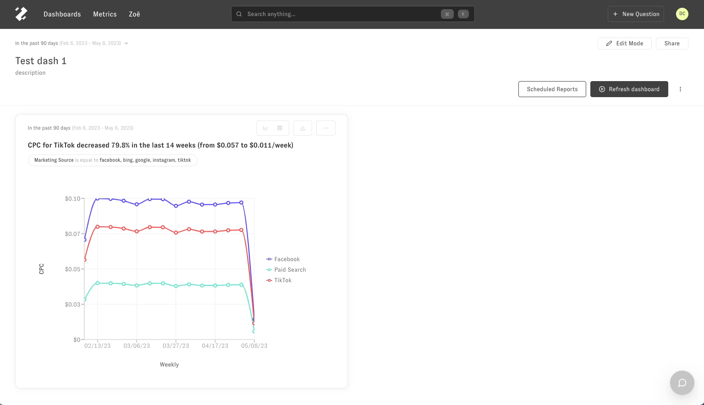
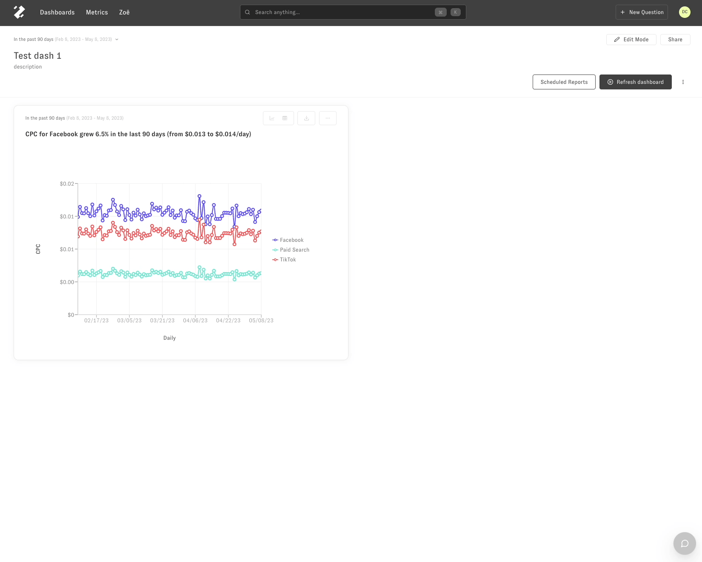

---
layout:
  title:
    visible: true
  description:
    visible: false
  tableOfContents:
    visible: true
  outline:
    visible: true
  pagination:
    visible: true
---

# Follow Ups From a Dashboard

There are two ways you can follow up from a dashboard question in Zenlytic.

1. Entering an explore interface, where you can select metrics, slices, and filters from a list.
2. Chatting with [Zöe](https://www.zenlytic.com/product), our natural language chatbot.

For both options, select the 3-dot menu in the top right-hand corner of a chart in a dashboard.

## Explore from here

Start a chat with Zöe

