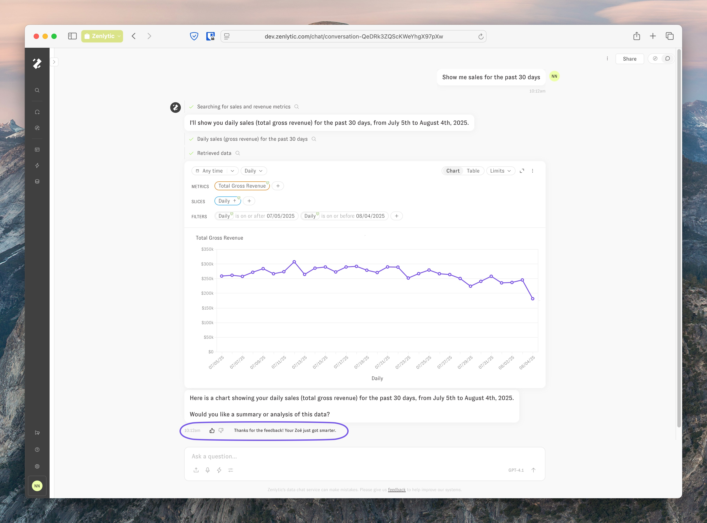
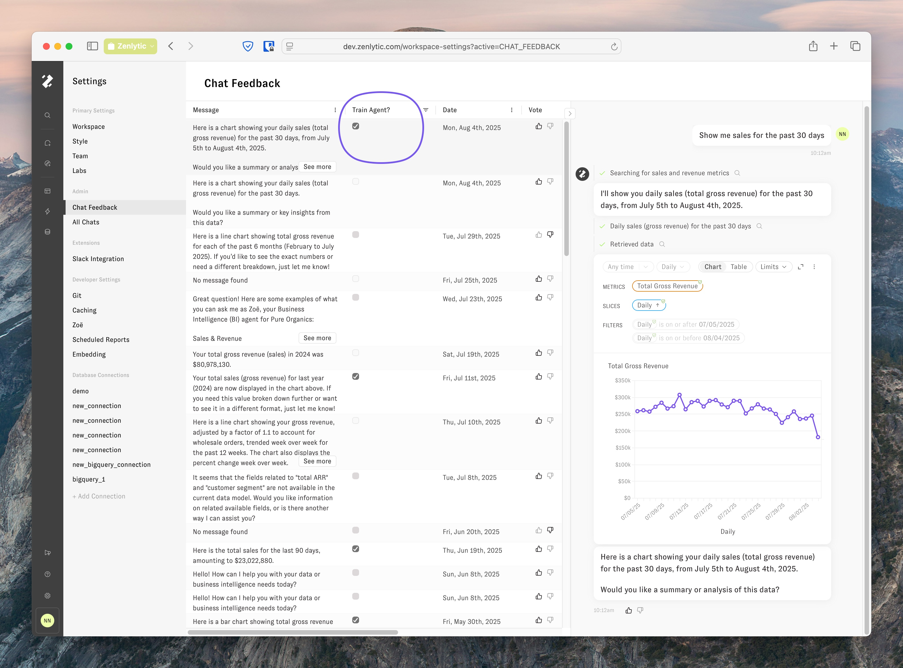
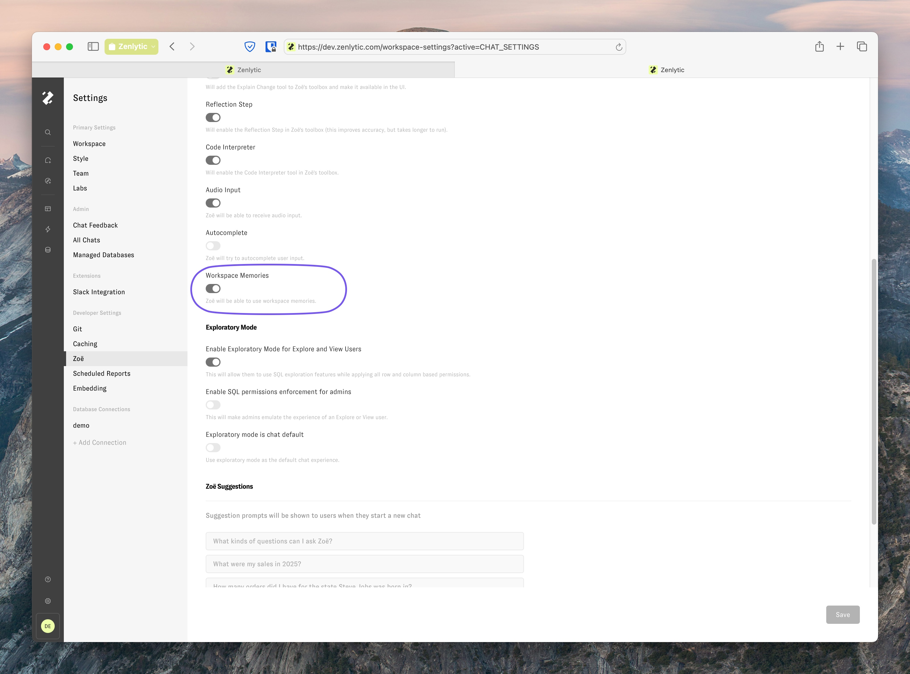

# Memories

Use memories to teach Zoë about your company, your data preferences, and how you want questions answered. When you give positive feedback in chat, Zoë creates memories to remember your preferences for future conversations.

## How memories work

Give Zoë positive feedback on good answers, and she'll remember your preferences. This makes her responses more accurate and personalized to how you work with your data.

## Create a memory

When Zoë gives you a good answer, click the "thumb up" :thumbsup: button to create a memory. This tells Zoë to remember how you want similar questions answered in the future.

**Made a mistake?** Click the "thumb down" :thumbsdown: button to remove the memory you just created.

## Manage your memories

View and control all memories from your workspace settings:

1. Click the "Settings" icon in the left navigation bar
2. Click the "Chat Feedback" tab
3. Toggle the "Train Agent" switch off for any conversation to disable its memories

## Turn off memories for your workspace

Disable memories completely for your entire workspace:

1. Click the "Settings" icon in the left navigation bar
2. Click the "Zoë" tab
3. Toggle "Workspace Memories" to off

## What memories can't do

Keep these limitations in mind:

* **Data questions only**: Memories work for data interpretation, not personality changes. Use [custom system prompts](../tips-and-tricks/zoe_context_ingestion.md) to modify Zoë's behavior or personality.
* **Positive feedback only**: Memories only learn from thumbs up, not thumbs down. Use [custom system prompts](../tips-and-tricks/zoe_context_ingestion.md) for negative feedback about Zoë's responses.

## Coming soon
* Edit and modify existing memories
* Create memories outside the chat interface
* View all workspace memories in one place