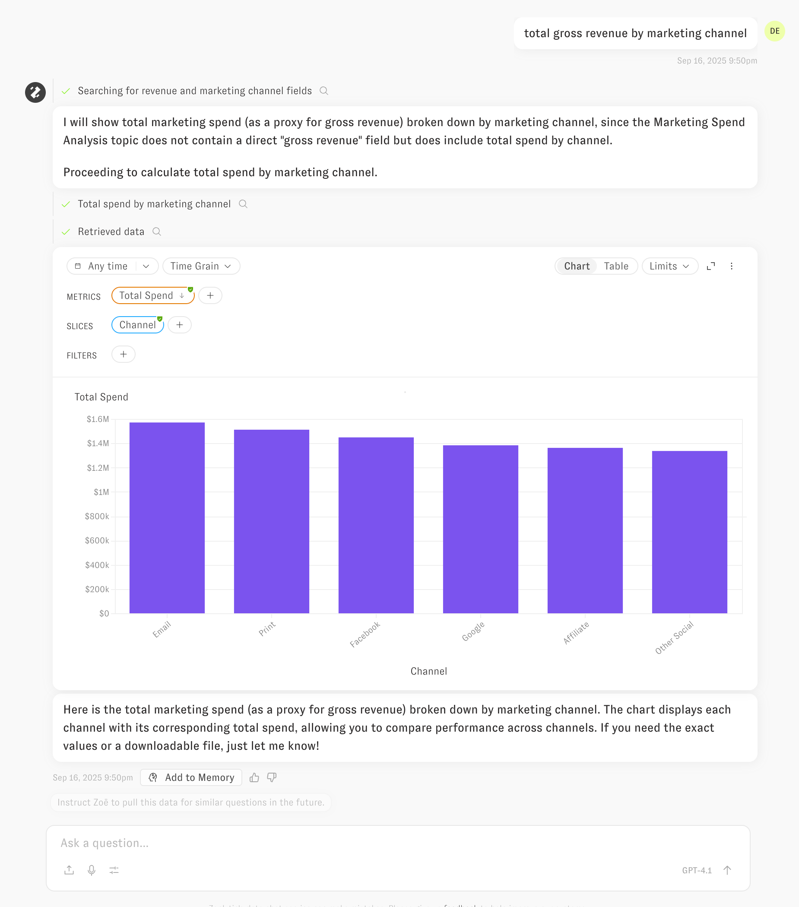
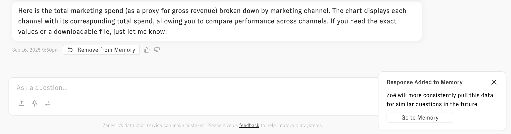
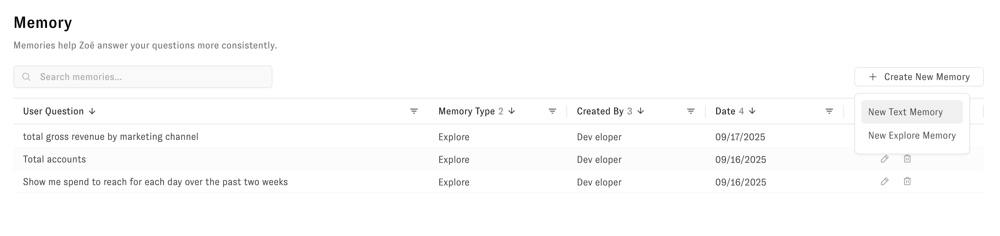
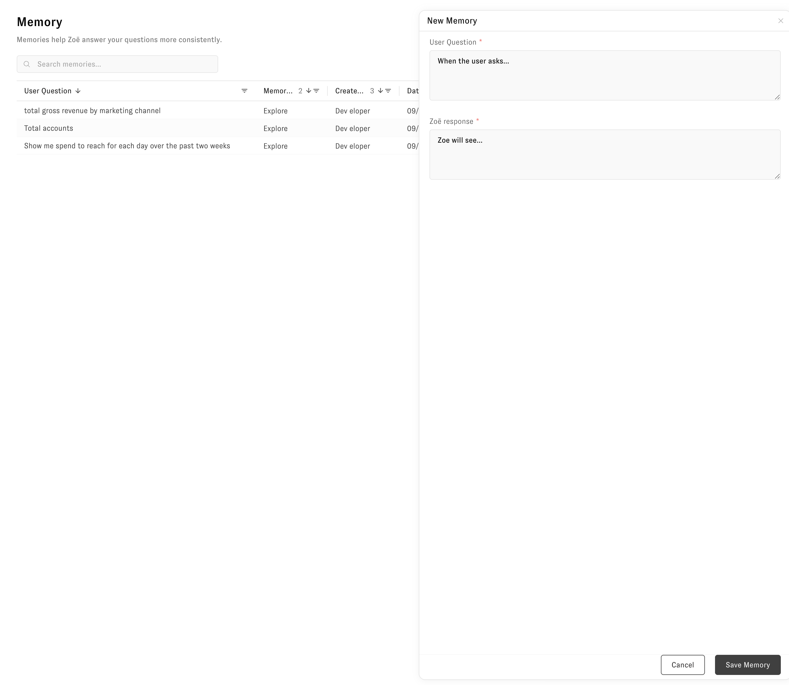
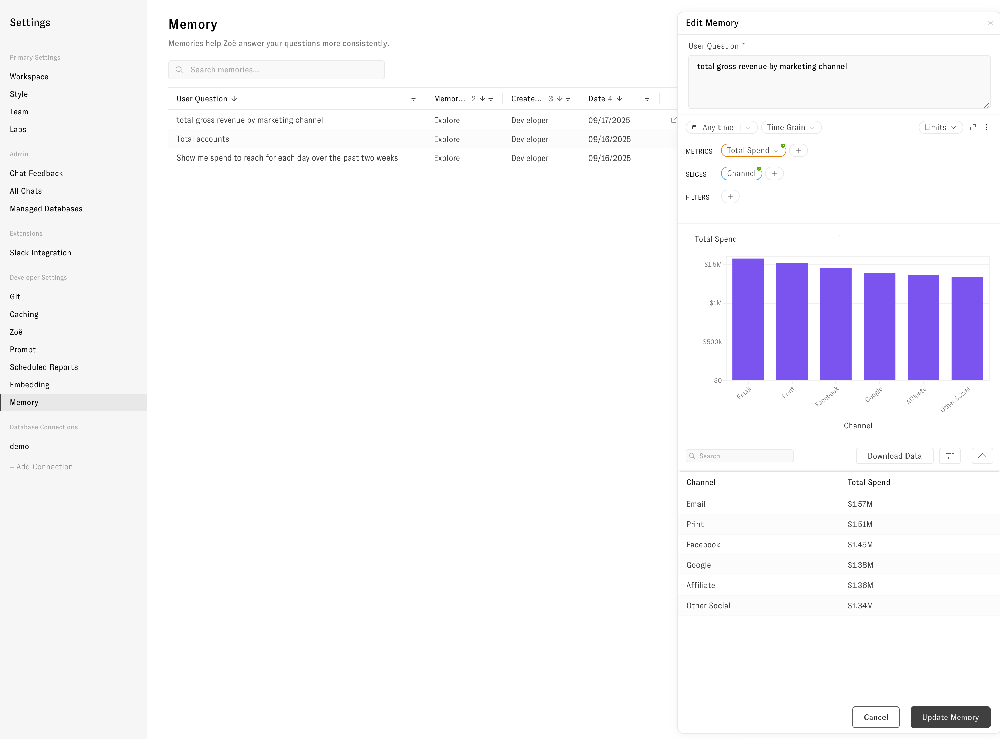

# Memories

Use memories to teach Zoë about your company, your data preferences, and how you want questions answered. Zoë uses these memories to understand your business and remember your preferences in future responses.

## How memories work

Click "Add to memory" on helpful responses in chat, or create and manage memories in the memory management portal. When you ask Zoë a question, she automatically finds and uses relevant memories to provide more accurate, consistent answers tailored to your business context and preferences.

## Create a memory

### From chat

Click "Add to memory" under a helpful response to save it.

After saving, you see a confirmation toast that says "Response Added to Memory — Zoë will more consistently pull this data for similar questions in the future." Use "Go to Memory" to open it, or click "Remove from Memory" to undo.

### From the memory management portal

Create memories directly in the portal when you want to define behavior outside of a specific chat.

1. Go to Settings → Memory.
2. Click Create new memory, then choose New Text memory or New Explore memory.

- **Text memory**: Enter the User question and Zoë response to specify how Zoë should answer similar questions.

- **Explore memory**: Enter the question, select the time range, metrics, slices, and any filters, then run the question to preview and save.

## Manage your memories

View and control all memories in the memory management portal:

1. Click Settings in the left navigation.
2. Open Memory by clicking on the row.
3. Search, edit, or delete memories as needed. Use the pencil icon to edit or the trash icon to delete.

## What memories can't do

Keep these limitations in mind:

- **Data questions only**: Memories work for data interpretation, not personality changes. Use [custom system prompts](../tips-and-tricks/zoe_context_ingestion.md) to modify Zoë's behavior or personality.
- **Opt-in only**: Memories save only what you explicitly add or create. They do not learn from negative feedback. Use [custom system prompts](../tips-and-tricks/zoe_context_ingestion.md) to provide general guidance about tone or style.
