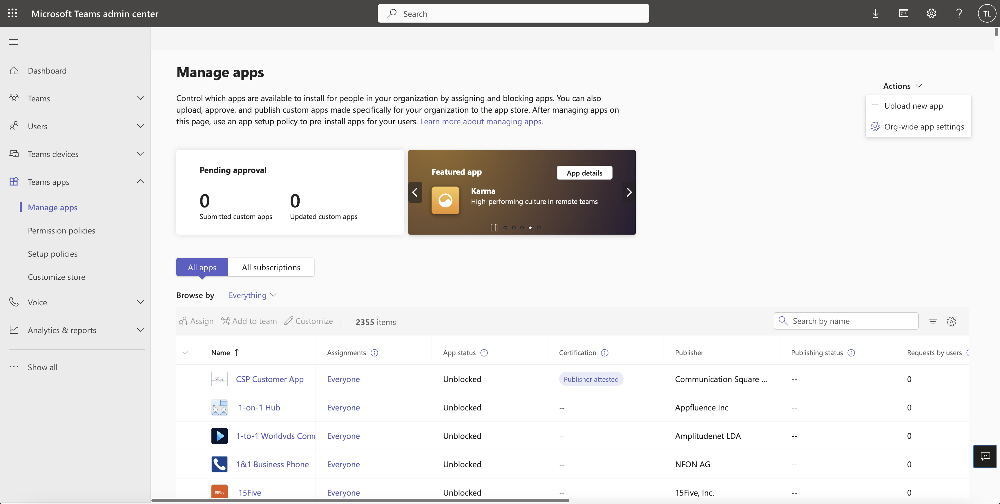
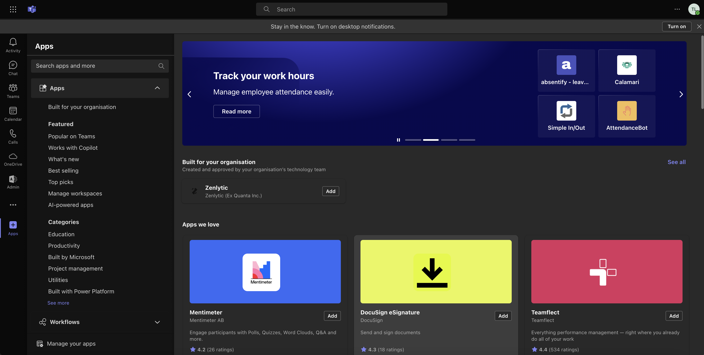
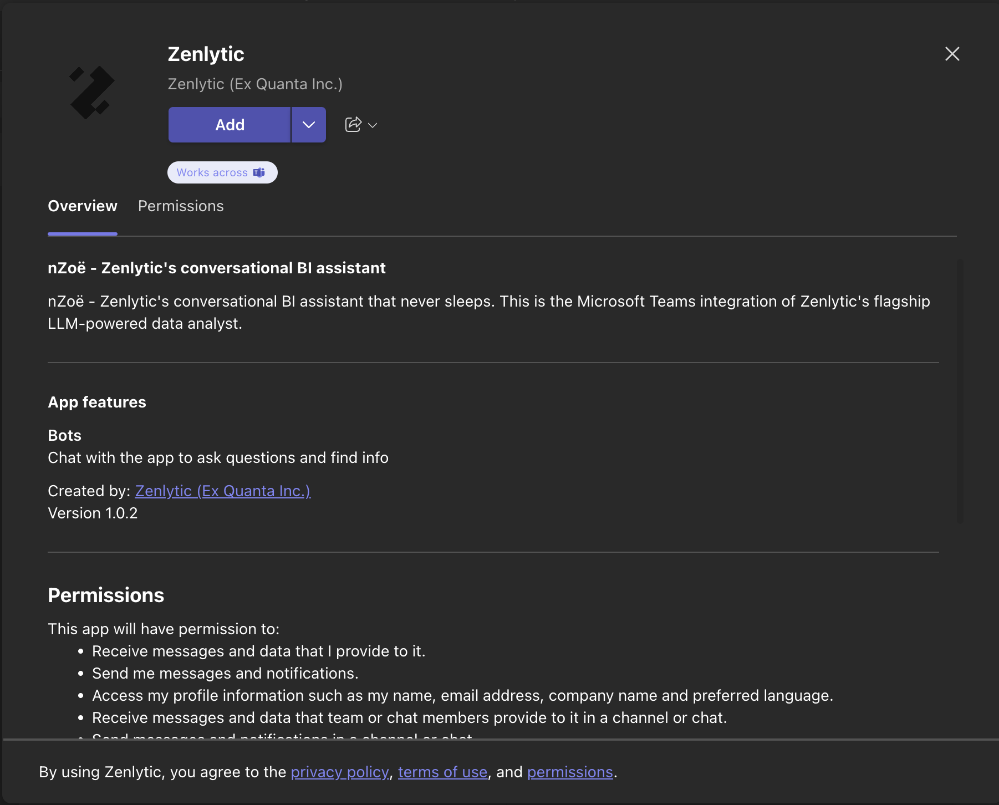
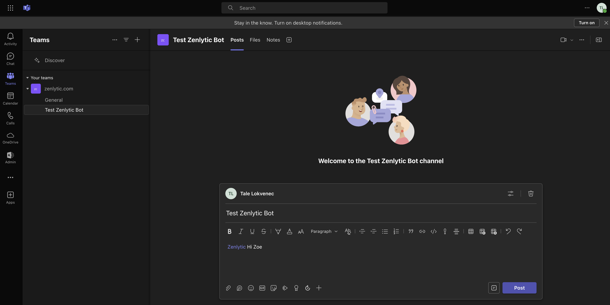

---
layout:
  title:
    visible: true
  description:
    visible: false
  tableOfContents:
    visible: true
  outline:
    visible: true
  pagination:
    visible: true
---

# Microsoft Teams Bot

The Zenlytic Bot brings the power of Zoë, Zenlytic's flagship natural language BI assistant, directly into Microsoft Teams. This integration allows users to effortlessly explore and query their organization's data, check available fields, views, and dashboards on specific topics, and even create or modify dashboards - all without ever leaving the convenience of Teams.

Whether you're collaborating within a team or seeking insights in a one-on-one scope, the Zenlytic Bot provides a seamless, intuitive interface for engaging with your data. By integrating directly with Teams, we aim to streamline workflows, foster data-driven decision-making, and enhance productivity across your organization.

This guide provides step-by-step instructions for IT teams on how to install the Zenlytic Bot within their organization's Microsoft Teams environment.

## Step 1: Access your Microsoft Tenant ID

* Sign in to the Azure portal
* Browse to "Microsoft Entra ID" > "Properties"
* Scroll down to the "Tenant ID" section and you will find your tenant ID in the box
* Send your tenant ID to **paul@zenlytic.com** to connect your Zenlytic workspace to your Teams workspace

## Step 2: Access the Microsoft Teams Admin Center

* Navigate to the [Microsoft Teams Admin Center](https://admin.teams.microsoft.com/dashboard) and log in using your admin credentials

## Step 3: Upload the Zenlytic Bot

* From the left-hand panel, select "Teams apps" > "Manage apps"
* In the upper-right corner, click on "Actions" and select "Upload new app" from the dropdown menu

Navigate to your **zenlytic\_bot.zip** file, select it and proceed with the upload.

## Step 4: Verify the App Publishing

* Upon successful upload, a confirmation message should appear. If a verification link is provided in the pop-up window, you can use it to directly verify that the app has been published correctly. If no pop-up window appears or you prefer to manually confirm the app's presence, navigate back to "Manage apps" within the Teams Admin Center. Here, search for "Zenlytic" in the app list to ensure it has been published successfully.

## Step 5: Add the Zenlytic Bot to your Team

* Open the Microsoft Teams app, and you should find the Zenlytic app listed under "Apps" in the left-hand menu

* Note that it might take a few hours for the app to become visible in your Teams app after publishing (based on our testing this could be up to 24 hours)
* Click on the Zenlytic app icon, then select "Add". Choose the appropriate team to which you want to add the Zenlytic Bot

## Step 6: Chat with your Data

The Zenlytic Bot should also be accessible for one-on-one and team conversations. It can be found under "Chat"/"Teams" in the left-hand menu of the Teams app.

You have successfully installed the Zenlytic Bot in your Microsoft Teams environment. Enjoy exploring the features and capabilities it brings to your team 🥳
