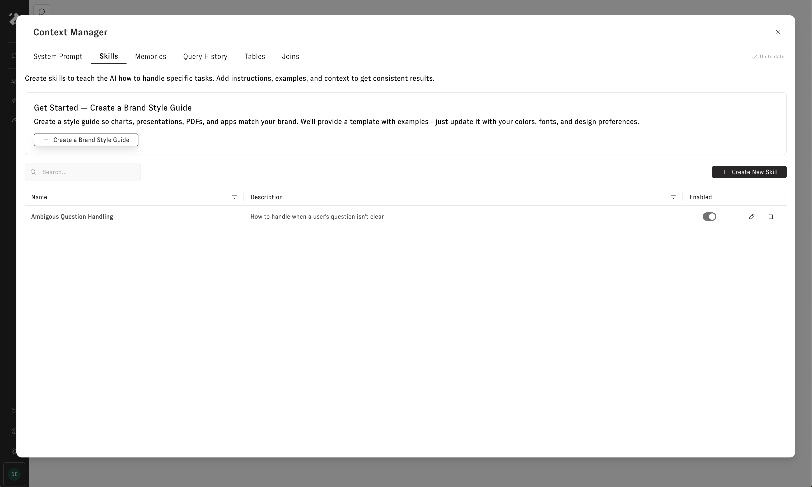
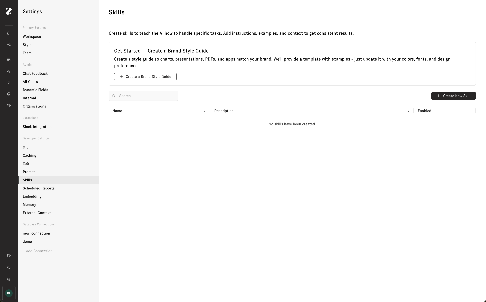
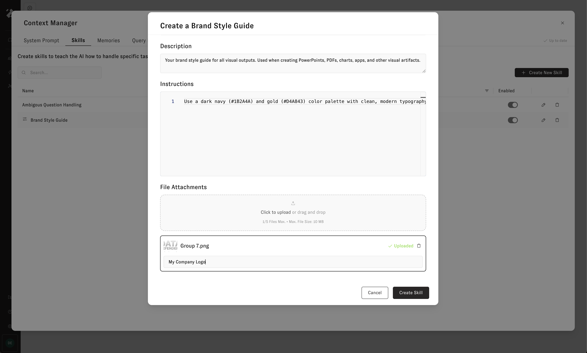
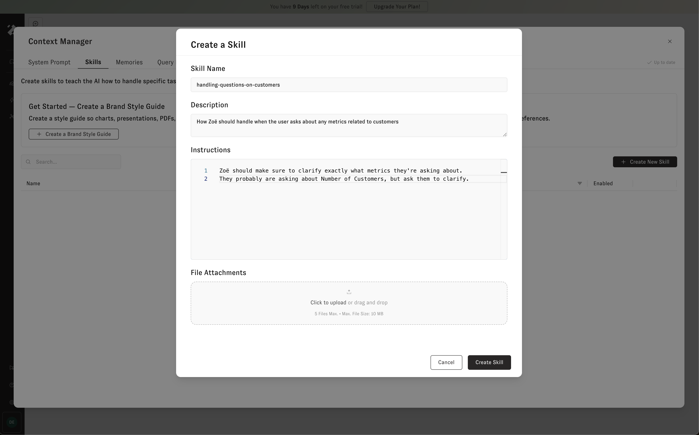
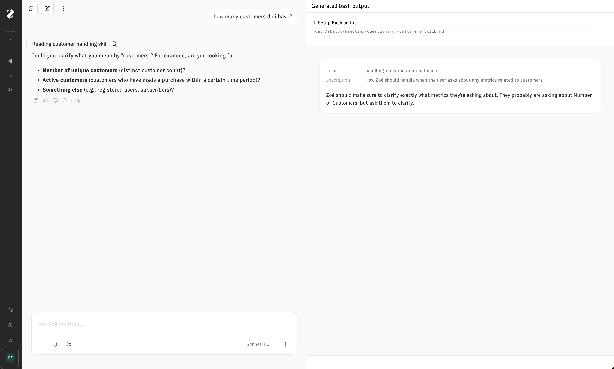

# Skills

Skills let you customize how Zoë works by giving her persistent instructions, brand guidelines, and reference files. With a skill, you can change the look and feel of every artifact Zoë creates, teach her about your company's style, or give her access to assets like your logo — all without repeating yourself in every conversation.

## Accessing skills

You can access skills in two ways:

* **Context Manager** — Open the Context Manager from any chat to view and manage your skills.
* **Workspace Settings** — Navigate to Workspace Settings to manage skills for your organization.

<figure></figure>

<figure></figure>

## Setting up your Brand Style Guide

The best way to get started with skills is to set up your **Brand Style Guide**. This is a built-in skill where you describe your brand's colors, aesthetic, typography, and any other visual preferences you want applied to your artifacts. In a single sentence, you can completely change the look of everything Zoë creates.

For example, you might write:

> Use a dark navy (#1B2A4A) and gold (#D4A843) color palette with clean, modern typography and minimal borders.

Once saved, Zoë will apply your brand style to dashboards, presentations, apps, and every other artifact she builds.

<figure></figure>

## Uploading reference files

In any skill, you can upload up to **5 files** to give Zoë reference material. This is useful for assets like logos, style sheets, or example documents that Zoë should use when creating artifacts.

For example, try uploading your company logo. Give it a description like "Our company logo — place it in the upper left corner of presentations and dashboards." Zoë will then have access to your logo for artifact creation and can include it in PowerPoint presentations, dashboards, and more.

## Creating a new skill

To create a new skill:

1. Open skills from the Context Manager or Workspace Settings.
2. Click **Create Skill** (or the equivalent button).
3. Give the skill a **name** — something descriptive like "Weekly Report Format" or "Brand Style Guide."
4. Write a **description** — a short summary of what the skill does.
5. Add **instructions** — detailed directions for Zoë on what she should do when this skill is active. Be as specific as you like.
6. Optionally, upload up to 5 reference files.
7. Save the skill.

<figure></figure>

## Verifying skill usage

Once a skill is created, you can see it in action by reading Zoë's tool calls in any conversation. Look for **skill usage** in the tool call details to confirm that Zoë is applying your skill's instructions.

<figure></figure>
