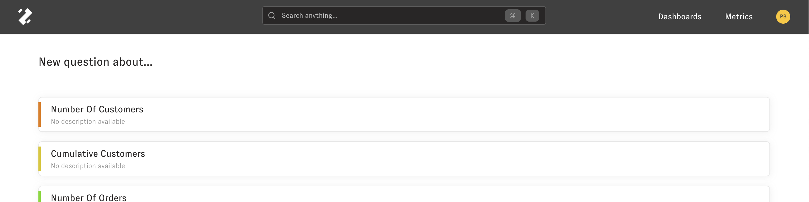
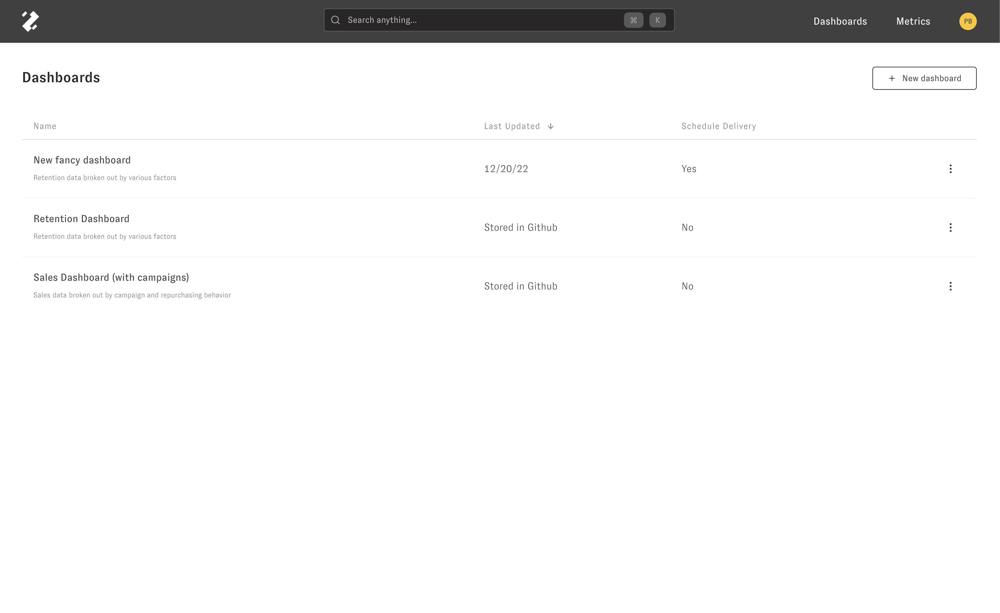
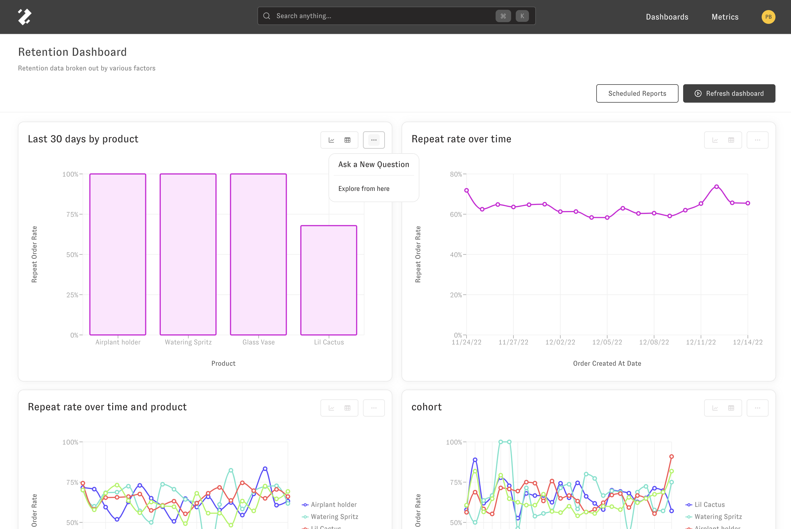

---
layout:
  title:
    visible: true
  description:
    visible: false
  tableOfContents:
    visible: true
  outline:
    visible: true
  pagination:
    visible: true
---

# Using Zenlytic

Zenlytic is a LLM-powered intelligent analytics platform that makes self-service possible. There are several different `question types` you can ask and answer in Zenlytic.

## Question Types

* [Zoë](zoe.md)
  * Zoë is an AI data analyst who uses your cognitive layer to answer questions about your data for you. She can answer questions about anything you can query using the [explore](exploring.md) interface, create and add plots to a dashboard, use a code interpreter to answer complex data science questions, and integrates with both Slack and Microsoft Teams.
* [Explore](exploring.md)
  * The explore question is a general purpose interface where you can answer the "What" questions that lead into the "Why" questions. For example, you could look at number of customers by acquisition channel who have spent more than $200 in the last 3 months in this question type. You can [slice](exploring.md#slicing) and [filter](exploring.md#filtering) key metrics easily.

## Search

You can also access your data via a natural language search that takes you directly to your question in your data. Search is always available in the top navigation bar and by clicking `cmd-k` at any time.

## Dashboards

You can also access saved views of your data using dashboards. To get to the list of your company's dashboards, you can click on the Dashboards option in the top navigation bar. Then to go to a dashboard, click on it's name.

When you're on a dashboard page, you can click the three dots on any of the plots to go into an interactive interface to ask follow up questions about the plot.

