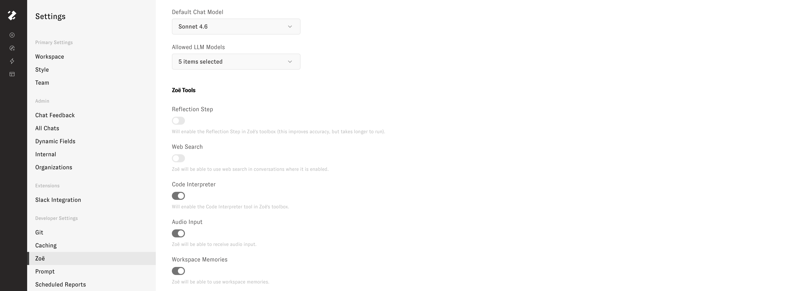
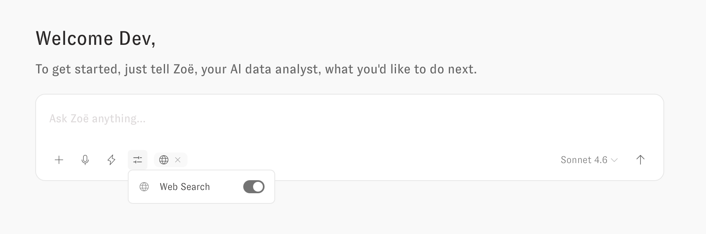
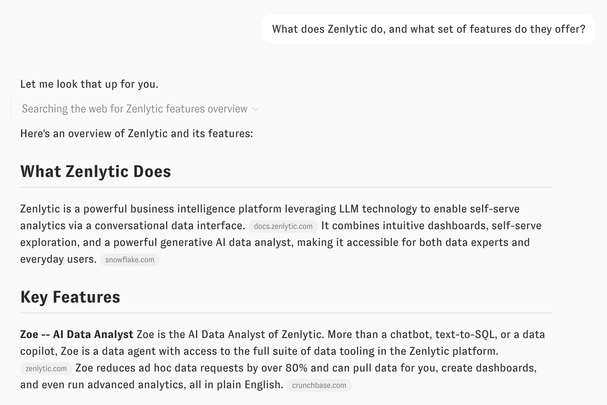

# Web Search

Zoë can search the web for real-time information to supplement her data analysis. This is useful when you need external context alongside your internal data — for example, comparing your metrics against industry benchmarks, understanding market trends, or referencing recent events.

> **Note:** Web Search is currently available only when using Anthropic models (e.g. Sonnet 4.6, Opus 4.6). If a non-Anthropic model is selected for the conversation, the Web Search toggle will not appear.

## Enabling Web Search for the Workspace

Web Search must first be enabled at the workspace level by an admin. Navigate to **Settings > Zoë** and toggle **Web Search** on. Once enabled, all users in the workspace will have the option to activate Web Search in their conversations.

<figure><figcaption>
Enabling Web Search in the Zoë workspace settings
</figcaption></figure>

## Enabling Web Search per Conversation

Once the workspace-level setting is enabled, Web Search can be toggled on or off for each individual conversation. Click the **Globe icon** in the toolbar below the Chat input to reveal the Web Search toggle, then switch it on for that conversation. When enabled, Zoë will be able to search the web as part of her response.

<figure><figcaption>
Toggling Web Search on for an individual conversation
</figcaption></figure>

The toggle is persistent for the conversation — once turned on, Zoë will have access to web search for all subsequent messages in that thread until you turn it off.

## How It Works

When Web Search is active and Zoë determines that external information would help answer your question, she will search the web before composing her response. You will see a "Searching the web for..." indicator in the chat while the search is in progress. Zoë synthesizes the search results into a coherent answer, combining external context with any data she pulls from your governed data model.

Common use cases include:

- **Industry benchmarks** — "How does our 15% churn rate compare to the SaaS industry average?"
- **Market context** — "What macroeconomic trends might explain the drop in Q4 sales?"
- **Product research** — "What are the latest best practices for customer onboarding?"
- **Current events** — "Are there any recent supply chain disruptions that could affect our forecast?"

## Cited Sources

When Zoë uses web search to answer a question, she cites the sources she found directly in her response. Each piece of externally sourced information is accompanied by a domain-level citation badge (e.g. `docs.zenlytic.com`, `snowflake.com`) so you can see exactly where the information came from and verify it yourself.

<figure><figcaption>
Zoë citing web sources in a response
</figcaption></figure>

These web citations are separate from Zoë's existing data citations, which reference specific query results from your governed data model. When both are present in the same response, you can easily distinguish between externally sourced context and internally queried data.
