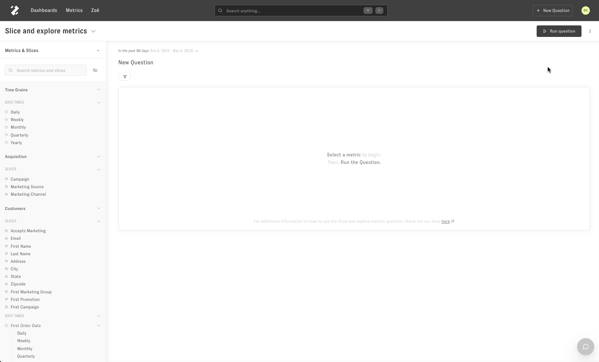

# Workspace Groups And Permissions

> Create a group in Workspace Settings, name it, and add team members. This group can govern dashboard access in your workspace.

## Creating Workspace Groups

To create a group for sharing permissions, click on your account icon in the top right hand corner (green circle), and select 'Workspace Settings'. Navigate to the 'Team Members' section. Select the 'Groups' tab.

Create a group, name the group, and lastly, add desired team members to the group. This group can be used on the dashboard level to govern access to reports in your workspace. ​

## Creating Dashboard Level Permissions

To create dashboard level permissions, on the dashboard page, click on the 'Share' button in the top right hand corner to select a group and the group's permission level.

