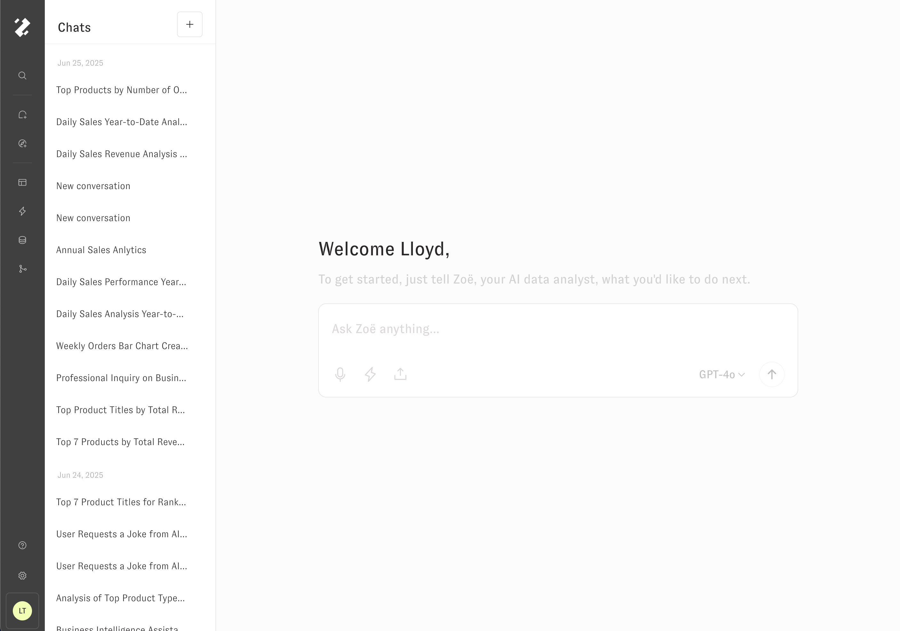
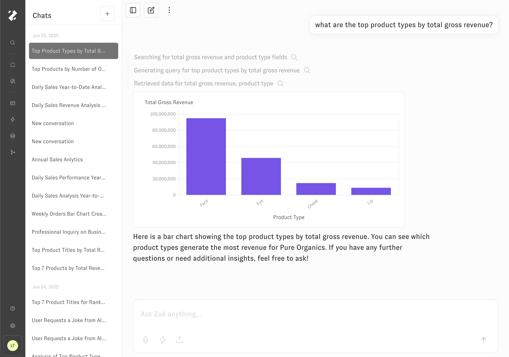
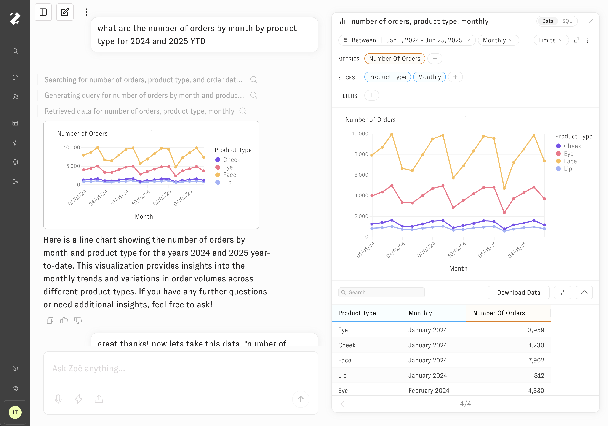
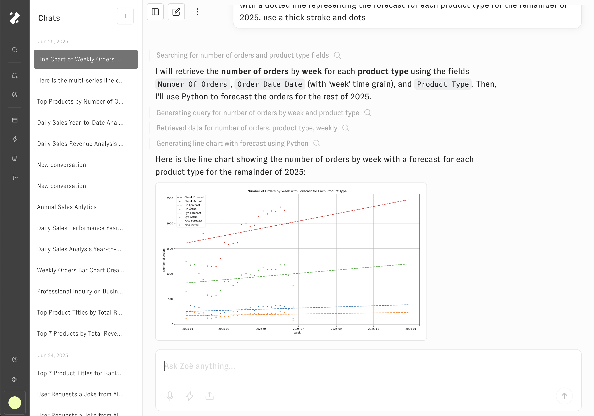

---
layout:
  title:
    visible: true
  description:
    visible: false
  tableOfContents:
    visible: true
  outline:
    visible: true
  pagination:
    visible: true
---

# Zoë

Zoë is an AI data analyst who uses your data to answer questions for you. This will describe some of her capabilities, and how to get best results.

## Just ask!

To get started using Zoë, just ask her a question. If you don't know what you can ask about, simply ask what data she can see, or what would be a great question to ask next. She will be even more helpful if you share your job title and more context about what you're trying to accomplish.

<figure><figcaption>
Starting a new chat with Zoë
</figcaption></figure>

When you're asking for data, you can be specific (e.g. "Show me sales YTD compared to the prior YTD, broken out by product type") or general (e.g. "I don't really know what I want to see, but tell me about channel and campaign performance"). Zoë can handle both type of questions, and will ask you follow up questions if she isn't able to make reasonable assumptions about what you intend from your question.

By pressing the Microphone icon, Zoë will listen through the web browser to capture your prompt through realtime voice transcription. The Lightning icon opens a panel for selecting a Workflow to run. The Upload icon supports adding file attachments to the message, like images, CSVs, and PDFs (limit 5). A dropdown on the right side of the user input supports changing the chat model that will be used for the new conversation. Press "Enter" or click the Up Arrow button to submit the message.&#x20;

## Querying

Zoë searches across the governed measures and dimensions to use existing fields and know when to create new ones to answer your data questions with compelling summaries and insightful visualizations. She was built on an agentic architecture that gives her ability to plan approaches to problems, to use tools to answer questions on your behalf, and memory to get better over time: all in service of helping you understand complex data. At times she may misunderstand what you are asking about, but you can see exactly what steps she is taking to respond, the reasoning behind her thinking, and the data she queries.

<figure><figcaption>
Asking Zoë for a bar chart
</figcaption></figure>

The left sidebar displays the Chat history, sorted by recent activity, and a button to create a new chat. In the upper left of the main content area, there's a button to collapse the left sidebar, a button to create a new chat, and the 3-Dot options menu that supports link sharing and "Save as Workflow" options.

<figure><figcaption>
Clicking into the Question drawer
</figcaption></figure>

Every tool call and chart that Zoë creates on your behalf can be clicked into, inspected and explored via the drawer, and added back to the conversation with follow up questions or tasks. The Magnifying glass icon represents than an element that will open in the drawer when clicked. The Question drawer header contains the shorthand name of the data question, a switch to show Question SQL, and an icon to close the drawer. The drawer content itself provides a form for exploring the query options available from this question starting point. You can either click the buttons in the drawer or ask Zoë to change the question's chart type, fields, filters & sorts, limits, etc.&#x20;

## Code Interpreter

Zoë also has the ability to write and evaluate Python code. This process occurs in a sandbox environment where she can write any code she needs on top of the governed results pulled from the data model. This gives Zoë a huge amount of flexibility to answer complex questions that involve merging results of separate queries, plugging in assumptions to scenarios, and doing advanced clustering, correlation, regression, and forecast analysis.

<figure><figcaption></figcaption></figure>

## Personal Fields

In addition to creating queries on your existing measures and dimensions, Zoë can (for Develop and above roles, and when the feature is turned on) create Personal fields, which are measures and dimensions that are assigned to the person who created them, instead of the global data model. Those Personal Fields can be "promoted" into the global data model, but _Zoë cannot promote them_. You must do that in the UI.

We, very intentionally, have not given Zoë the ability to modify the global cognitive layer, to ensure your end users are always getting a consistent and governed experience.

## Dashboards

Zoë can create new dashboards and add plots to those dashboards or add plots to existing dashboards. She can also search your dashboards for terms so you can answer questions like "What dashboards do we have for revenue and plan?"

## Slack & Teams

Zoë integrates with both Slack and Microsoft Teams. You can ask questions, and she will respond to them in either interface.

### Slack

To set up the Slack integration, you can install it from the "Slack Integration" tab of the Workspace Settings menu.

To make Zoë receive a message you must tag `@Zenlytic` in every message you want Zoë to see. Unfortunately, Zoë does not automatically see messages that are added to a thread without that tag.

Additionally, you can schedule dashboards for delivery in Slack, through the scheduled reports functionality in the dashboard options or the admin panel.

### Teams

To set up the Teams integration, contact Zenlytic support, following [these instructions](microsoft_teams_bot.md)

Zoë is available in DMs and in channels, but not in group DMs.
